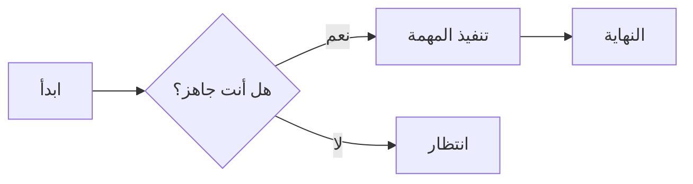
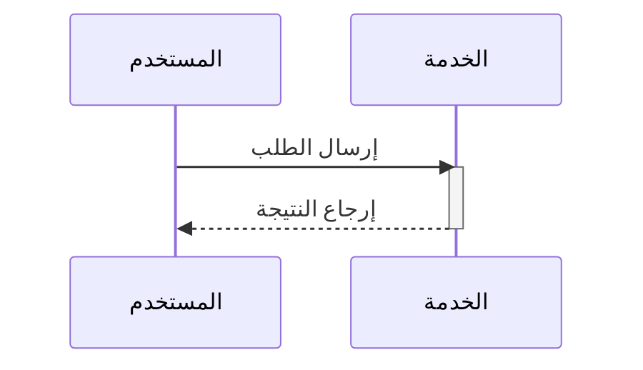

# العناوين

```
# h1 عنوان 8-)
## h2 عنوان
### h3 عنوان
#### h4 عنوان
##### h5 عنوان
###### h6 عنوان

وبدلاً من ذلك، يمكن استخدام نمط التسطير لـ H1 و H2:

Alt-H1
======

Alt-H2
------
```

# h1 عنوان 8-)
## h2 عنوان
### h3 عنوان
#### h4 عنوان
##### h5 عنوان
###### h6 عنوان

وبدلاً من ذلك، يمكن استخدام نمط التسطير لـ H1 و H2:

Alt-H1
======

Alt-H2
------

------

# التوكيد

```
التوكيد، أي الخط المائل، باستخدام *النجوم* أو _الشرطات السفلية_.

التوكيد القوي، أي الخط العريض، باستخدام **النجوم** أو __الشرطات السفلية__.

توكيد مدمج مع **النجوم و_الشرطات السفلية_**.

الخط المشطوب يستخدم علامتي المدّة. ~~اشطب هذا.~~

**هذا نص عريض**

__هذا أيضاً نص عريض__

*هذا نص مائل*

_هذا أيضاً نص مائل_

~~مشطوب~~
```

التوكيد، أي الخط المائل، باستخدام *النجوم* أو _الشرطات السفلية_.

التوكيد القوي، أي الخط العريض، باستخدام **النجوم** أو __الشرطات السفلية__.

توكيد مدمج مع **النجوم و_الشرطات السفلية_**.

الخط المشطوب يستخدم علامتي المدّة. ~~اشطب هذا.~~

**هذا نص عريض**

__هذا أيضاً نص عريض__

*هذا نص مائل*

_هذا أيضاً نص مائل_

~~مشطوب~~

------

# القوائم

```
1. العنصر الأول في القائمة المرتبة
2. عنصر آخر
⋅⋅* قائمة فرعية غير مرتبة.
1. الأرقام الفعلية لا تهم، المهم أن يكون رقماً
⋅⋅1. قائمة فرعية مرتبة
4. وعنصر آخر.

⋅⋅⋅يمكنك وضع فقرات ذات إزاحة صحيحة داخل عناصر القائمة. لاحظ السطر الفارغ أعلاه، والمسافات البادئة (واحدة على الأقل، لكننا سنستخدم ثلاثاً هنا لمحاذاة Markdown الخام أيضاً).

⋅⋅⋅للحصول على فاصل أسطر بدون فقرة، ستحتاج إلى استخدام مسافتين في نهاية السطر.⋅⋅
⋅⋅⋅لاحظ أن هذا السطر منفصل، لكنه داخل نفس الفقرة.⋅⋅
⋅⋅⋅(هذا مخالف لسلوك فاصل الأسطر النموذجي في GFM، حيث لا تكون المسافات النهائية مطلوبة.)

* يمكن للقائمة غير المرتبة استخدام النجوم
- أو الشرطات
+ أو علامات الجمع

1. إجراء تغييراتي
    1. إصلاح الخلل
    2. تحسين التنسيق
        - تكبير العناوين
2. دفع التزاماتي إلى GitHub
3. فتح طلب سحب
    * وصف تغييراتي
    * ذكر جميع أعضاء فريقي
        * طلب الملاحظات

+ أنشئ قائمة ببدء سطر بـ `+` أو `-` أو `*`
+ تُنشأ القوائم الفرعية بإزاحة مقدارها مسافتان:
  - تغيير علامة العنصر يفرض بدء قائمة جديدة:
    * Ac tristique libero volutpat at
    + Facilisis in pretium nisl aliquet
    - Nulla volutpat aliquam velit
+ سهل جداً!
```

1. العنصر الأول في القائمة المرتبة
2. عنصر آخر
⋅⋅* قائمة فرعية غير مرتبة.
1. الأرقام الفعلية لا تهم، المهم أن يكون رقماً
⋅⋅1. قائمة فرعية مرتبة
4. وعنصر آخر.

⋅⋅⋅يمكنك وضع فقرات ذات إزاحة صحيحة داخل عناصر القائمة. لاحظ السطر الفارغ أعلاه، والمسافات البادئة (واحدة على الأقل، لكننا سنستخدم ثلاثاً هنا لمحاذاة Markdown الخام أيضاً).

⋅⋅⋅للحصول على فاصل أسطر بدون فقرة، ستحتاج إلى استخدام مسافتين في نهاية السطر.⋅⋅
⋅⋅⋅لاحظ أن هذا السطر منفصل، لكنه داخل نفس الفقرة.⋅⋅
⋅⋅⋅(هذا مخالف لسلوك فاصل الأسطر النموذجي في GFM، حيث لا تكون المسافات النهائية مطلوبة.)

* يمكن للقائمة غير المرتبة استخدام النجوم
- أو الشرطات
+ أو علامات الجمع

1. إجراء تغييراتي
    1. إصلاح الخلل
    2. تحسين التنسيق
        - تكبير العناوين
2. دفع التزاماتي إلى GitHub
3. فتح طلب سحب
    * وصف تغييراتي
    * ذكر جميع أعضاء فريقي
        * طلب الملاحظات

+ أنشئ قائمة ببدء سطر بـ `+` أو `-` أو `*`
+ تُنشأ القوائم الفرعية بإزاحة مقدارها مسافتان:
  - تغيير علامة العنصر يفرض بدء قائمة جديدة:
    * Ac tristique libero volutpat at
    + Facilisis in pretium nisl aliquet
    - Nulla volutpat aliquam velit
+ سهل جداً!

------

# قوائم المهام

```
- [x] إنهاء تغييراتي
- [ ] دفع التزاماتي إلى GitHub
- [ ] فتح طلب سحب
- [x] دعم @الإشارات و #المراجع و [الروابط]() و **التنسيق** و<del>الوسوم</del>
- [x] صيغة القائمة مطلوبة (تُدعم أي قائمة مرتبة أو غير مرتبة)
- [x] هذا عنصر مكتمل
- [ ] هذا عنصر غير مكتمل
```

- [x] إنهاء تغييراتي
- [ ] دفع التزاماتي إلى GitHub
- [ ] فتح طلب سحب
- [x] دعم @الإشارات و #المراجع و [الروابط]() و **التنسيق** و<del>الوسوم</del>
- [x] صيغة القائمة مطلوبة (تُدعم أي قائمة مرتبة أو غير مرتبة)
- [ ] هذا عنصر مكتمل
- [ ] هذا عنصر غير مكتمل

------

# تجاهل تنسيق Markdown

يمكنك إخبار GitHub بتجاهل (أو إفلات) تنسيق Markdown بوضع \ قبل الحرف.

```
لنُعد تسمية \*our-new-project\* إلى \*our-old-project\*.
```

لنُعد تسمية \*our-new-project\* إلى \*our-old-project\*.

------

# الروابط

```
[أنا رابط بنمط سطري](https://www.google.com)

[أنا رابط بنمط سطري مع عنوان](https://www.google.com "الصفحة الرئيسية لـ Google")

[أنا رابط بنمط مرجعي][نص مرجعي غير حساس لحالة الأحرف]

[أنا مرجع نسبي لملف في المستودع](../blob/master/LICENSE)

[يمكنك استخدام الأرقام لتعريفات الروابط المرجعية][1]

أو اتركه فارغاً واستخدم [نص الرابط نفسه].

تتحول عناوين URL وعناوين URL بين قوسين زاوية تلقائياً إلى روابط.
http://www.example.com أو <http://www.example.com> وأحياناً
example.com (لكن ليس على Github على سبيل المثال).

بعض النص لإظهار أن الروابط المرجعية يمكن أن تُعرّف لاحقاً.

[نص مرجعي غير حساس لحالة الأحرف]: https://www.mozilla.org
[1]: http://slashdot.org
[نص الرابط نفسه]: http://www.reddit.com
```

[أنا رابط بنمط سطري](https://www.google.com)

[أنا رابط بنمط سطري مع عنوان](https://www.google.com "الصفحة الرئيسية لـ Google")

[أنا رابط بنمط مرجعي][نص مرجعي غير حساس لحالة الأحرف]

[أنا مرجع نسبي لملف في المستودع](../blob/master/LICENSE)

[يمكنك استخدام الأرقام لتعريفات الروابط المرجعية][1]

أو اتركه فارغاً واستخدم [نص الرابط نفسه].

تتحول عناوين URL وعناوين URL بين قوسين زاوية تلقائياً إلى روابط.
http://www.example.com أو <http://www.example.com> وأحياناً
example.com (لكن ليس على Github على سبيل المثال).

بعض النص لإظهار أن الروابط المرجعية يمكن أن تُعرّف لاحقاً.

[نص مرجعي غير حساس لحالة الأحرف]: https://www.mozilla.org
[1]: http://slashdot.org
[نص الرابط نفسه]: http://www.reddit.com

------

# الصور

```
هنا شعارنا (مرّر المؤشر لرؤية نص العنوان):

نمط سطري:


نمط مرجعي:
![نص بديل][logo]

[logo]: https://github.com/adam-p/markdown-here/raw/master/src/common/images/icon48.png "نص عنوان الشعار 2"


مثل الروابط، الصور لها أيضاً صيغة حاشية سفلية

![نص بديل][id]

مع مرجع لاحق في المستند يحدد مكان عنوان URL:

[id]: https://octodex.github.com/images/dojocat.jpg  "The Dojocat"
```

هنا شعارنا (مرّر المؤشر لرؤية نص العنوان):

نمط سطري:


نمط مرجعي:
![نص بديل][logo]

[logo]: https://github.com/adam-p/markdown-here/raw/master/src/common/images/icon48.png "نص عنوان الشعار 2"


مثل الروابط، الصور لها أيضاً صيغة حاشية سفلية

![نص بديل][id]

مع مرجع لاحق في المستند يحدد مكان عنوان URL:

[id]: https://octodex.github.com/images/dojocat.jpg  "The Dojocat"

------

# [الحواشي السفلية](https://github.com/markdown-it/markdown-it-footnote)

```
رابط الحاشية السفلية 1[^first].

رابط الحاشية السفلية 2[^second].

تعريف حاشية سفلية سطرية^[نص الحاشية السفلية السطرية].

مرجع حاشية مكرر[^second].

[^first]: يمكن للحاشية السفلية أن **تحتوي تنسيقاً**

    وفقرات متعددة.

[^second]: نص الحاشية السفلية.
```

رابط الحاشية السفلية 1[^first].

رابط الحاشية السفلية 2[^second].

تعريف حاشية سفلية سطرية^[نص الحاشية السفلية السطرية].

مرجع حاشية مكرر[^second].

[^first]: يمكن للحاشية السفلية أن **تحتوي تنسيقاً**

    وفقرات متعددة.

[^second]: نص الحاشية السفلية.

------

# الكود وتمييز بناء الجملة

```
الكود `code` السطري له `علامات عكسية حوله`.
```

الكود `code` السطري له `علامات عكسية حوله`.

```c#
using System.IO.Compression;

#pragma warning disable 414, 3021

namespace MyApplication
{
    [Obsolete("...")]
    class Program : IInterface
    {
        public static List<int> JustDoIt(int count)
        {
            Console.WriteLine($"Hello {Name}!");
            return new List<int>(new int[] { 1, 2, 3 })
        }
    }
}
```

```css
@font-face {
  font-family: Chunkfive; src: url('Chunkfive.otf');
}

body, .usertext {
  color: #F0F0F0; background: #600;
  font-family: Chunkfive, sans;
}

@import url(print.css);
@media print {
  a[href^=http]::after {
    content: attr(href)
  }
}
```

```javascript
function $initHighlight(block, cls) {
  try {
    if (cls.search(/\bno\-highlight\b/) != -1)
      return process(block, true, 0x0F) +
             ` class="${cls}"`;
  } catch (e) {
    /* handle exception */
  }
  for (var i = 0 / 2; i < classes.length; i++) {
    if (checkCondition(classes[i]) === undefined)
      console.log('undefined');
  }
}

export  $initHighlight;
```

```php
require_once 'Zend/Uri/Http.php';

namespace Location\Web;

interface Factory
{
    static function _factory();
}

abstract class URI extends BaseURI implements Factory
{
    abstract function test();

    public static $st1 = 1;
    const ME = "Yo";
    var $list = NULL;
    private $var;

    /**
     * Returns a URI
     *
     * @return URI
     */
    static public function _factory($stats = array(), $uri = 'http')
    {
        echo __METHOD__;
        $uri = explode(':', $uri, 0b10);
        $schemeSpecific = isset($uri[1]) ? $uri[1] : '';
        $desc = 'Multi
line description';

        // Security check
        if (!ctype_alnum($scheme)) {
            throw new Zend_Uri_Exception('Illegal scheme');
        }

        $this->var = 0 - self::$st;
        $this->list = list(Array("1"=> 2, 2=>self::ME, 3 => \Location\Web\URI::class));

        return [
            'uri'   => $uri,
            'value' => null,
        ];
    }
}

echo URI::ME . URI::$st1;

__halt_compiler () ; datahere
datahere
datahere */
datahere
```

------

# الجداول

```
يمكن استخدام النقطتين الرأسيتين لمحاذاة الأعمدة.

| Tables        | Are           | Cool  |
| ------------- |:-------------:| -----:|
| col 3 is      | right-aligned | $1600 |
| col 2 is      | centered      |   $12 |
| zebra stripes | are neat      |    $1 |

يجب أن يكون هناك 3 شرطات على الأقل تفصل كل خلية رأس.
أنابيب الطرف الخارجية (|) اختيارية، ولا تحتاج لجعل سطور Markdown الخام متسقة. يمكنك أيضاً استخدام Markdown سطري.

Markdown | Less | Pretty
--- | --- | ---
*Still* | `renders` | **nicely**
1 | 2 | 3

| الرأس الأول  | الرأس الثاني |
| ------------- | ------------- |
| خلية المحتوى  | خلية المحتوى  |
| خلية المحتوى  | خلية المحتوى  |

| الأمر | الوصف |
| --- | --- |
| git status | سرد جميع الملفات الجديدة أو المعدلة |
| git diff | إظهار الاختلافات غير المرحّلة |

| الأمر | الوصف |
| --- | --- |
| `git status` | سرد جميع الملفات *الجديدة أو المعدلة* |
| `git diff` | إظهار الاختلافات **غير المرحّلة** |

| محاذاة لليسار | محاذاة للوسط | محاذاة لليمين |
| :---         |     :---:      |          ---: |
| git status   | git status     | git status    |
| git diff     | git diff       | git diff      |

| الاسم     | الحرف |
| ---      | ---       |
| علامة عكسية | `         |
| أنبوب     | \|        |
```

يمكن استخدام النقطتين الرأسيتين لمحاذاة الأعمدة.

| Tables        | Are           | Cool  |
| ------------- |:-------------:| -----:|
| col 3 is      | right-aligned | $1600 |
| col 2 is      | centered      |   $12 |
| zebra stripes | are neat      |    $1 |

يجب أن يكون هناك 3 شرطات على الأقل تفصل كل خلية رأس.
أنابيب الطرف الخارجية (|) اختيارية، ولا تحتاج لجعل سطور Markdown الخام متسقة. يمكنك أيضاً استخدام Markdown سطري.

Markdown | Less | Pretty
--- | --- | ---
*Still* | `renders` | **nicely**
1 | 2 | 3

| الرأس الأول  | الرأس الثاني |
| ------------- | ------------- |
| خلية المحتوى  | خلية المحتوى  |
| خلية المحتوى  | خلية المحتوى  |

| الأمر | الوصف |
| --- | --- |
| git status | سرد جميع الملفات الجديدة أو المعدلة |
| git diff | إظهار الاختلافات غير المرحّلة |

| الأمر | الوصف |
| --- | --- |
| `git status` | سرد جميع الملفات *الجديدة أو المعدلة* |
| `git diff` | إظهار الاختلافات **غير المرحّلة** |

| محاذاة لليسار | محاذاة للوسط | محاذاة لليمين |
| :---         |     :---:      |          ---: |
| git status   | git status     | git status    |
| git diff     | git diff       | git diff      |

| الاسم     | الحرف |
| ---      | ---       |
| علامة عكسية | `         |
| أنبوب     | \|        |

<!-- جدول عريض: 11 عموداً × 15 صفاً، لاختبار التمرير الأفقي/الالتفاف للجداول الكبيرة -->

| نوع الاستعلام | 10 صفوف | 100 صف | 1K صف | 10K صف | 100K صف | 1M صف | 10M صف | 100M صف | 1B صف |
| :--- | ---: | ---: | ---: | ---: | ---: | ---: | ---: | ---: | ---: |
| SELECT * | 0.4 ms | 1.2 ms | 4.8 ms | 18.6 ms | 71.2 ms | 289.4 ms | 1.31 s | 6.84 s | 29.3 s |
| SELECT COUNT(*) | 0.2 ms | 0.5 ms | 1.9 ms | 7.4 ms | 28.9 ms | 112.7 ms | 0.52 s | 2.61 s | 11.8 s |
| تصفية WHERE | 0.3 ms | 0.9 ms | 3.6 ms | 13.8 ms | 52.4 ms | 198.2 ms | 0.87 s | 4.19 s | 18.7 s |
| JOIN (جدولان) | 0.6 ms | 2.4 ms | 9.7 ms | 38.2 ms | 149.5 ms | 588.1 ms | 2.64 s | 13.9 s | — |
| JOIN (3 جداول) | 0.9 ms | 3.8 ms | 15.2 ms | 61.7 ms | 243.8 ms | 967.3 ms | 4.31 s | 22.7 s | — |
| GROUP BY | 0.5 ms | 1.7 ms | 6.3 ms | 24.9 ms | 98.6 ms | 376.4 ms | 1.72 s | 8.93 s | 38.1 s |
| ORDER BY | 0.7 ms | 2.2 ms | 8.8 ms | 35.1 ms | 137.9 ms | 531.6 ms | 2.38 s | 12.4 s | 51.7 s |
| INSERT (مفرد) | 0.8 ms | 1.1 ms | 1.6 ms | 2.9 ms | 6.7 ms | 18.4 ms | 0.09 s | 0.44 s | 2.1 s |
| INSERT (دفعة 100) | 0.9 ms | 1.4 ms | 3.1 ms | 7.8 ms | 21.4 ms | 74.6 ms | 0.31 s | 1.48 s | 7.2 s |
| UPDATE | 0.6 ms | 2.0 ms | 7.4 ms | 29.8 ms | 118.3 ms | 462.5 ms | 2.05 s | 10.6 s | — |
| DELETE | 0.6 ms | 1.9 ms | 7.1 ms | 28.4 ms | 112.8 ms | 441.9 ms | 1.96 s | 10.1 s | — |
| CREATE INDEX | 1.2 ms | 2.8 ms | 9.4 ms | 41.7 ms | 173.2 ms | 715.8 ms | 3.12 s | 15.8 s | 68.4 s |
| DROP INDEX | 0.8 ms | 1.6 ms | 5.2 ms | 19.3 ms | 76.9 ms | 302.7 ms | 1.33 s | 6.97 s | 30.1 s |
| VACUUM | 3.4 ms | 8.9 ms | 27.6 ms | 104.3 ms | 396.8 ms | 1.47 s | 6.12 s | 27.4 s | — |
| ANALYZE | 1.1 ms | 2.5 ms | 7.9 ms | 28.7 ms | 109.2 ms | 415.3 ms | 1.78 s | 8.62 s | — |
| CLUSTER | 2.1 ms | 5.6 ms | 18.9 ms | 67.3 ms | 254.8 ms | 968.2 ms | 3.87 s | 16.2 s | — |
| REINDEX | 1.9 ms | 4.8 ms | 15.7 ms | 58.4 ms | 221.6 ms | 843.1 ms | 3.41 s | 14.7 s | — |
| TRUNCATE | 0.9 ms | 1.4 ms | 2.2 ms | 4.1 ms | 8.7 ms | 19.6 ms | 0.11 s | 0.52 s | 2.3 s |
| COPY (استيراد) | 1.1 ms | 2.9 ms | 9.8 ms | 36.2 ms | 138.4 ms | 527.9 ms | 2.19 s | 9.84 s | 42.6 s |
| COPY (تصدير) | 0.8 ms | 2.1 ms | 7.2 ms | 27.9 ms | 108.6 ms | 419.2 ms | 1.83 s | 8.11 s | 35.4 s |
| EXPLAIN ANALYZE | 0.5 ms | 1.3 ms | 4.9 ms | 19.7 ms | 77.4 ms | 301.8 ms | 1.36 s | 6.52 s | 28.9 s |
| SHOW ALL | 0.1 ms | 0.2 ms | 0.3 ms | 0.4 ms | 0.6 ms | 1.1 ms | 0.01 s | 0.04 s | 0.2 s |
| SET config | 0.3 ms | 0.4 ms | 0.5 ms | 0.7 ms | 1.2 ms | 2.8 ms | 0.02 s | 0.09 s | 0.4 s |
| LOCK TABLE | 0.7 ms | 1.2 ms | 2.8 ms | 6.4 ms | 15.8 ms | 41.2 ms | 0.19 s | 0.93 s | 4.1 s |
| GRANT / REVOKE | 0.4 ms | 0.9 ms | 1.8 ms | 3.6 ms | 8.1 ms | 19.7 ms | 0.09 s | 0.44 s | 2.0 s |
| ALTER TABLE | 1.4 ms | 3.2 ms | 9.1 ms | 26.8 ms | 84.6 ms | 271.3 ms | 1.12 s | 5.87 s | 25.3 s |
| CHECKPOINT | 8.7 ms | 14.2 ms | 31.5 ms | 78.9 ms | 214.6 ms | 642.3 ms | 2.78 s | 12.9 s | — |
| SAVEPOINT | 0.5 ms | 1.1 ms | 2.4 ms | 5.2 ms | 12.7 ms | 33.6 ms | 0.15 s | 0.72 s | 3.1 s |
| PREPARE | 0.6 ms | 1.5 ms | 4.3 ms | 12.8 ms | 41.5 ms | 139.2 ms | 0.58 s | 2.94 s | 13.2 s |
| LISTEN / NOTIFY | 0.7 ms | 1.6 ms | 3.9 ms | 9.4 ms | 24.8 ms | 67.3 ms | 0.31 s | 1.56 s | 7.0 s |

------

# الاقتباسات

```
> الاقتباسات مفيدة جداً في البريد الإلكتروني لمحاكاة نص الرد.
> هذا السطر جزء من نفس الاقتباس.

فاصل الاقتباس.

> هذا سطر طويل جداً وسيظل مقتبساً بشكل صحيح عند التفافه. دعنا نستمر في الكتابة للتأكد من أنه طويل بما يكفي ليلتف للجميع. أوه، يمكنك *وضع* **Markdown** داخل اقتباس.

> يمكن أيضاً تداخل الاقتباسات...
>> ...بإضافة علامات أكبر من إضافية بجانب بعضها...
> > > ...أو بمسافات بين الأسهم.
```

> الاقتباسات مفيدة جداً في البريد الإلكتروني لمحاكاة نص الرد.
> هذا السطر جزء من نفس الاقتباس.

فاصل الاقتباس.

> هذا سطر طويل جداً وسيظل مقتبساً بشكل صحيح عند التفافه. دعنا نستمر في الكتابة للتأكد من أنه طويل بما يكفي ليلتف للجميع. أوه، يمكنك *وضع* **Markdown** داخل اقتباس.

> يمكن أيضاً تداخل الاقتباسات...
>> ...بإضافة علامات أكبر من إضافية بجانب بعضها...
> > > ...أو بمسافات بين الأسهم.

------

# HTML داخل السطر

```
<dl>
  <dt>قائمة التعريفات</dt>
  <dd>شيء يستخدمه الناس أحياناً.</dd>

  <dt>Markdown في HTML</dt>
  <dd>لا يعمل *جيداً* **جداً**. استخدم <em>وسوم</em> HTML.</dd>
</dl>
```

<dl>
  <dt>قائمة التعريفات</dt>
  <dd>شيء يستخدمه الناس أحياناً.</dd>

  <dt>Markdown في HTML</dt>
  <dd>لا يعمل *جيداً* **جداً**. استخدم <em>وسوم</em> HTML.</dd>
</dl>

------

# تخطيط الصور

صورة مستقلة (بدون لاحقة، بعرض كامل):


صورة سطرية:  أيقونة صغيرة داخل النص؛ تحتفظ الصورة بحجمها الطبيعي ولا تتمدد عبر السطر.

صورة صغيرة مفروضة (مستقلة، في المنتصف):


صورة عائمة (يسار): هذه فقرة نصية مع صورة عائمة على اليسار،  والنص التالي يلتف حول الجانب الأيمن للصورة، بأسلوب الصحف. الفقرة طويلة عمداً ليكون الالتفاف واضحاً.

صورة عائمة (يمين): هذه فقرة نصية أخرى مع صورة عائمة على اليمين،  النص ينتشر أولاً، والصورة على اليمين، والنص التالي يلتف حول جانبها الأيسر.

زوج جنباً إلى جنب (صورة وشرح في صف واحد):


هذا هو الشرح المقرون، معروض في نفس الحاوية مع الصورة؛ يلتف ويتكدس تلقائياً على الشاشات الضيقة.

معرض متعدد الصور (عدة صور في صف واحد):

  

# الخطوط الأفقية

```
ثلاثة أو أكثر...

---

شرطات

***

نجوم

___

شرطات سفلية
```

ثلاثة أو أكثر...

---

شرطات

***

نجوم

___

شرطات سفلية

------

# فيديوهات YouTube

```
<a href="http://www.youtube.com/watch?feature=player_embedded&v=YOUTUBE_VIDEO_ID_HERE" target="_blank">

</a>
```

<a href="http://www.youtube.com/watch?feature=player_embedded&v=YOUTUBE_VIDEO_ID_HERE" target="_blank">

</a>

```
[](http://www.youtube.com/watch?v=YOUTUBE_VIDEO_ID_HERE)
```

[](https://www.youtube.com/watch?v=ciawICBvQoE)


-------


## الصيغ الرياضية

صيغة سطرية: متطابقة أويلر $e^{i\pi} + 1 = 0$.

صيغة كتلة:

$$
\int_{-\infty}^{\infty} e^{-x^2}\,dx = \sqrt{\pi}
$$

## مخططات Mermaid

### مخطط انسيابي



### مخطط تسلسلي


