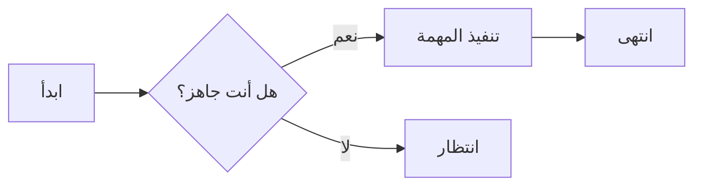
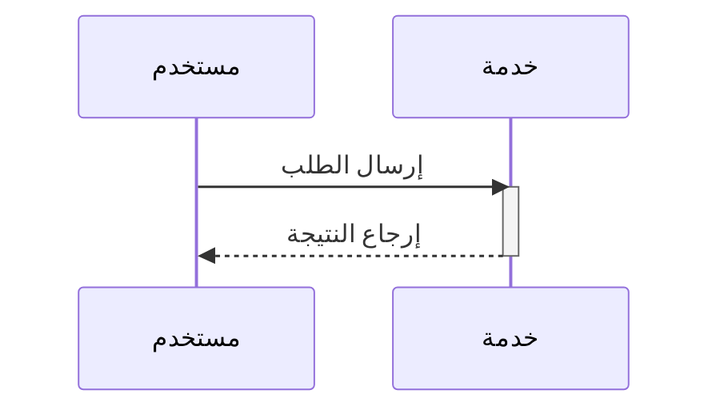

مرحباً بكم في صفحة اختبار صياغة Markdown. تغطي هذه المقالة الصياغات الشائعة لـ Markdown وGFM (نمط GitHub) والمعادلات ورسوم Mermaid للتحقق من خط العرض.

## مستويات العناوين

### عنوان من المستوى الثالث

هذا نص تحت h3. جميع العناوين h2/h3/h4 تحتوي على مراسي — حرك الماوس يسار العنوان سيظهر أيقونة رابط `#`.

#### عنوان من المستوى الرابع

يُستخدم h4 لأقسام أدق. يمكن خلط **غامق** و*مائل* و***غامق مائل*** و~~شطب~~ هنا.

## الفقرات وفواصل الأسطر

هذه فقرة. تُفصل الفقرات بأسطر فارغة ولا تُدمج الفقرات المتجاورة تلقائياً.

هذه هي الفقرة الثانية. يمكن فرض فاصل سطر ناعم بإضافة مسافتين في نهاية السطر ثم الانتقال لسطر جديد  
بهذا ينتقل النص إلى السطر التالي.

## أنماط النص

- **غامق**:`**غامق**`
- *مائل*:`*مائل*`
- ***غامق مائل***:`***غامق مائل***`
- ~~شطب~~:`~~شطب~~`(GFM)
- كود سطري:`const x = 1`
- مرتفع/منخفض:x<sup>2</sup>、H<sub>2</sub>O

## الروابط

- رابط سطري:[مدونة Nettix](https://luoyuhao.nettix.top)
- رابط بعنوان:[زيارة الوثائق](https://luoyuhao.nettix.top "الصفحة الرئيسية للوثائق")
- رابط مرجعي:[موقع مثال][ref]
- رابط تلقائي:<https://luoyuhao.nettix.top>

[ref]: https://luoyuhao.nettix.top "وجهة الرابط المرجعي"

## الصور


تدعم الصور alt وtitle، ولا يمكن تحديدها أو سحبها.

## القوائم

### قائمة غير مرقمة

- البند 1
- البند 2
  - بند متداخل A
  - بند متداخل B
- البند 3

### قائمة مرقمة

1. الخطوة 1
2. الخطوة 2
3. الخطوة 3
   1. خطوة متداخلة a
   2. خطوة متداخلة b

### قائمة المهام (GFM)

- [x] مهمة مكتملة
- [ ] مهمة غير مكتملة
- [x] مهمة تحتوي `code`

## الاقتباس

> هذا اقتباس.
>
> > اقتباس متداخل.
>
> يمكن أن يتضمن الاقتباس **غامقاً** و`كوداً سطرياً`.

## الكود

كود سطري:`npm run dev`。

كتلة كود مسيجة (JavaScript):

```javascript
function greet(name) {
  return `Hello, ${name}!`;
}
```

TypeScript:

```typescript
interface User {
  id: number;
  name: string;
}
const user: User = { id: 1, name: "Alice" };
```

Python:

```python
def fib(n):
    a, b = 0, 1
    for _ in range(n):
        a, b = b, a + b
    return a
```

Shell:

```bash
# تثبيت التبعيات
pnpm install
```

## الجدول

| المحاذاة | يسار | وسط | يمين |
| :------- | :--- | :-: | ---: |
| مثال     | نص   | نص  |   نص |
| قيمة     | 100  | 200 |   300 |

## الفاصل

ما سبق محتوى، ويُفصل عما يلي:

---

محتوى بعد الفاصل.

## المعادلات الرياضية

معادلة سطرية:متطابقة أويلر $e^{i\pi} + 1 = 0$。

معادلة كتلة:

$$
\int_{-\infty}^{\infty} e^{-x^2}\,dx = \sqrt{\pi}
$$

## رسوم Mermaid

### مخطط تدفقي



### مخطط تسلسلي



## HTML خام وصورة بارزة

أدناه صورة ملفوفة بـ HTML خام، تمتد إلى حافة الورقة في وضع الورقة:

<figure class="full-bleed">
  
  <figcaption class="px-2 pt-2 text-center text-sm text-text-muted">يمتد إلى حافة الورقة</figcaption>
</figure>

## الرموز التعبيرية والأحرف الخاصة

😄 🚀 ✨ —— والأحرف التي تتطلب تهريباً:`&`、`<`、`>`、`"`。

## الخاتمة

تغطي هذه المقالة معظم الصياغات الشائعة. إذا لاحظت أي خلل في العرض، يُرجى إبلاغي.
