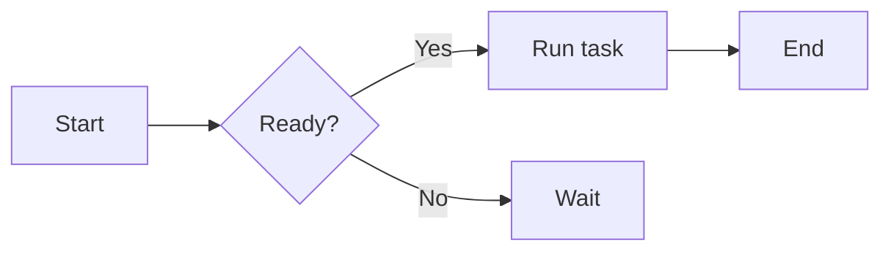
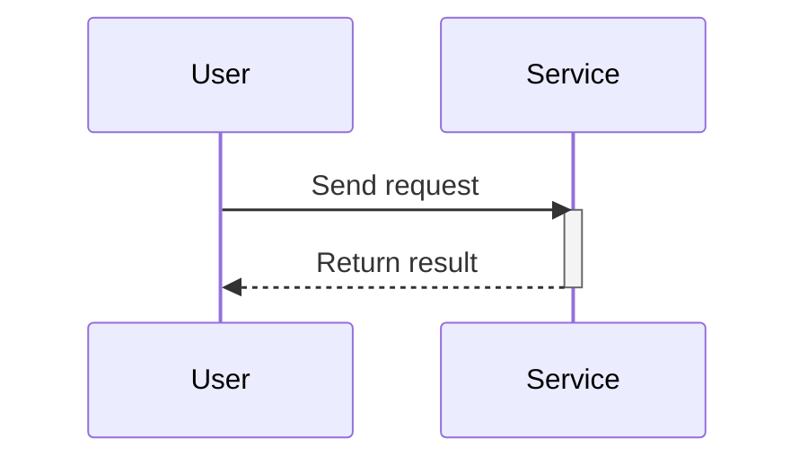

# Headers

```
# h1 Heading 8-)
## h2 Heading
### h3 Heading
#### h4 Heading
##### h5 Heading
###### h6 Heading

Alternatively, for H1 and H2, an underline-ish style:

Alt-H1
======

Alt-H2
------
```

# h1 Heading 8-)
## h2 Heading
### h3 Heading
#### h4 Heading
##### h5 Heading
###### h6 Heading

Alternatively, for H1 and H2, an underline-ish style:

Alt-H1
======

Alt-H2
------

------

# Emphasis

```
Emphasis, aka italics, with *asterisks* or _underscores_.

Strong emphasis, aka bold, with **asterisks** or __underscores__.

Combined emphasis with **asterisks and _underscores_**.

Strikethrough uses two tildes. ~~Scratch this.~~

**This is bold text**

__This is bold text__

*This is italic text*

_This is italic text_

~~Strikethrough~~
```

Emphasis, aka italics, with *asterisks* or _underscores_.

Strong emphasis, aka bold, with **asterisks** or __underscores__.

Combined emphasis with **asterisks and _underscores_**.

Strikethrough uses two tildes. ~~Scratch this.~~

**This is bold text**

__This is bold text__

*This is italic text*

_This is italic text_

~~Strikethrough~~

------

# Lists

```
1. First ordered list item
2. Another item
⋅⋅* Unordered sub-list.
1. Actual numbers don't matter, just that it's a number
⋅⋅1. Ordered sub-list
4. And another item.

⋅⋅⋅You can have properly indented paragraphs within list items. Notice the blank line above, and the leading spaces (at least one, but we'll use three here to also align the raw Markdown).

⋅⋅⋅To have a line break without a paragraph, you will need to use two trailing spaces.⋅⋅
⋅⋅⋅Note that this line is separate, but within the same paragraph.⋅⋅
⋅⋅⋅(This is contrary to the typical GFM line break behaviour, where trailing spaces are not required.)

* Unordered list can use asterisks
- Or minuses
+ Or pluses

1. Make my changes
    1. Fix bug
    2. Improve formatting
        - Make the headings bigger
2. Push my commits to GitHub
3. Open a pull request
    * Describe my changes
    * Mention all the members of my team
        * Ask for feedback

+ Create a list by starting a line with `+`, `-`, or `*`
+ Sub-lists are made by indenting 2 spaces:
  - Marker character change forces new list start:
    * Ac tristique libero volutpat at
    + Facilisis in pretium nisl aliquet
    - Nulla volutpat aliquam velit
+ Very easy!
```

1. First ordered list item
2. Another item
⋅⋅* Unordered sub-list.
1. Actual numbers don't matter, just that it's a number
⋅⋅1. Ordered sub-list
4. And another item.

⋅⋅⋅You can have properly indented paragraphs within list items. Notice the blank line above, and the leading spaces (at least one, but we'll use three here to also align the raw Markdown).

⋅⋅⋅To have a line break without a paragraph, you will need to use two trailing spaces.⋅⋅
⋅⋅⋅Note that this line is separate, but within the same paragraph.⋅⋅
⋅⋅⋅(This is contrary to the typical GFM line break behaviour, where trailing spaces are not required.)

* Unordered list can use asterisks
- Or minuses
+ Or pluses

1. Make my changes
    1. Fix bug
    2. Improve formatting
        - Make the headings bigger
2. Push my commits to GitHub
3. Open a pull request
    * Describe my changes
    * Mention all the members of my team
        * Ask for feedback

+ Create a list by starting a line with `+`, `-`, or `*`
+ Sub-lists are made by indenting 2 spaces:
  - Marker character change forces new list start:
    * Ac tristique libero volutpat at
    + Facilisis in pretium nisl aliquet
    - Nulla volutpat aliquam velit
+ Very easy!

------

# Task lists

```
- [x] Finish my changes
- [ ] Push my commits to GitHub
- [ ] Open a pull request
- [x] @mentions, #refs, [links](), **formatting**, and <del>tags</del> supported
- [x] list syntax required (any unordered or ordered list supported)
- [x] this is a complete item
- [ ] this is an incomplete item
```

- [x] Finish my changes
- [ ] Push my commits to GitHub
- [ ] Open a pull request
- [x] @mentions, #refs, [links](), **formatting**, and <del>tags</del> supported
- [x] list syntax required (any unordered or ordered list supported)
- [ ] this is a complete item
- [ ] this is an incomplete item

------

# Ignoring Markdown formatting

You can tell GitHub to ignore (or escape) Markdown formatting by using \ before the Markdown character.

```
Let's rename \*our-new-project\* to \*our-old-project\*.
```

Let's rename \*our-new-project\* to \*our-old-project\*.

------

# Links

```
[I'm an inline-style link](https://www.google.com)

[I'm an inline-style link with title](https://www.google.com "Google's Homepage")

[I'm a reference-style link][Arbitrary case-insensitive reference text]

[I'm a relative reference to a repository file](../blob/master/LICENSE)

[You can use numbers for reference-style link definitions][1]

Or leave it empty and use the [link text itself].

URLs and URLs in angle brackets will automatically get turned into links.
http://www.example.com or <http://www.example.com> and sometimes
example.com (but not on Github, for example).

Some text to show that the reference links can follow later.

[arbitrary case-insensitive reference text]: https://www.mozilla.org
[1]: http://slashdot.org
[link text itself]: http://www.reddit.com
```

[I'm an inline-style link](https://www.google.com)

[I'm an inline-style link with title](https://www.google.com "Google's Homepage")

[I'm a reference-style link][Arbitrary case-insensitive reference text]

[I'm a relative reference to a repository file](../blob/master/LICENSE)

[You can use numbers for reference-style link definitions][1]

Or leave it empty and use the [link text itself].

URLs and URLs in angle brackets will automatically get turned into links.
http://www.example.com or <http://www.example.com> and sometimes
example.com (but not on Github, for example).

Some text to show that the reference links can follow later.

[arbitrary case-insensitive reference text]: https://www.mozilla.org
[1]: http://slashdot.org
[link text itself]: http://www.reddit.com

------

# Images

```
Here's our logo (hover to see the title text):

Inline-style:


Reference-style:
![alt text][logo]

[logo]: https://github.com/adam-p/markdown-here/raw/master/src/common/images/icon48.png "Logo Title Text 2"


Like links, Images also have a footnote style syntax

![Alt text][id]

With a reference later in the document defining the URL location:

[id]: https://octodex.github.com/images/dojocat.jpg  "The Dojocat"
```

Here's our logo (hover to see the title text):

Inline-style:


Reference-style:
![alt text][logo]

[logo]: https://github.com/adam-p/markdown-here/raw/master/src/common/images/icon48.png "Logo Title Text 2"


Like links, Images also have a footnote style syntax

![Alt text][id]

With a reference later in the document defining the URL location:

[id]: https://octodex.github.com/images/dojocat.jpg  "The Dojocat"

------

# [Footnotes](https://github.com/markdown-it/markdown-it-footnote)

```
Footnote 1 link[^first].

Footnote 2 link[^second].

Inline footnote^[Text of inline footnote] definition.

Duplicated footnote reference[^second].

[^first]: Footnote **can have markup**

    and multiple paragraphs.

[^second]: Footnote text.
```

Footnote 1 link[^first].

Footnote 2 link[^second].

Inline footnote^[Text of inline footnote] definition.

Duplicated footnote reference[^second].

[^first]: Footnote **can have markup**

    and multiple paragraphs.

[^second]: Footnote text.

------

# Code and Syntax Highlighting

```
Inline `code` has `back-ticks around` it.
```

Inline `code` has `back-ticks around` it.

```c#
using System.IO.Compression;

#pragma warning disable 414, 3021

namespace MyApplication
{
    [Obsolete("...")]
    class Program : IInterface
    {
        public static List<int> JustDoIt(int count)
        {
            Console.WriteLine($"Hello {Name}!");
            return new List<int>(new int[] { 1, 2, 3 })
        }
    }
}
```

```css
@font-face {
  font-family: Chunkfive; src: url('Chunkfive.otf');
}

body, .usertext {
  color: #F0F0F0; background: #600;
  font-family: Chunkfive, sans;
}

@import url(print.css);
@media print {
  a[href^=http]::after {
    content: attr(href)
  }
}
```

```javascript
function $initHighlight(block, cls) {
  try {
    if (cls.search(/\bno\-highlight\b/) != -1)
      return process(block, true, 0x0F) +
             ` class="${cls}"`;
  } catch (e) {
    /* handle exception */
  }
  for (var i = 0 / 2; i < classes.length; i++) {
    if (checkCondition(classes[i]) === undefined)
      console.log('undefined');
  }
}

export  $initHighlight;
```

```php
require_once 'Zend/Uri/Http.php';

namespace Location\Web;

interface Factory
{
    static function _factory();
}

abstract class URI extends BaseURI implements Factory
{
    abstract function test();

    public static $st1 = 1;
    const ME = "Yo";
    var $list = NULL;
    private $var;

    /**
     * Returns a URI
     *
     * @return URI
     */
    static public function _factory($stats = array(), $uri = 'http')
    {
        echo __METHOD__;
        $uri = explode(':', $uri, 0b10);
        $schemeSpecific = isset($uri[1]) ? $uri[1] : '';
        $desc = 'Multi
line description';

        // Security check
        if (!ctype_alnum($scheme)) {
            throw new Zend_Uri_Exception('Illegal scheme');
        }

        $this->var = 0 - self::$st;
        $this->list = list(Array("1"=> 2, 2=>self::ME, 3 => \Location\Web\URI::class));

        return [
            'uri'   => $uri,
            'value' => null,
        ];
    }
}

echo URI::ME . URI::$st1;

__halt_compiler () ; datahere
datahere
datahere */
datahere
```

------

# Tables

```
Colons can be used to align columns.

| Tables        | Are           | Cool  |
| ------------- |:-------------:| -----:|
| col 3 is      | right-aligned | $1600 |
| col 2 is      | centered      |   $12 |
| zebra stripes | are neat      |    $1 |

There must be at least 3 dashes separating each header cell.
The outer pipes (|) are optional, and you don't need to make the
raw Markdown line up prettily. You can also use inline Markdown.

Markdown | Less | Pretty
--- | --- | ---
*Still* | `renders` | **nicely**
1 | 2 | 3

| First Header  | Second Header |
| ------------- | ------------- |
| Content Cell  | Content Cell  |
| Content Cell  | Content Cell  |

| Command | Description |
| --- | --- |
| git status | List all new or modified files |
| git diff | Show file differences that haven't been staged |

| Command | Description |
| --- | --- |
| `git status` | List all *new or modified* files |
| `git diff` | Show file differences that **haven't been** staged |

| Left-aligned | Center-aligned | Right-aligned |
| :---         |     :---:      |          ---: |
| git status   | git status     | git status    |
| git diff     | git diff       | git diff      |

| Name     | Character |
| ---      | ---       |
| Backtick | `         |
| Pipe     | \|        |
```

Colons can be used to align columns.

| Tables        | Are           | Cool  |
| ------------- |:-------------:| -----:|
| col 3 is      | right-aligned | $1600 |
| col 2 is      | centered      |   $12 |
| zebra stripes | are neat      |    $1 |

There must be at least 3 dashes separating each header cell.
The outer pipes (|) are optional, and you don't need to make the
raw Markdown line up prettily. You can also use inline Markdown.

Markdown | Less | Pretty
--- | --- | ---
*Still* | `renders` | **nicely**
1 | 2 | 3

| First Header  | Second Header |
| ------------- | ------------- |
| Content Cell  | Content Cell  |
| Content Cell  | Content Cell  |

| Command | Description |
| --- | --- |
| git status | List all new or modified files |
| git diff | Show file differences that haven't been staged |

| Command | Description |
| --- | --- |
| `git status` | List all *new or modified* files |
| `git diff` | Show file differences that **haven't been** staged |

| Left-aligned | Center-aligned | Right-aligned |
| :---         |     :---:      |          ---: |
| git status   | git status     | git status    |
| git diff     | git diff       | git diff      |

| Name     | Character |
| ---      | ---       |
| Backtick | `         |
| Pipe     | \|        |

<!-- Wide table: 11 columns × 15 rows, tests horizontal scrolling/wrapping of oversized tables -->

| Query Type | 10 rows | 100 rows | 1K rows | 10K rows | 100K rows | 1M rows | 10M rows | 100M rows | 1B rows |
| :--- | ---: | ---: | ---: | ---: | ---: | ---: | ---: | ---: | ---: |
| SELECT * | 0.4 ms | 1.2 ms | 4.8 ms | 18.6 ms | 71.2 ms | 289.4 ms | 1.31 s | 6.84 s | 29.3 s |
| SELECT COUNT(*) | 0.2 ms | 0.5 ms | 1.9 ms | 7.4 ms | 28.9 ms | 112.7 ms | 0.52 s | 2.61 s | 11.8 s |
| WHERE filter | 0.3 ms | 0.9 ms | 3.6 ms | 13.8 ms | 52.4 ms | 198.2 ms | 0.87 s | 4.19 s | 18.7 s |
| JOIN (2 tables) | 0.6 ms | 2.4 ms | 9.7 ms | 38.2 ms | 149.5 ms | 588.1 ms | 2.64 s | 13.9 s | — |
| JOIN (3 tables) | 0.9 ms | 3.8 ms | 15.2 ms | 61.7 ms | 243.8 ms | 967.3 ms | 4.31 s | 22.7 s | — |
| GROUP BY | 0.5 ms | 1.7 ms | 6.3 ms | 24.9 ms | 98.6 ms | 376.4 ms | 1.72 s | 8.93 s | 38.1 s |
| ORDER BY | 0.7 ms | 2.2 ms | 8.8 ms | 35.1 ms | 137.9 ms | 531.6 ms | 2.38 s | 12.4 s | 51.7 s |
| INSERT (single) | 0.8 ms | 1.1 ms | 1.6 ms | 2.9 ms | 6.7 ms | 18.4 ms | 0.09 s | 0.44 s | 2.1 s |
| INSERT (batch 100) | 0.9 ms | 1.4 ms | 3.1 ms | 7.8 ms | 21.4 ms | 74.6 ms | 0.31 s | 1.48 s | 7.2 s |
| UPDATE | 0.6 ms | 2.0 ms | 7.4 ms | 29.8 ms | 118.3 ms | 462.5 ms | 2.05 s | 10.6 s | — |
| DELETE | 0.6 ms | 1.9 ms | 7.1 ms | 28.4 ms | 112.8 ms | 441.9 ms | 1.96 s | 10.1 s | — |
| CREATE INDEX | 1.2 ms | 2.8 ms | 9.4 ms | 41.7 ms | 173.2 ms | 715.8 ms | 3.12 s | 15.8 s | 68.4 s |
| DROP INDEX | 0.8 ms | 1.6 ms | 5.2 ms | 19.3 ms | 76.9 ms | 302.7 ms | 1.33 s | 6.97 s | 30.1 s |
| VACUUM | 3.4 ms | 8.9 ms | 27.6 ms | 104.3 ms | 396.8 ms | 1.47 s | 6.12 s | 27.4 s | — |
| ANALYZE | 1.1 ms | 2.5 ms | 7.9 ms | 28.7 ms | 109.2 ms | 415.3 ms | 1.78 s | 8.62 s | — |
| CLUSTER | 2.1 ms | 5.6 ms | 18.9 ms | 67.3 ms | 254.8 ms | 968.2 ms | 3.87 s | 16.2 s | — |
| REINDEX | 1.9 ms | 4.8 ms | 15.7 ms | 58.4 ms | 221.6 ms | 843.1 ms | 3.41 s | 14.7 s | — |
| TRUNCATE | 0.9 ms | 1.4 ms | 2.2 ms | 4.1 ms | 8.7 ms | 19.6 ms | 0.11 s | 0.52 s | 2.3 s |
| COPY (in) | 1.1 ms | 2.9 ms | 9.8 ms | 36.2 ms | 138.4 ms | 527.9 ms | 2.19 s | 9.84 s | 42.6 s |
| COPY (out) | 0.8 ms | 2.1 ms | 7.2 ms | 27.9 ms | 108.6 ms | 419.2 ms | 1.83 s | 8.11 s | 35.4 s |
| EXPLAIN ANALYZE | 0.5 ms | 1.3 ms | 4.9 ms | 19.7 ms | 77.4 ms | 301.8 ms | 1.36 s | 6.52 s | 28.9 s |
| SHOW ALL | 0.1 ms | 0.2 ms | 0.3 ms | 0.4 ms | 0.6 ms | 1.1 ms | 0.01 s | 0.04 s | 0.2 s |
| SET config | 0.3 ms | 0.4 ms | 0.5 ms | 0.7 ms | 1.2 ms | 2.8 ms | 0.02 s | 0.09 s | 0.4 s |
| LOCK TABLE | 0.7 ms | 1.2 ms | 2.8 ms | 6.4 ms | 15.8 ms | 41.2 ms | 0.19 s | 0.93 s | 4.1 s |
| GRANT / REVOKE | 0.4 ms | 0.9 ms | 1.8 ms | 3.6 ms | 8.1 ms | 19.7 ms | 0.09 s | 0.44 s | 2.0 s |
| ALTER TABLE | 1.4 ms | 3.2 ms | 9.1 ms | 26.8 ms | 84.6 ms | 271.3 ms | 1.12 s | 5.87 s | 25.3 s |
| CHECKPOINT | 8.7 ms | 14.2 ms | 31.5 ms | 78.9 ms | 214.6 ms | 642.3 ms | 2.78 s | 12.9 s | — |
| SAVEPOINT | 0.5 ms | 1.1 ms | 2.4 ms | 5.2 ms | 12.7 ms | 33.6 ms | 0.15 s | 0.72 s | 3.1 s |
| PREPARE | 0.6 ms | 1.5 ms | 4.3 ms | 12.8 ms | 41.5 ms | 139.2 ms | 0.58 s | 2.94 s | 13.2 s |
| LISTEN / NOTIFY | 0.7 ms | 1.6 ms | 3.9 ms | 9.4 ms | 24.8 ms | 67.3 ms | 0.31 s | 1.56 s | 7.0 s |

------

# Blockquotes

```
> Blockquotes are very handy in email to emulate reply text.
> This line is part of the same quote.

Quote break.

> This is a very long line that will still be quoted properly when it wraps. Oh boy let's keep writing to make sure this is long enough to actually wrap for everyone. Oh, you can *put* **Markdown** into a blockquote.

> Blockquotes can also be nested...
>> ...by using additional greater-than signs right next to each other...
> > > ...or with spaces between arrows.
```

> Blockquotes are very handy in email to emulate reply text.
> This line is part of the same quote.

Quote break.

> This is a very long line that will still be quoted properly when it wraps. Oh boy let's keep writing to make sure this is long enough to actually wrap for everyone. Oh, you can *put* **Markdown** into a blockquote.

> Blockquotes can also be nested...
>> ...by using additional greater-than signs right next to each other...
> > > ...or with spaces between arrows.

------

# Inline HTML

```
<dl>
  <dt>Definition list</dt>
  <dd>Is something people use sometimes.</dd>

  <dt>Markdown in HTML</dt>
  <dd>Does *not* work **very** well. Use HTML <em>tags</em>.</dd>
</dl>
```

<dl>
  <dt>Definition list</dt>
  <dd>Is something people use sometimes.</dd>

  <dt>Markdown in HTML</dt>
  <dd>Does *not* work **very** well. Use HTML <em>tags</em>.</dd>
</dl>

------

# Image Layout

Standalone image (no suffix, full-width hero):


Inline image: an  icon sits inside the text; the image keeps its natural size and does not stretch across the line.

Forced small image (standalone, centered):


Floating image (left): this is a text paragraph with the image floated to the left,  and the following text wraps around the right side of the image, newspaper-style. The paragraph is kept long on purpose so the wrapping is easy to see.

Floating image (right): this is another text paragraph with the image floated to the right,  the text spreads out first, the image sits to the right, and the following text wraps around its left side.

Side-by-side pair (image and caption in one row):


This is the paired caption, displayed in the same container as the image; it stacks and wraps automatically on narrow screens.

Multi-image gallery (several images in one row):

  

# Horizontal Rules

```
Three or more...

---

Hyphens

***

Asterisks

___

Underscores
```

Three or more...

---

Hyphens

***

Asterisks

___

Underscores

------

# YouTube Videos

```
<a href="http://www.youtube.com/watch?feature=player_embedded&v=YOUTUBE_VIDEO_ID_HERE" target="_blank">

</a>
```

<a href="http://www.youtube.com/watch?feature=player_embedded&v=YOUTUBE_VIDEO_ID_HERE" target="_blank">

</a>

```
[](http://www.youtube.com/watch?v=YOUTUBE_VIDEO_ID_HERE)
```

[](https://www.youtube.com/watch?v=ciawICBvQoE)


-------


## Math Formulas

Inline formula: Euler's identity $e^{i\pi} + 1 = 0$.

Block formula:

$$
\int_{-\infty}^{\infty} e^{-x^2}\,dx = \sqrt{\pi}
$$

## Mermaid Diagrams

### Flowchart



### Sequence diagram


