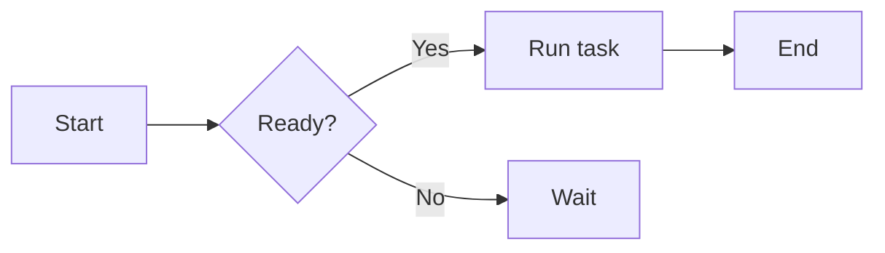
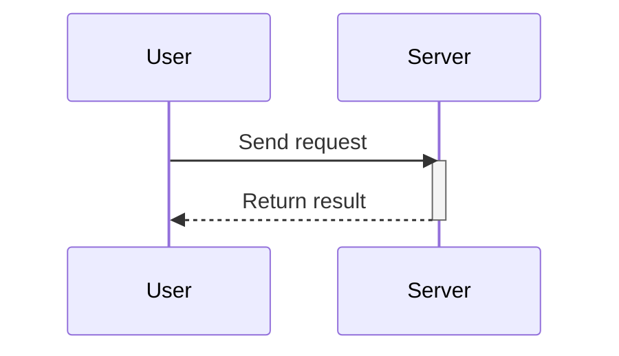

Welcome to the Markdown syntax test page. This post covers common Markdown, GFM (GitHub Flavored Markdown), math formulas and Mermaid diagrams to exercise the rendering pipeline.

## Headings

### H3 heading

Body text under an H3. Every H2/H3/H4 heading has an anchor — hover the left edge of the heading to reveal the `#` link icon.

#### H4 heading

H4 is for finer sections. **Bold**, *italic*, ***bold italic*** and ~~strikethrough~~ mix freely here.

## Paragraphs & line breaks

This is a paragraph. Paragraphs are separated by blank lines and never merge automatically.

This is a second paragraph. Two trailing spaces at the end of a line force a soft line break  
so the text continues on the next line.

## Inline styles

- **Bold**: `**bold**`
- *Italic*: `*italic*`
- ***Bold italic***: `***bold italic***`
- ~~Strikethrough~~: `~~strikethrough~~` (GFM)
- Inline code: `const x = 1`
- Superscript/subscript: x<sup>2</sup>, H<sub>2</sub>O

## Links

- Inline link: [Nettix Blog](https://luoyuhao.nettix.top)
- Link with title: [Visit docs](https://luoyuhao.nettix.top "Docs home")
- Reference link: [Example][ref]
- Autolink: <https://luoyuhao.nettix.top>

[ref]: https://luoyuhao.nettix.top "Reference link target"

## Images


Images carry alt and title, and are neither selectable nor draggable.

## Lists

### Unordered

- Item one
- Item two
  - Nested A
  - Nested B
- Item three

### Ordered

1. First
2. Second
3. Third
   1. Nested a
   2. Nested b

### Task list (GFM)

- [x] Completed task
- [ ] Open task
- [x] Task with `code`

## Blockquotes

> This is a blockquote.
>
> > Nested blockquote.
>
> A blockquote can include **bold** and `inline code`.

## Code

Inline code: `npm run dev`.

Fenced block (JavaScript):

```javascript
function greet(name) {
  return `Hello, ${name}!`;
}
```

TypeScript:

```typescript
interface User {
  id: number;
  name: string;
}
const user: User = { id: 1, name: "Alice" };
```

Python:

```python
def fib(n):
    a, b = 0, 1
    for _ in range(n):
        a, b = b, a + b
    return a
```

Shell:

```bash
# install dependencies
pnpm install
```

## Tables

| Alignment | Left  | Center | Right |
| :-------- | :---- | :----: | ----: |
| Example   | text  | text   |  text |
| Value     | 100   | 200    |   300 |

## Horizontal rule

Content above, split by a rule below:

---

Content after the rule.

## Math

Inline: Euler's identity $e^{i\pi} + 1 = 0$.

Display:

$$
\int_{-\infty}^{\infty} e^{-x^2}\,dx = \sqrt{\pi}
$$

## Mermaid diagrams

### Flowchart



### Sequence



## Raw HTML & full-bleed image

Wrapped in raw HTML, this one bleeds to the paper edge:

<figure class="full-bleed">
  
  <figcaption class="px-2 pt-2 text-center text-sm text-text-muted">Flush to the paper edge</figcaption>
</figure>

## Emoji & special characters

😄 🚀 ✨ — plus characters that need escaping: `&`, `<`, `>`, `"`.

## Closing

That covers most common syntax. If anything renders wrong, please report it.
