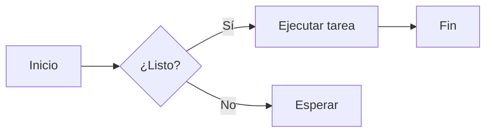
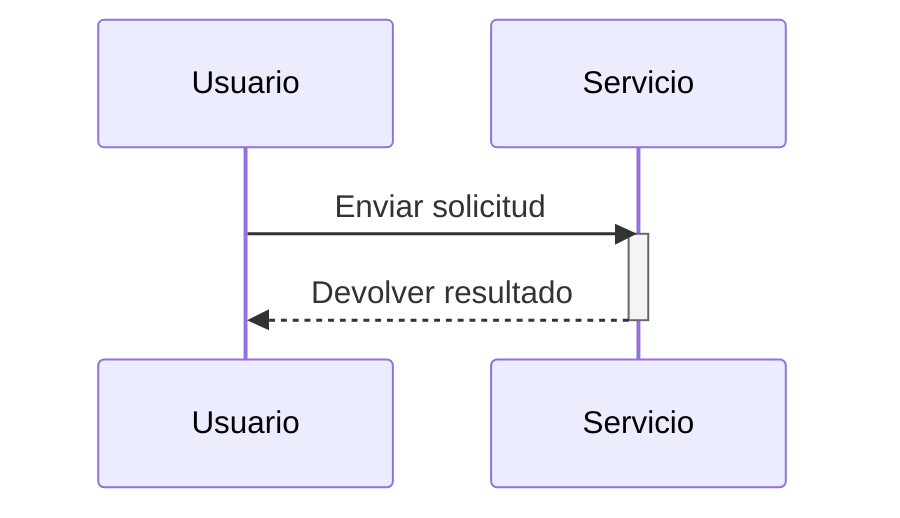

# Encabezados

```
# h1 Encabezado 8-)
## h2 Encabezado
### h3 Encabezado
#### h4 Encabezado
##### h5 Encabezado
###### h6 Encabezado

Alternativamente, para H1 y H2, un estilo subrayado:

Alt-H1
======

Alt-H2
------
```

# h1 Encabezado 8-)
## h2 Encabezado
### h3 Encabezado
#### h4 Encabezado
##### h5 Encabezado
###### h6 Encabezado

Alternativamente, para H1 y H2, un estilo subrayado:

Alt-H1
======

Alt-H2
------

------

# Énfasis

```
Énfasis, también cursiva, con *asteriscos* o _guiones bajos_.

Énfasis fuerte, también negrita, con **asteriscos** o __guiones bajos__.

Énfasis combinado con **asteriscos y _guiones bajos_**.

El tachado usa dos virgulillas. ~~Tacha esto.~~

**Esto es texto en negrita**

__Esto también es texto en negrita__

*Esto es texto en cursiva*

_Esto también es texto en cursiva_

~~Tachado~~
```

Énfasis, también cursiva, con *asteriscos* o _guiones bajos_.

Énfasis fuerte, también negrita, con **asteriscos** o __guiones bajos__.

Énfasis combinado con **asteriscos y _guiones bajos_**.

El tachado usa dos virgulillas. ~~Tacha esto.~~

**Esto es texto en negrita**

__Esto también es texto en negrita__

*Esto es texto en cursiva*

_Esto también es texto en cursiva_

~~Tachado~~

------

# Listas

```
1. Primer elemento de la lista ordenada
2. Otro elemento
⋅⋅* Sublista desordenada.
1. Los números reales no importan, solo que sea un número
⋅⋅1. Sublista ordenada
4. Y otro elemento.

⋅⋅⋅Puedes tener párrafos correctamente sangrados dentro de los elementos de lista. Observa la línea en blanco de arriba y los espacios iniciales (al menos uno, pero usaremos tres aquí para alinear también el Markdown original).

⋅⋅⋅Para tener un salto de línea sin párrafo, necesitarás usar dos espacios al final.⋅⋅
⋅⋅⋅Ten en cuenta que esta línea es independiente, pero dentro del mismo párrafo.⋅⋅
⋅⋅⋅(Esto contradice el comportamiento típico de salto de línea de GFM, donde los espacios finales no son necesarios.)

* La lista desordenada puede usar asteriscos
- O guiones
+ O signos más

1. Hacer mis cambios
    1. Arreglar el error
    2. Mejorar el formato
        - Agrandar los encabezados
2. Subir mis commits a GitHub
3. Abrir una pull request
    * Describir mis cambios
    * Mencionar a todos los miembros de mi equipo
        * Pedir comentarios

+ Crea una lista comenzando una línea con `+`, `-` o `*`
+ Las sublistas se crean sangrando 2 espacios:
  - Un cambio de marcador fuerza un nuevo inicio de lista:
    * Ac tristique libero volutpat at
    + Facilisis in pretium nisl aliquet
    - Nulla volutpat aliquam velit
+ ¡Muy fácil!
```

1. Primer elemento de la lista ordenada
2. Otro elemento
⋅⋅* Sublista desordenada.
1. Los números reales no importan, solo que sea un número
⋅⋅1. Sublista ordenada
4. Y otro elemento.

⋅⋅⋅Puedes tener párrafos correctamente sangrados dentro de los elementos de lista. Observa la línea en blanco de arriba y los espacios iniciales (al menos uno, pero usaremos tres aquí para alinear también el Markdown original).

⋅⋅⋅Para tener un salto de línea sin párrafo, necesitarás usar dos espacios al final.⋅⋅
⋅⋅⋅Ten en cuenta que esta línea es independiente, pero dentro del mismo párrafo.⋅⋅
⋅⋅⋅(Esto contradice el comportamiento típico de salto de línea de GFM, donde los espacios finales no son necesarios.)

* La lista desordenada puede usar asteriscos
- O guiones
+ O signos más

1. Hacer mis cambios
    1. Arreglar el error
    2. Mejorar el formato
        - Agrandar los encabezados
2. Subir mis commits a GitHub
3. Abrir una pull request
    * Describir mis cambios
    * Mencionar a todos los miembros de mi equipo
        * Pedir comentarios

+ Crea una lista comenzando una línea con `+`, `-` o `*`
+ Las sublistas se crean sangrando 2 espacios:
  - Un cambio de marcador fuerza un nuevo inicio de lista:
    * Ac tristique libero volutpat at
    + Facilisis in pretium nisl aliquet
    - Nulla volutpat aliquam velit
+ ¡Muy fácil!

------

# Listas de tareas

```
- [x] Terminar mis cambios
- [ ] Subir mis commits a GitHub
- [ ] Abrir una pull request
- [x] Se admiten @menciones, #referencias, [enlaces](), **formato** y <del>etiquetas</del>
- [x] Se requiere sintaxis de lista (se admite cualquier lista ordenada o desordenada)
- [x] Este es un elemento completo
- [ ] Este es un elemento incompleto
```

- [x] Terminar mis cambios
- [ ] Subir mis commits a GitHub
- [ ] Abrir una pull request
- [x] Se admiten @menciones, #referencias, [enlaces](), **formato** y <del>etiquetas</del>
- [x] Se requiere sintaxis de lista (se admite cualquier lista ordenada o desordenada)
- [ ] Este es un elemento completo
- [ ] Este es un elemento incompleto

------

# Ignorar el formato de Markdown

Puedes indicarle a GitHub que ignore (o escape) el formato de Markdown poniendo \ antes del carácter Markdown.

```
Cambiemos \*our-new-project\* a \*our-old-project\*.
```

Cambiemos \*our-new-project\* a \*our-old-project\*.

------

# Enlaces

```
[Soy un enlace en línea](https://www.google.com)

[Soy un enlace en línea con título](https://www.google.com "Página de Google")

[Soy un enlace por referencia][Texto de referencia insensible a mayúsculas]

[Soy una referencia relativa a un archivo del repositorio](../blob/master/LICENSE)

[Puedes usar números para definir enlaces por referencia][1]

O déjalo vacío y usa el [propio texto del enlace].

Las URL y las URL entre corchetes angulares se convierten automáticamente en enlaces.
http://www.example.com o <http://www.example.com> y a veces
example.com (pero no en Github, por ejemplo).

Algo de texto para mostrar que los enlaces de referencia pueden definirse más adelante.

[texto de referencia insensible a mayúsculas]: https://www.mozilla.org
[1]: http://slashdot.org
[propio texto del enlace]: http://www.reddit.com
```

[Soy un enlace en línea](https://www.google.com)

[Soy un enlace en línea con título](https://www.google.com "Página de Google")

[Soy un enlace por referencia][Texto de referencia insensible a mayúsculas]

[Soy una referencia relativa a un archivo del repositorio](../blob/master/LICENSE)

[Puedes usar números para definir enlaces por referencia][1]

O déjalo vacío y usa el [propio texto del enlace].

Las URL y las URL entre corchetes angulares se convierten automáticamente en enlaces.
http://www.example.com o <http://www.example.com> y a veces
example.com (pero no en Github, por ejemplo).

Algo de texto para mostrar que los enlaces de referencia pueden definirse más adelante.

[texto de referencia insensible a mayúsculas]: https://www.mozilla.org
[1]: http://slashdot.org
[propio texto del enlace]: http://www.reddit.com

------

# Imágenes

```
Aquí está nuestro logotipo (pasa el cursor para ver el texto del título):

En línea:


Por referencia:
![texto alternativo][logo]

[logo]: https://github.com/adam-p/markdown-here/raw/master/src/common/images/icon48.png "Texto del título del logotipo 2"


Al igual que los enlaces, las imágenes también tienen una sintaxis de nota al pie

![Texto alternativo][id]

Con una referencia más adelante en el documento que define la ubicación de la URL:

[id]: https://octodex.github.com/images/dojocat.jpg  "El Dojocat"
```

Aquí está nuestro logotipo (pasa el cursor para ver el texto del título):

En línea:


Por referencia:
![texto alternativo][logo]

[logo]: https://github.com/adam-p/markdown-here/raw/master/src/common/images/icon48.png "Texto del título del logotipo 2"


Al igual que los enlaces, las imágenes también tienen una sintaxis de nota al pie

![Texto alternativo][id]

Con una referencia más adelante en el documento que define la ubicación de la URL:

[id]: https://octodex.github.com/images/dojocat.jpg  "El Dojocat"

------

# [Notas al pie](https://github.com/markdown-it/markdown-it-footnote)

```
Enlace de la nota al pie 1[^first].

Enlace de la nota al pie 2[^second].

Definición de nota al pie en línea^[Texto de la nota al pie en línea].

Referencia de nota al pie duplicada[^second].

[^first]: La nota al pie **puede contener formato**

    y varios párrafos.

[^second]: Texto de la nota al pie.
```

Enlace de la nota al pie 1[^first].

Enlace de la nota al pie 2[^second].

Definición de nota al pie en línea^[Texto de la nota al pie en línea].

Referencia de nota al pie duplicada[^second].

[^first]: La nota al pie **puede contener formato**

    y varios párrafos.

[^second]: Texto de la nota al pie.

------

# Código y resaltado de sintaxis

```
El `código` en línea tiene `acentos graves alrededor`.
```

El `código` en línea tiene `acentos graves alrededor`.

```c#
using System.IO.Compression;

#pragma warning disable 414, 3021

namespace MyApplication
{
    [Obsolete("...")]
    class Program : IInterface
    {
        public static List<int> JustDoIt(int count)
        {
            Console.WriteLine($"Hello {Name}!");
            return new List<int>(new int[] { 1, 2, 3 })
        }
    }
}
```

```css
@font-face {
  font-family: Chunkfive; src: url('Chunkfive.otf');
}

body, .usertext {
  color: #F0F0F0; background: #600;
  font-family: Chunkfive, sans;
}

@import url(print.css);
@media print {
  a[href^=http]::after {
    content: attr(href)
  }
}
```

```javascript
function $initHighlight(block, cls) {
  try {
    if (cls.search(/\bno\-highlight\b/) != -1)
      return process(block, true, 0x0F) +
             ` class="${cls}"`;
  } catch (e) {
    /* handle exception */
  }
  for (var i = 0 / 2; i < classes.length; i++) {
    if (checkCondition(classes[i]) === undefined)
      console.log('undefined');
  }
}

export  $initHighlight;
```

```php
require_once 'Zend/Uri/Http.php';

namespace Location\Web;

interface Factory
{
    static function _factory();
}

abstract class URI extends BaseURI implements Factory
{
    abstract function test();

    public static $st1 = 1;
    const ME = "Yo";
    var $list = NULL;
    private $var;

    /**
     * Returns a URI
     *
     * @return URI
     */
    static public function _factory($stats = array(), $uri = 'http')
    {
        echo __METHOD__;
        $uri = explode(':', $uri, 0b10);
        $schemeSpecific = isset($uri[1]) ? $uri[1] : '';
        $desc = 'Multi
line description';

        // Security check
        if (!ctype_alnum($scheme)) {
            throw new Zend_Uri_Exception('Illegal scheme');
        }

        $this->var = 0 - self::$st;
        $this->list = list(Array("1"=> 2, 2=>self::ME, 3 => \Location\Web\URI::class));

        return [
            'uri'   => $uri,
            'value' => null,
        ];
    }
}

echo URI::ME . URI::$st1;

__halt_compiler () ; datahere
datahere
datahere */
datahere
```

------

# Tablas

```
Se pueden usar dos puntos para alinear las columnas.

| Tables        | Are           | Cool  |
| ------------- |:-------------:| -----:|
| col 3 is      | right-aligned | $1600 |
| col 2 is      | centered      |   $12 |
| zebra stripes | are neat      |    $1 |

Debe haber al menos 3 guiones separando cada celda de encabezado.
Las barras verticales exteriores (|) son opcionales y no necesitas alinear el Markdown original de forma bonita. También puedes usar Markdown en línea.

Markdown | Less | Pretty
--- | --- | ---
*Still* | `renders` | **nicely**
1 | 2 | 3

| Primer encabezado  | Segundo encabezado |
| ------------- | ------------- |
| Celda de contenido  | Celda de contenido  |
| Celda de contenido  | Celda de contenido  |

| Comando | Descripción |
| --- | --- |
| git status | Lista todos los archivos nuevos o modificados |
| git diff | Muestra las diferencias que aún no se han preparado |

| Comando | Descripción |
| --- | --- |
| `git status` | Lista todos los archivos *nuevos o modificados* |
| `git diff` | Muestra las diferencias que **aún no se han** preparado |

| Alineado a la izquierda | Centrado | Alineado a la derecha |
| :---         |     :---:      |          ---: |
| git status   | git status     | git status    |
| git diff     | git diff       | git diff      |

| Nombre     | Carácter |
| ---      | ---       |
| Acento grave | `         |
| Barra vertical | \|        |
```

Se pueden usar dos puntos para alinear las columnas.

| Tables        | Are           | Cool  |
| ------------- |:-------------:| -----:|
| col 3 is      | right-aligned | $1600 |
| col 2 is      | centered      |   $12 |
| zebra stripes | are neat      |    $1 |

Debe haber al menos 3 guiones separando cada celda de encabezado.
Las barras verticales exteriores (|) son opcionales y no necesitas alinear el Markdown original de forma bonita. También puedes usar Markdown en línea.

Markdown | Less | Pretty
--- | --- | ---
*Still* | `renders` | **nicely**
1 | 2 | 3

| Primer encabezado  | Segundo encabezado |
| ------------- | ------------- |
| Celda de contenido  | Celda de contenido  |
| Celda de contenido  | Celda de contenido  |

| Comando | Descripción |
| --- | --- |
| git status | Lista todos los archivos nuevos o modificados |
| git diff | Muestra las diferencias que aún no se han preparado |

| Comando | Descripción |
| --- | --- |
| `git status` | Lista todos los archivos *nuevos o modificados* |
| `git diff` | Muestra las diferencias que **aún no se han** preparado |

| Alineado a la izquierda | Centrado | Alineado a la derecha |
| :---         |     :---:      |          ---: |
| git status   | git status     | git status    |
| git diff     | git diff       | git diff      |

| Nombre     | Carácter |
| ---      | ---       |
| Acento grave | `         |
| Barra vertical | \|        |

<!-- Tabla ancha: 11 columnas × 15 filas, prueba el desplazamiento horizontal y el ajuste de tablas sobredimensionadas -->

| Tipo de consulta | 10 filas | 100 filas | 1K filas | 10K filas | 100K filas | 1M filas | 10M filas | 100M filas | 1B filas |
| :--- | ---: | ---: | ---: | ---: | ---: | ---: | ---: | ---: | ---: |
| SELECT * | 0.4 ms | 1.2 ms | 4.8 ms | 18.6 ms | 71.2 ms | 289.4 ms | 1.31 s | 6.84 s | 29.3 s |
| SELECT COUNT(*) | 0.2 ms | 0.5 ms | 1.9 ms | 7.4 ms | 28.9 ms | 112.7 ms | 0.52 s | 2.61 s | 11.8 s |
| Filtro WHERE | 0.3 ms | 0.9 ms | 3.6 ms | 13.8 ms | 52.4 ms | 198.2 ms | 0.87 s | 4.19 s | 18.7 s |
| JOIN (2 tablas) | 0.6 ms | 2.4 ms | 9.7 ms | 38.2 ms | 149.5 ms | 588.1 ms | 2.64 s | 13.9 s | — |
| JOIN (3 tablas) | 0.9 ms | 3.8 ms | 15.2 ms | 61.7 ms | 243.8 ms | 967.3 ms | 4.31 s | 22.7 s | — |
| GROUP BY | 0.5 ms | 1.7 ms | 6.3 ms | 24.9 ms | 98.6 ms | 376.4 ms | 1.72 s | 8.93 s | 38.1 s |
| ORDER BY | 0.7 ms | 2.2 ms | 8.8 ms | 35.1 ms | 137.9 ms | 531.6 ms | 2.38 s | 12.4 s | 51.7 s |
| INSERT (único) | 0.8 ms | 1.1 ms | 1.6 ms | 2.9 ms | 6.7 ms | 18.4 ms | 0.09 s | 0.44 s | 2.1 s |
| INSERT (lote 100) | 0.9 ms | 1.4 ms | 3.1 ms | 7.8 ms | 21.4 ms | 74.6 ms | 0.31 s | 1.48 s | 7.2 s |
| UPDATE | 0.6 ms | 2.0 ms | 7.4 ms | 29.8 ms | 118.3 ms | 462.5 ms | 2.05 s | 10.6 s | — |
| DELETE | 0.6 ms | 1.9 ms | 7.1 ms | 28.4 ms | 112.8 ms | 441.9 ms | 1.96 s | 10.1 s | — |
| CREATE INDEX | 1.2 ms | 2.8 ms | 9.4 ms | 41.7 ms | 173.2 ms | 715.8 ms | 3.12 s | 15.8 s | 68.4 s |
| DROP INDEX | 0.8 ms | 1.6 ms | 5.2 ms | 19.3 ms | 76.9 ms | 302.7 ms | 1.33 s | 6.97 s | 30.1 s |
| VACUUM | 3.4 ms | 8.9 ms | 27.6 ms | 104.3 ms | 396.8 ms | 1.47 s | 6.12 s | 27.4 s | — |
| ANALYZE | 1.1 ms | 2.5 ms | 7.9 ms | 28.7 ms | 109.2 ms | 415.3 ms | 1.78 s | 8.62 s | — |
| CLUSTER | 2.1 ms | 5.6 ms | 18.9 ms | 67.3 ms | 254.8 ms | 968.2 ms | 3.87 s | 16.2 s | — |
| REINDEX | 1.9 ms | 4.8 ms | 15.7 ms | 58.4 ms | 221.6 ms | 843.1 ms | 3.41 s | 14.7 s | — |
| TRUNCATE | 0.9 ms | 1.4 ms | 2.2 ms | 4.1 ms | 8.7 ms | 19.6 ms | 0.11 s | 0.52 s | 2.3 s |
| COPY (entrada) | 1.1 ms | 2.9 ms | 9.8 ms | 36.2 ms | 138.4 ms | 527.9 ms | 2.19 s | 9.84 s | 42.6 s |
| COPY (salida) | 0.8 ms | 2.1 ms | 7.2 ms | 27.9 ms | 108.6 ms | 419.2 ms | 1.83 s | 8.11 s | 35.4 s |
| EXPLAIN ANALYZE | 0.5 ms | 1.3 ms | 4.9 ms | 19.7 ms | 77.4 ms | 301.8 ms | 1.36 s | 6.52 s | 28.9 s |
| SHOW ALL | 0.1 ms | 0.2 ms | 0.3 ms | 0.4 ms | 0.6 ms | 1.1 ms | 0.01 s | 0.04 s | 0.2 s |
| SET config | 0.3 ms | 0.4 ms | 0.5 ms | 0.7 ms | 1.2 ms | 2.8 ms | 0.02 s | 0.09 s | 0.4 s |
| LOCK TABLE | 0.7 ms | 1.2 ms | 2.8 ms | 6.4 ms | 15.8 ms | 41.2 ms | 0.19 s | 0.93 s | 4.1 s |
| GRANT / REVOKE | 0.4 ms | 0.9 ms | 1.8 ms | 3.6 ms | 8.1 ms | 19.7 ms | 0.09 s | 0.44 s | 2.0 s |
| ALTER TABLE | 1.4 ms | 3.2 ms | 9.1 ms | 26.8 ms | 84.6 ms | 271.3 ms | 1.12 s | 5.87 s | 25.3 s |
| CHECKPOINT | 8.7 ms | 14.2 ms | 31.5 ms | 78.9 ms | 214.6 ms | 642.3 ms | 2.78 s | 12.9 s | — |
| SAVEPOINT | 0.5 ms | 1.1 ms | 2.4 ms | 5.2 ms | 12.7 ms | 33.6 ms | 0.15 s | 0.72 s | 3.1 s |
| PREPARE | 0.6 ms | 1.5 ms | 4.3 ms | 12.8 ms | 41.5 ms | 139.2 ms | 0.58 s | 2.94 s | 13.2 s |
| LISTEN / NOTIFY | 0.7 ms | 1.6 ms | 3.9 ms | 9.4 ms | 24.8 ms | 67.3 ms | 0.31 s | 1.56 s | 7.0 s |

------

# Citas en bloque

```
> Las citas en bloque son muy útiles en el correo para simular texto de respuesta.
> Esta línea es parte de la misma cita.

Corte de cita.

> Esta es una línea muy larga que seguirá citándose correctamente al ajustarse. Vaya, sigamos escribiendo para asegurarnos de que es lo bastante larga para ajustarse para todos. Oh, puedes *poner* **Markdown** en una cita en bloque.

> Las citas en bloque también pueden anidarse...
>> ...usando signos mayor que adicionales justo al lado...
> > > ...o con espacios entre las flechas.
```

> Las citas en bloque son muy útiles en el correo para simular texto de respuesta.
> Esta línea es parte de la misma cita.

Corte de cita.

> Esta es una línea muy larga que seguirá citándose correctamente al ajustarse. Vaya, sigamos escribiendo para asegurarnos de que es lo bastante larga para ajustarse para todos. Oh, puedes *poner* **Markdown** en una cita en bloque.

> Las citas en bloque también pueden anidarse...
>> ...usando signos mayor que adicionales justo al lado...
> > > ...o con espacios entre las flechas.

------

# HTML en línea

```
<dl>
  <dt>Lista de definiciones</dt>
  <dd>Es algo que la gente usa a veces.</dd>

  <dt>Markdown en HTML</dt>
  <dd>No funciona *muy* **bien**. Usa etiquetas HTML <em></em>.</dd>
</dl>
```

<dl>
  <dt>Lista de definiciones</dt>
  <dd>Es algo que la gente usa a veces.</dd>

  <dt>Markdown en HTML</dt>
  <dd>No funciona *muy* **bien**. Usa etiquetas HTML <em></em>.</dd>
</dl>

------

# Diseño de imágenes

Imagen independiente (sin sufijo, ancho completo):


Imagen en línea: un  pequeño dentro del texto; la imagen conserva su tamaño natural y no se estira a lo ancho de la línea.

Imagen pequeña forzada (independiente, centrada):


Imagen flotante (izquierda): este es un párrafo con la imagen flotando a la izquierda,  y el texto siguiente se ajusta alrededor del lado derecho de la imagen, estilo periódico. El párrafo se mantiene largo a propósito para que el ajuste se vea con claridad.

Imagen flotante (derecha): este es otro párrafo con la imagen flotando a la derecha,  el texto se extiende primero, la imagen queda a la derecha y el texto siguiente se ajusta alrededor de su lado izquierdo.

Par en paralelo (imagen y pie en la misma fila):


Este es el pie emparejado, mostrado en el mismo contenedor que la imagen; se apila y se ajusta automáticamente en pantallas estrechas.

Galería de varias imágenes (varias imágenes en una fila):

  

# Reglas horizontales

```
Tres o más...

---

Guiones

***

Asteriscos

___

Guiones bajos
```

Tres o más...

---

Guiones

***

Asteriscos

___

Guiones bajos

------

# Vídeos de YouTube

```
<a href="http://www.youtube.com/watch?feature=player_embedded&v=YOUTUBE_VIDEO_ID_HERE" target="_blank">

</a>
```

<a href="http://www.youtube.com/watch?feature=player_embedded&v=YOUTUBE_VIDEO_ID_HERE" target="_blank">

</a>

```
[](http://www.youtube.com/watch?v=YOUTUBE_VIDEO_ID_HERE)
```

[](https://www.youtube.com/watch?v=ciawICBvQoE)


-------


## Fórmulas matemáticas

Fórmula en línea: identidad de Euler $e^{i\pi} + 1 = 0$.

Fórmula en bloque:

$$
\int_{-\infty}^{\infty} e^{-x^2}\,dx = \sqrt{\pi}
$$

## Diagramas Mermaid

### Diagrama de flujo



### Diagrama de secuencia


