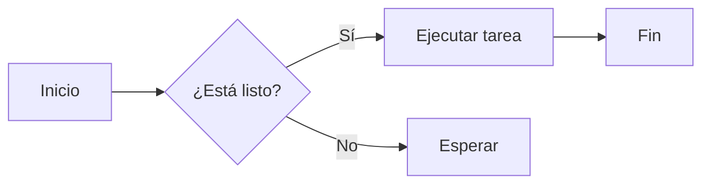
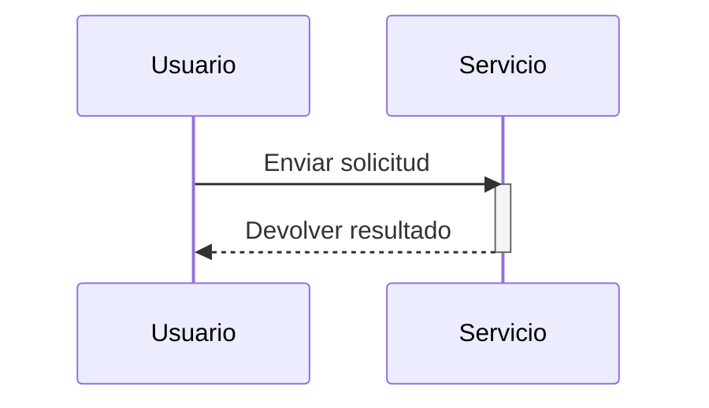

Bienvenido a la página de prueba de sintaxis Markdown. Este artículo cubre la sintaxis más usada de Markdown, GFM (estilo GitHub), fórmulas matemáticas y diagramas Mermaid para verificar el pipeline de renderizado.

## Niveles de encabezado

### Encabezado de nivel 3

Este es el texto bajo h3. Todos los encabezados h2/h3/h4 tienen anclas: al pasar el ratón por la izquierda del encabezado aparece el icono de enlace `#`.

#### Encabezado de nivel 4

h4 se usa para secciones más finas. Aquí se pueden mezclar **negrita**, *cursiva*, ***negrita y cursiva*** y ~~tachado~~.

## Párrafos y saltos de línea

Este es un párrafo. Los párrafos se separan con líneas en blanco; los párrafos adyacentes no se fusionan automáticamente.

Este es el segundo párrafo. Añadir dos espacios al final de la línea y saltar de línea fuerza un salto suave  
Así el texto pasa a la siguiente línea.

## Estilos de texto

- **Negrita**:`**negrita**`
- *Cursiva*:`*cursiva*`
- ***Negrita cursiva***:`***negrita cursiva***`
- ~~Tachado~~:`~~tachado~~`(GFM)
- Código en línea:`const x = 1`
- Superíndice/subíndice:x<sup>2</sup>、H<sub>2</sub>O

## Enlaces

- Enlace en línea:[Blog de Nettix](https://luoyuhao.nettix.top)
- Enlace con título:[Ver documentación](https://luoyuhao.nettix.top "Página de inicio de la documentación")
- Enlace de referencia:[Sitio de ejemplo][ref]
- Enlace automático:<https://luoyuhao.nettix.top>

[ref]: https://luoyuhao.nettix.top "Destino del enlace de referencia"

## Imágenes


Las imágenes admiten alt y title, y no se pueden seleccionar ni arrastrar.

## Listas

### Lista sin ordenar

- Elemento 1
- Elemento 2
  - Elemento anidado A
  - Elemento anidado B
- Elemento 3

### Lista ordenada

1. Paso 1
2. Paso 2
3. Paso 3
   1. Paso anidado a
   2. Paso anidado b

### Lista de tareas (GFM)

- [x] Tarea completada
- [ ] Tarea pendiente
- [x] Tarea con `code`

## Cita

> Esto es una cita.
>
> > Cita anidada.
>
> La cita puede contener **negrita** y `código en línea`.

## Código

Código en línea:`npm run dev`.

Bloque de código (JavaScript):

```javascript
function greet(name) {
  return `Hello, ${name}!`;
}
```

TypeScript:

```typescript
interface User {
  id: number;
  name: string;
}
const user: User = { id: 1, name: "Alice" };
```

Python:

```python
def fib(n):
    a, b = 0, 1
    for _ in range(n):
        a, b = b, a + b
    return a
```

Shell:

```bash
# Instalar dependencias
pnpm install
```

## Tabla

| Alineación | Izquierda | Centro | Derecha |
| :--------- | :-------- | :----: | ------: |
| Ejemplo    | Texto     | Texto  |   Texto |
| Valor      | 100       | 200    |     300 |

## Separador

Lo anterior es contenido; lo siguiente se separa con una línea:

---

Contenido tras el separador.

## Fórmulas matemáticas

Fórmula en línea:identidad de Euler $e^{i\pi} + 1 = 0$。

Fórmula en bloque:

$$
\int_{-\infty}^{\infty} e^{-x^2}\,dx = \sqrt{\pi}
$$

## Diagramas Mermaid

### Diagrama de flujo



### Diagrama de secuencia



## HTML sin procesar e imagen a sangre

La siguiente imagen está envuelta en HTML nativo y se extiende hasta el borde del papel en modo papel:

<figure class="full-bleed">
  
  <figcaption class="px-2 pt-2 text-center text-sm text-text-muted">Se extiende al borde del papel</figcaption>
</figure>

## Emojis y caracteres especiales

😄 🚀 ✨ —— y caracteres que requieren escape:`&`、`<`、`>`、`"`。

## Conclusión

El artículo cubre la mayoría de la sintaxis habitual. Si encuentras algún fallo de renderizado, no dudes en avisarme.
