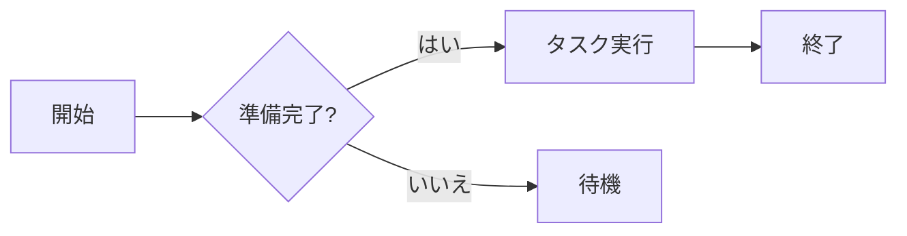
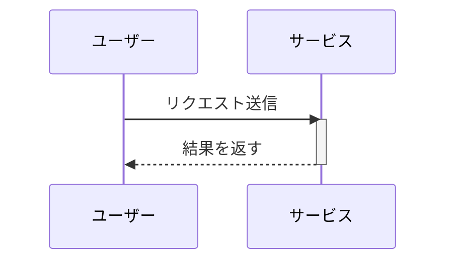

# 見出し

```
# h1 見出し 8-)
## h2 見出し
### h3 見出し
#### h4 見出し
##### h5 見出し
###### h6 見出し

あるいは、H1 と H2 は下線スタイルでも書けます:

Alt-H1
======

Alt-H2
------
```

# h1 見出し 8-)
## h2 見出し
### h3 見出し
#### h4 見出し
##### h5 見出し
###### h6 見出し

あるいは、H1 と H2 は下線スタイルでも書けます:

Alt-H1
======

Alt-H2
------

------

# 強調

```
イタリック(強調):*アスタリスク* または _アンダースコア_ で囲む。

太字(強い強調):**アスタリスク** または __アンダースコア__ で囲む。

太字とイタリックの組み合わせ:**アスタリスクと _アンダースコア_**。

打ち消し線はチルダ2つ:~~これを消す。~~

**これは太字テキストです**

__これも太字テキストです__

*これはイタリックテキストです*

_これもイタリックテキストです_

~~打ち消し線~~
```

イタリック(強調):*アスタリスク* または _アンダースコア_ で囲む。

太字(強い強調):**アスタリスク** または __アンダースコア__ で囲む。

太字とイタリックの組み合わせ:**アスタリスクと _アンダースコア_**。

打ち消し線はチルダ2つ:~~これを消す。~~

**これは太字テキストです**

__これも太字テキストです__

*これはイタリックテキストです*

_これもイタリックテキストです_

~~打ち消し線~~

------

# リスト

```
1. 番号付きリストの最初の項目
2. 別の項目
⋅⋅* 番号なしサブリスト。
1. 実際の数字はどうでもよく、数字であればよい
⋅⋅1. 番号付きサブリスト
4. そしてもうひとつの項目。

⋅⋅⋅リスト項目の中に、正しくインデントされた段落を置くことができます。上の空行と行頭のスペース(少なくとも1つ。ここでは元の Markdown に合わせるため3つ使います)に注意してください。

⋅⋅⋅段落を区切らずに改行するには、行末にスペースを2つ付けます。⋅⋅
⋅⋅⋅この行は独立していますが、同じ段落内にあることに注意してください。⋅⋅
⋅⋅⋅(これは典型的な GFM の改行挙動とは逆です。GFM では行末スペースは不要です。)

* 番号なしリストはアスタリスクを使える
- マイナスでもよい
+ プラスでもよい

1. 変更を加える
    1. バグを修正
    2. 書式を改善
        - 見出しを大きくする
2. コミットを GitHub にプッシュする
3. プルリクエストを開く
    * 変更内容を説明する
    * チームのメンバー全員に知らせる
        * レビューを依頼する

+ 行頭を `+`、`-`、`*` にするとリストを作成できる
+ サブリストは2スペースのインデントで作る:
  - マーカー文字を変えると新しいリストが始まる:
    * Ac tristique libero volutpat at
    + Facilisis in pretium nisl aliquet
    - Nulla volutpat aliquam velit
+ とても簡単!
```

1. 番号付きリストの最初の項目
2. 別の項目
⋅⋅* 番号なしサブリスト。
1. 実際の数字はどうでもよく、数字であればよい
⋅⋅1. 番号付きサブリスト
4. そしてもうひとつの項目。

⋅⋅⋅リスト項目の中に、正しくインデントされた段落を置くことができます。上の空行と行頭のスペース(少なくとも1つ。ここでは元の Markdown に合わせるため3つ使います)に注意してください。

⋅⋅⋅段落を区切らずに改行するには、行末にスペースを2つ付けます。⋅⋅
⋅⋅⋅この行は独立していますが、同じ段落内にあることに注意してください。⋅⋅
⋅⋅⋅(これは典型的な GFM の改行挙動とは逆です。GFM では行末スペースは不要です。)

* 番号なしリストはアスタリスクを使える
- マイナスでもよい
+ プラスでもよい

1. 変更を加える
    1. バグを修正
    2. 書式を改善
        - 見出しを大きくする
2. コミットを GitHub にプッシュする
3. プルリクエストを開く
    * 変更内容を説明する
    * チームのメンバー全員に知らせる
        * レビューを依頼する

+ 行頭を `+`、`-`、`*` にするとリストを作成できる
+ サブリストは2スペースのインデントで作る:
  - マーカー文字を変えると新しいリストが始まる:
    * Ac tristique libero volutpat at
    + Facilisis in pretium nisl aliquet
    - Nulla volutpat aliquam velit
+ とても簡単!

------

# タスクリスト

```
- [x] 変更を完了する
- [ ] コミットを GitHub にプッシュする
- [ ] プルリクエストを開く
- [x] @メンション、#参照、[リンク](),**書式**、<del>タグ</del>に対応
- [x] リスト構文が必要(番号付き・番号なしどちらも対応)
- [x] これは完了済み項目です
- [ ] これは未完了項目です
```

- [x] 変更を完了する
- [ ] コミットを GitHub にプッシュする
- [ ] プルリクエストを開く
- [x] @メンション、#参照、[リンク](),**書式**、<del>タグ</del>に対応
- [x] リスト構文が必要(番号付き・番号なしどちらも対応)
- [ ] これは完了済み項目です
- [ ] これは未完了項目です

------

# Markdown 書式の無視

Markdown の文字の前に \ を付けると、GitHub に Markdown 書式を無視(エスケープ)させられます。

```
\*our-new-project\* を \*our-old-project\* にリネームしましょう。
```

\*our-new-project\* を \*our-old-project\* にリネームしましょう。

------

# リンク

```
[インラインスタイルのリンク](https://www.google.com)

[タイトル付きインラインスタイルのリンク](https://www.google.com "Google のホームページ")

[参照スタイルのリンク][大文字小文字を区別しない参照テキスト]

[リポジトリのファイルへの相対参照](../blob/master/LICENSE)

[参照スタイルのリンク定義には数字も使える][1]

または空のままにして、[リンクテキスト自体]を使う。

URL や山括弧で囲んだ URL は自動的にリンクになります。
http://www.example.com や <http://www.example.com>、ときには
example.com も(ただし GitHub では不可)。

参照リンクは後から定義できることを示すテキスト。

[大文字小文字を区別しない参照テキスト]: https://www.mozilla.org
[1]: http://slashdot.org
[リンクテキスト自体]: http://www.reddit.com
```

[インラインスタイルのリンク](https://www.google.com)

[タイトル付きインラインスタイルのリンク](https://www.google.com "Google のホームページ")

[参照スタイルのリンク][大文字小文字を区別しない参照テキスト]

[リポジトリのファイルへの相対参照](../blob/master/LICENSE)

[参照スタイルのリンク定義には数字も使える][1]

または空のままにして、[リンクテキスト自体]を使う。

URL や山括弧で囲んだ URL は自動的にリンクになります。
http://www.example.com や <http://www.example.com>、ときには
example.com も(ただし GitHub では不可)。

参照リンクは後から定義できることを示すテキスト。

[大文字小文字を区別しない参照テキスト]: https://www.mozilla.org
[1]: http://slashdot.org
[リンクテキスト自体]: http://www.reddit.com

------

# 画像

```
こちらが私たちのロゴです(ホバーでタイトルテキストを表示):

インラインスタイル:


参照スタイル:
![代替テキスト][logo]

[logo]: https://github.com/adam-p/markdown-here/raw/master/src/common/images/icon48.png "ロゴのタイトルテキスト 2"


リンクと同様、画像にも脚注スタイルの構文があります

![代替テキスト][id]

後でドキュメント内の参照が URL の場所を定義します:

[id]: https://octodex.github.com/images/dojocat.jpg  "The Dojocat"
```

こちらが私たちのロゴです(ホバーでタイトルテキストを表示):

インラインスタイル:


参照スタイル:
![代替テキスト][logo]

[logo]: https://github.com/adam-p/markdown-here/raw/master/src/common/images/icon48.png "ロゴのタイトルテキスト 2"


リンクと同様、画像にも脚注スタイルの構文があります

![代替テキスト][id]

後でドキュメント内の参照が URL の場所を定義します:

[id]: https://octodex.github.com/images/dojocat.jpg  "The Dojocat"

------

# [脚注](https://github.com/markdown-it/markdown-it-footnote)

```
脚注 1 へのリンク[^first]。

脚注 2 へのリンク[^second]。

インライン脚注^[インライン脚注のテキスト]の定義。

重複した脚注参照[^second]。

[^first]: 脚注は**マークアップを含められる**

    そして複数の段落も。

[^second]: 脚注テキスト。
```

脚注 1 へのリンク[^first]。

脚注 2 へのリンク[^second]。

インライン脚注^[インライン脚注のテキスト]の定義。

重複した脚注参照[^second]。

[^first]: 脚注は**マークアップを含められる**

    そして複数の段落も。

[^second]: 脚注テキスト。

------

# コードとシンタックスハイライト

```
インラインの `code` は `バッククォート` で囲みます。
```

インラインの `code` は `バッククォート` で囲みます。

```c#
using System.IO.Compression;

#pragma warning disable 414, 3021

namespace MyApplication
{
    [Obsolete("...")]
    class Program : IInterface
    {
        public static List<int> JustDoIt(int count)
        {
            Console.WriteLine($"Hello {Name}!");
            return new List<int>(new int[] { 1, 2, 3 })
        }
    }
}
```

```css
@font-face {
  font-family: Chunkfive; src: url('Chunkfive.otf');
}

body, .usertext {
  color: #F0F0F0; background: #600;
  font-family: Chunkfive, sans;
}

@import url(print.css);
@media print {
  a[href^=http]::after {
    content: attr(href)
  }
}
```

```javascript
function $initHighlight(block, cls) {
  try {
    if (cls.search(/\bno\-highlight\b/) != -1)
      return process(block, true, 0x0F) +
             ` class="${cls}"`;
  } catch (e) {
    /* handle exception */
  }
  for (var i = 0 / 2; i < classes.length; i++) {
    if (checkCondition(classes[i]) === undefined)
      console.log('undefined');
  }
}

export  $initHighlight;
```

```php
require_once 'Zend/Uri/Http.php';

namespace Location\Web;

interface Factory
{
    static function _factory();
}

abstract class URI extends BaseURI implements Factory
{
    abstract function test();

    public static $st1 = 1;
    const ME = "Yo";
    var $list = NULL;
    private $var;

    /**
     * Returns a URI
     *
     * @return URI
     */
    static public function _factory($stats = array(), $uri = 'http')
    {
        echo __METHOD__;
        $uri = explode(':', $uri, 0b10);
        $schemeSpecific = isset($uri[1]) ? $uri[1] : '';
        $desc = 'Multi
line description';

        // Security check
        if (!ctype_alnum($scheme)) {
            throw new Zend_Uri_Exception('Illegal scheme');
        }

        $this->var = 0 - self::$st;
        $this->list = list(Array("1"=> 2, 2=>self::ME, 3 => \Location\Web\URI::class));

        return [
            'uri'   => $uri,
            'value' => null,
        ];
    }
}

echo URI::ME . URI::$st1;

__halt_compiler () ; datahere
datahere
datahere */
datahere
```

------

# テーブル

```
コロンを使って列を揃えられます。

| Tables        | Are           | Cool  |
| ------------- |:-------------:| -----:|
| col 3 is      | right-aligned | $1600 |
| col 2 is      | centered      |   $12 |
| zebra stripes | are neat      |    $1 |

各ヘッダーセルの間には少なくとも3つのハイフンが必要です。
外側の縦線(|)は省略可能で、元の Markdown をきれいに揃える必要もありません。インライン Markdown も使えます。

Markdown | Less | Pretty
--- | --- | ---
*Still* | `renders` | **nicely**
1 | 2 | 3

| 最初のヘッダー  | 2番目のヘッダー |
| ------------- | ------------- |
| コンテンツセル  | コンテンツセル  |
| コンテンツセル  | コンテンツセル  |

| コマンド | 説明 |
| --- | --- |
| git status | 新規または変更されたファイルをすべて一覧表示 |
| git diff | ステージされていない差分を表示 |

| コマンド | 説明 |
| --- | --- |
| `git status` | 新規または変更されたファイルをすべて*一覧表示* |
| `git diff` | **ステージされていない**差分を表示 |

| 左揃え | 中央揃え | 右揃え |
| :---         |     :---:      |          ---: |
| git status   | git status     | git status    |
| git diff     | git diff       | git diff      |

| 名前     | 文字 |
| ---      | ---       |
| バッククォート | `         |
| パイプ     | \|        |
```

コロンを使って列を揃えられます。

| Tables        | Are           | Cool  |
| ------------- |:-------------:| -----:|
| col 3 is      | right-aligned | $1600 |
| col 2 is      | centered      |   $12 |
| zebra stripes | are neat      |    $1 |

各ヘッダーセルの間には少なくとも3つのハイフンが必要です。
外側の縦線(|)は省略可能で、元の Markdown をきれいに揃える必要もありません。インライン Markdown も使えます。

Markdown | Less | Pretty
--- | --- | ---
*Still* | `renders` | **nicely**
1 | 2 | 3

| 最初のヘッダー  | 2番目のヘッダー |
| ------------- | ------------- |
| コンテンツセル  | コンテンツセル  |
| コンテンツセル  | コンテンツセル  |

| コマンド | 説明 |
| --- | --- |
| git status | 新規または変更されたファイルをすべて一覧表示 |
| git diff | ステージされていない差分を表示 |

| コマンド | 説明 |
| --- | --- |
| `git status` | 新規または変更されたファイルをすべて*一覧表示* |
| `git diff` | **ステージされていない**差分を表示 |

| 左揃え | 中央揃え | 右揃え |
| :---         |     :---:      |          ---: |
| git status   | git status     | git status    |
| git diff     | git diff       | git diff      |

| 名前     | 文字 |
| ---      | ---       |
| バッククォート | `         |
| パイプ     | \|        |

<!-- ワイドテーブル:11 列 × 15 行。特大テーブルの横スクロール/折り返しレンダリングを検証 -->

| クエリタイプ | 10 行 | 100 行 | 1K 行 | 10K 行 | 100K 行 | 1M 行 | 10M 行 | 100M 行 | 1B 行 |
| :--- | ---: | ---: | ---: | ---: | ---: | ---: | ---: | ---: | ---: |
| SELECT * | 0.4 ms | 1.2 ms | 4.8 ms | 18.6 ms | 71.2 ms | 289.4 ms | 1.31 s | 6.84 s | 29.3 s |
| SELECT COUNT(*) | 0.2 ms | 0.5 ms | 1.9 ms | 7.4 ms | 28.9 ms | 112.7 ms | 0.52 s | 2.61 s | 11.8 s |
| WHERE フィルタ | 0.3 ms | 0.9 ms | 3.6 ms | 13.8 ms | 52.4 ms | 198.2 ms | 0.87 s | 4.19 s | 18.7 s |
| JOIN (2 テーブル) | 0.6 ms | 2.4 ms | 9.7 ms | 38.2 ms | 149.5 ms | 588.1 ms | 2.64 s | 13.9 s | — |
| JOIN (3 テーブル) | 0.9 ms | 3.8 ms | 15.2 ms | 61.7 ms | 243.8 ms | 967.3 ms | 4.31 s | 22.7 s | — |
| GROUP BY | 0.5 ms | 1.7 ms | 6.3 ms | 24.9 ms | 98.6 ms | 376.4 ms | 1.72 s | 8.93 s | 38.1 s |
| ORDER BY | 0.7 ms | 2.2 ms | 8.8 ms | 35.1 ms | 137.9 ms | 531.6 ms | 2.38 s | 12.4 s | 51.7 s |
| INSERT (単一) | 0.8 ms | 1.1 ms | 1.6 ms | 2.9 ms | 6.7 ms | 18.4 ms | 0.09 s | 0.44 s | 2.1 s |
| INSERT (バッチ 100) | 0.9 ms | 1.4 ms | 3.1 ms | 7.8 ms | 21.4 ms | 74.6 ms | 0.31 s | 1.48 s | 7.2 s |
| UPDATE | 0.6 ms | 2.0 ms | 7.4 ms | 29.8 ms | 118.3 ms | 462.5 ms | 2.05 s | 10.6 s | — |
| DELETE | 0.6 ms | 1.9 ms | 7.1 ms | 28.4 ms | 112.8 ms | 441.9 ms | 1.96 s | 10.1 s | — |
| CREATE INDEX | 1.2 ms | 2.8 ms | 9.4 ms | 41.7 ms | 173.2 ms | 715.8 ms | 3.12 s | 15.8 s | 68.4 s |
| DROP INDEX | 0.8 ms | 1.6 ms | 5.2 ms | 19.3 ms | 76.9 ms | 302.7 ms | 1.33 s | 6.97 s | 30.1 s |
| VACUUM | 3.4 ms | 8.9 ms | 27.6 ms | 104.3 ms | 396.8 ms | 1.47 s | 6.12 s | 27.4 s | — |
| ANALYZE | 1.1 ms | 2.5 ms | 7.9 ms | 28.7 ms | 109.2 ms | 415.3 ms | 1.78 s | 8.62 s | — |
| CLUSTER | 2.1 ms | 5.6 ms | 18.9 ms | 67.3 ms | 254.8 ms | 968.2 ms | 3.87 s | 16.2 s | — |
| REINDEX | 1.9 ms | 4.8 ms | 15.7 ms | 58.4 ms | 221.6 ms | 843.1 ms | 3.41 s | 14.7 s | — |
| TRUNCATE | 0.9 ms | 1.4 ms | 2.2 ms | 4.1 ms | 8.7 ms | 19.6 ms | 0.11 s | 0.52 s | 2.3 s |
| COPY (インポート) | 1.1 ms | 2.9 ms | 9.8 ms | 36.2 ms | 138.4 ms | 527.9 ms | 2.19 s | 9.84 s | 42.6 s |
| COPY (エクスポート) | 0.8 ms | 2.1 ms | 7.2 ms | 27.9 ms | 108.6 ms | 419.2 ms | 1.83 s | 8.11 s | 35.4 s |
| EXPLAIN ANALYZE | 0.5 ms | 1.3 ms | 4.9 ms | 19.7 ms | 77.4 ms | 301.8 ms | 1.36 s | 6.52 s | 28.9 s |
| SHOW ALL | 0.1 ms | 0.2 ms | 0.3 ms | 0.4 ms | 0.6 ms | 1.1 ms | 0.01 s | 0.04 s | 0.2 s |
| SET config | 0.3 ms | 0.4 ms | 0.5 ms | 0.7 ms | 1.2 ms | 2.8 ms | 0.02 s | 0.09 s | 0.4 s |
| LOCK TABLE | 0.7 ms | 1.2 ms | 2.8 ms | 6.4 ms | 15.8 ms | 41.2 ms | 0.19 s | 0.93 s | 4.1 s |
| GRANT / REVOKE | 0.4 ms | 0.9 ms | 1.8 ms | 3.6 ms | 8.1 ms | 19.7 ms | 0.09 s | 0.44 s | 2.0 s |
| ALTER TABLE | 1.4 ms | 3.2 ms | 9.1 ms | 26.8 ms | 84.6 ms | 271.3 ms | 1.12 s | 5.87 s | 25.3 s |
| CHECKPOINT | 8.7 ms | 14.2 ms | 31.5 ms | 78.9 ms | 214.6 ms | 642.3 ms | 2.78 s | 12.9 s | — |
| SAVEPOINT | 0.5 ms | 1.1 ms | 2.4 ms | 5.2 ms | 12.7 ms | 33.6 ms | 0.15 s | 0.72 s | 3.1 s |
| PREPARE | 0.6 ms | 1.5 ms | 4.3 ms | 12.8 ms | 41.5 ms | 139.2 ms | 0.58 s | 2.94 s | 13.2 s |
| LISTEN / NOTIFY | 0.7 ms | 1.6 ms | 3.9 ms | 9.4 ms | 24.8 ms | 67.3 ms | 0.31 s | 1.56 s | 7.0 s |

------

# 引用ブロック

```
> 引用ブロックはメールで返信テキストを模倣するのに便利です。
> この行は同じ引用の一部です。

引用の区切り。

> これは非常に長い行で、折り返しても正しく引用され続けます。みんなに実際に折り返してもらえるよう、十分長くなるまで書き続けましょう。引用ブロックの中に *Markdown* を**入れる**こともできます。

> 引用ブロックはネストもできます...
>> ...隣り合わせで大なり記号を追加することで...
> > > ...または矢印の間にスペースを入れて。
```

> 引用ブロックはメールで返信テキストを模倣するのに便利です。
> この行は同じ引用の一部です。

引用の区切り。

> これは非常に長い行で、折り返しても正しく引用され続けます。みんなに実際に折り返してもらえるよう、十分長くなるまで書き続けましょう。引用ブロックの中に *Markdown* を**入れる**こともできます。

> 引用ブロックはネストもできます...
>> ...隣り合わせで大なり記号を追加することで...
> > > ...または矢印の間にスペースを入れて。

------

# インライン HTML

```
<dl>
  <dt>定義リスト</dt>
  <dd>時々人々が使うもの。</dd>

  <dt>HTML 内の Markdown</dt>
  <dd>*あまり*うまく**機能しません**。HTML の <em>タグ</em> を使ってください。</dd>
</dl>
```

<dl>
  <dt>定義リスト</dt>
  <dd>時々人々が使うもの。</dd>

  <dt>HTML 内の Markdown</dt>
  <dd>*あまり*うまく**機能しません**。HTML の <em>タグ</em> を使ってください。</dd>
</dl>

------

# 画像レイアウト

独立画像(サフィックスなし、全幅ヒーロー):


インライン画像:テキストの中に  アイコンが入ります。画像は自然なサイズのまま行内に表示され、行全体には引き伸ばされません。

強制小画像(独立、中央):


フロート画像(左):画像を左にフロートさせたテキスト段落です。 後続のテキストは画像の右側に回り込み、新聞のようなレイアウトになります。テキストの回り込みが見えるよう、段落は意図的に長くしてあります。

フロート画像(右):画像を右にフロートさせた別のテキスト段落です。 テキストが先に広がり、画像は右側に配置され、後続のテキストは画像の左側に回り込みます。

ペア並列(画像とキャプションを1行に):


これはペアのキャプションで、画像と同じコンテナに表示されます。狭い画面では自動的に折り返して積み重なります。

複数画像ギャラリー(複数の画像を1行に):

  

# 水平線

```
3つ以上...

---

ハイフン

***

アスタリスク

___

アンダースコア
```

3つ以上...

---

ハイフン

***

アスタリスク

___

アンダースコア

------

# YouTube 動画

```
<a href="http://www.youtube.com/watch?feature=player_embedded&v=YOUTUBE_VIDEO_ID_HERE" target="_blank">

</a>
```

<a href="http://www.youtube.com/watch?feature=player_embedded&v=YOUTUBE_VIDEO_ID_HERE" target="_blank">

</a>

```
[](http://www.youtube.com/watch?v=YOUTUBE_VIDEO_ID_HERE)
```

[](https://www.youtube.com/watch?v=ciawICBvQoE)


-------


## 数式

インライン数式:オイラーの等式 $e^{i\pi} + 1 = 0$。

ブロック数式:

$$
\int_{-\infty}^{\infty} e^{-x^2}\,dx = \sqrt{\pi}
$$

## Mermaid 図

### フローチャート



### シーケンス図


