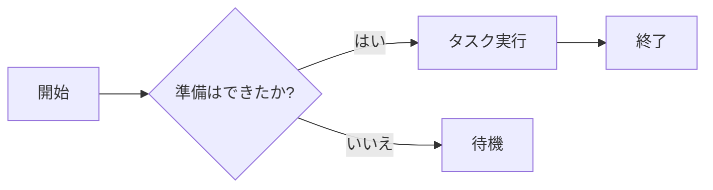
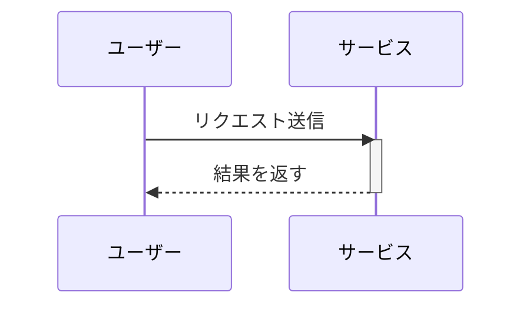

Markdown 構文テストページへようこそ。この記事は Markdown、GFM(GitHub スタイル)、数式、Mermaid 図のよく使う構文を網羅し、レンダリングパイプラインを検証します。

## 見出しレベル

### レベル3の見出し

これは h3 配下の本文です。h2/h3/h4 の見出しにはすべてアンカーがあり、見出しの左にマウスを移動すると `#` リンクアイコンが表示されます。

#### レベル4の見出し

h4 はより細かい節に使います。**太字**、*斜体*、***太字斜体***、~~取り消し線~~をここで混在できます。

## 段落と改行

これは段落です。段落間は空行で区切ります。隣接する段落は自動で結合されません。

これは2番目の段落です。行末にスペースを2つ入れて改行すると、強制的にソフト改行されます  
このように文字が次の行に移動します。

## 文字スタイル

- **太字**:`**太字**`
- *斜体*:`*斜体*`
- ***太字斜体***:`***太字斜体***`
- ~~取り消し線~~:`~~取り消し線~~`(GFM)
- インラインコード:`const x = 1`
- 上付き/下付き:x<sup>2</sup>、H<sub>2</sub>O

## リンク

- インラインリンク:[Nettix ブログ](https://luoyuhao.nettix.top)
- タイトル付きリンク:[ドキュメント](https://luoyuhao.nettix.top "ドキュメントのトップ")
- 参照リンク:[サンプルサイト][ref]
- 自動リンク:<https://luoyuhao.nettix.top>

[ref]: https://luoyuhao.nettix.top "参照リンクの宛先"

## 画像


画像は alt と title に対応し、選択・ドラッグはできません。

## リスト

### 番号なしリスト

- 項目1
- 項目2
  - ネスト項目 A
  - ネスト項目 B
- 項目3

### 番号付きリスト

1. ステップ1
2. ステップ2
3. ステップ3
   1. ネストステップ a
   2. ネストステップ b

### タスクリスト(GFM)

- [x] 完了したタスク
- [ ] 未完了のタスク
- [x] `code` 付きタスク

## 引用

> これは引用です。
>
> > ネストされた引用。
>
> 引用には **太字** と `インラインコード` を含められます。

## コード

インラインコード:`npm run dev`。

フェンスコードブロック(JavaScript):

```javascript
function greet(name) {
  return `Hello, ${name}!`;
}
```

TypeScript:

```typescript
interface User {
  id: number;
  name: string;
}
const user: User = { id: 1, name: "Alice" };
```

Python:

```python
def fib(n):
    a, b = 0, 1
    for _ in range(n):
        a, b = b, a + b
    return a
```

Shell:

```bash
# 依存関係をインストール
pnpm install
```

## テーブル

| 配置     | 左揃え | 中央 | 右揃え |
| :------- | :----- | :--: | -----: |
| サンプル | テキスト | テキスト |   テキスト |
| 値       | 100    | 200  |    300 |

## 区切り線

上は本文、下は区切り線で区切ります:

---

区切り線の後の本文。

## 数式

インライン数式:オイラーの等式 $e^{i\pi} + 1 = 0$。

ブロック数式:

$$
\int_{-\infty}^{\infty} e^{-x^2}\,dx = \sqrt{\pi}
$$

## Mermaid 図

### フローチャート



### シーケンス図



## 生 HTML と破格画像

以下はネイティブ HTML でラップし、ペーパーモードで紙の端まで突き抜けます:

<figure class="full-bleed">
  
  <figcaption class="px-2 pt-2 text-center text-sm text-text-muted">紙の端まで突き抜け</figcaption>
</figure>

## Emoji と特殊文字

😄 🚀 ✨ —— およびエスケープが必要な文字:`&`、`<`、`>`、`"`。

## 結語

以上でよく使う構文の大部分を網羅しました。レンダリングに異常を見つけたら、ぜひお知らせください。
