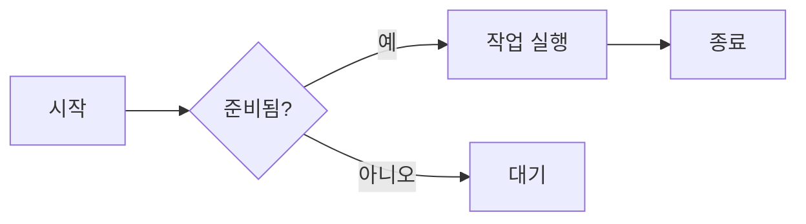
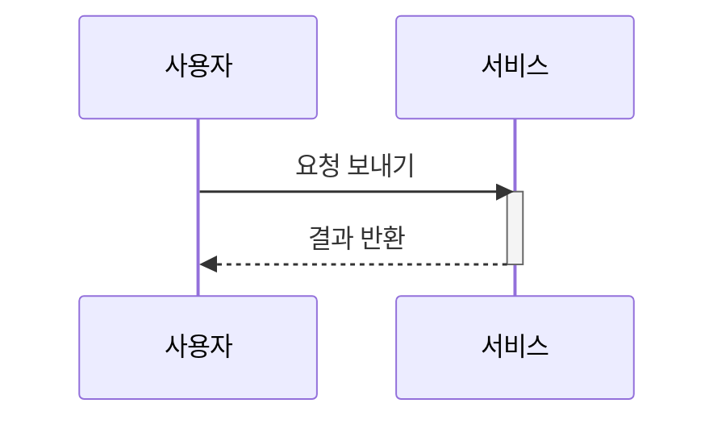

# 제목

```
# h1 제목 8-)
## h2 제목
### h3 제목
#### h4 제목
##### h5 제목
###### h6 제목

또는 H1, H2는 밑줄 스타일로도 쓸 수 있습니다:

Alt-H1
======

Alt-H2
------
```

# h1 제목 8-)
## h2 제목
### h3 제목
#### h4 제목
##### h5 제목
###### h6 제목

또는 H1, H2는 밑줄 스타일로도 쓸 수 있습니다:

Alt-H1
======

Alt-H2
------

------

# 강조

```
이탤릭(강조): *별표* 또는 _밑줄_로 감쌉니다.

볼드(강한 강조): **별표** 또는 __밑줄__로 감쌉니다.

강조 조합: **별표와 _밑줄_**.

취소선은 물결표 두 개: ~~이 문장을 지우세요.~~

**이것은 볼드 텍스트입니다**

__이것도 볼드 텍스트입니다__

*이것은 이탤릭 텍스트입니다*

_이것도 이탤릭 텍스트입니다_

~~취소선~~
```

이탤릭(강조): *별표* 또는 _밑줄_로 감쌉니다.

볼드(강한 강조): **별표** 또는 __밑줄__로 감쌉니다.

강조 조합: **별표와 _밑줄_**.

취소선은 물결표 두 개: ~~이 문장을 지우세요.~~

**이것은 볼드 텍스트입니다**

__이것도 볼드 텍스트입니다__

*이것은 이탤릭 텍스트입니다*

_이것도 이탤릭 텍스트입니다_

~~취소선~~

------

# 목록

```
1. 순서 목록 첫 번째 항목
2. 다른 항목
⋅⋅* 순서 없는 하위 목록.
1. 실제 숫자는 중요하지 않고, 숫자이기만 하면 됩니다
⋅⋅1. 순서 하위 목록
4. 그리고 또 다른 항목.

⋅⋅⋅목록 항목 안에 제대로 들여쓰기된 문단을 넣을 수 있습니다. 위의 빈 줄과 줄 앞 공백(최소 1개, 여기서는 원본 Markdown과 맞추기 위해 3개를 사용)에 주의하세요.

⋅⋅⋅문단을 나누지 않고 줄을 바꾸려면 줄 끝에 공백을 두 개 넣어야 합니다.⋅⋅
⋅⋅⋅이 줄은 독립적이지만 같은 문단 안에 있음에 주의하세요.⋅⋅
⋅⋅⋅(이것은 일반적인 GFM 줄바꿈 동작과 반대입니다. GFM에서는 줄 끝 공백이 필요 없습니다.)

* 순서 없는 목록은 별표를 쓸 수 있습니다
- 빼기 기호도 가능
+ 더하기 기호도 가능

1. 변경 사항을 적용합니다
    1. 버그 수정
    2. 서식 개선
        - 제목을 더 크게
2. 커밋을 GitHub에 푸시합니다
3. 풀 리퀘스트를 엽니다
    * 변경 내용을 설명합니다
    * 팀원 전원에게 알립니다
        * 리뷰를 요청합니다

+ `+`, `-`, `*`로 시작하는 줄을 만들면 목록이 생성됩니다
+ 하위 목록은 2칸 들여쓰기로 만듭니다:
  - 마커 문자를 바꾸면 새 목록이 시작됩니다:
    * Ac tristique libero volutpat at
    + Facilisis in pretium nisl aliquet
    - Nulla volutpat aliquam velit
+ 아주 쉽습니다!
```

1. 순서 목록 첫 번째 항목
2. 다른 항목
⋅⋅* 순서 없는 하위 목록.
1. 실제 숫자는 중요하지 않고, 숫자이기만 하면 됩니다
⋅⋅1. 순서 하위 목록
4. 그리고 또 다른 항목.

⋅⋅⋅목록 항목 안에 제대로 들여쓰기된 문단을 넣을 수 있습니다. 위의 빈 줄과 줄 앞 공백(최소 1개, 여기서는 원본 Markdown과 맞추기 위해 3개를 사용)에 주의하세요.

⋅⋅⋅문단을 나누지 않고 줄을 바꾸려면 줄 끝에 공백을 두 개 넣어야 합니다.⋅⋅
⋅⋅⋅이 줄은 독립적이지만 같은 문단 안에 있음에 주의하세요.⋅⋅
⋅⋅⋅(이것은 일반적인 GFM 줄바꿈 동작과 반대입니다. GFM에서는 줄 끝 공백이 필요 없습니다.)

* 순서 없는 목록은 별표를 쓸 수 있습니다
- 빼기 기호도 가능
+ 더하기 기호도 가능

1. 변경 사항을 적용합니다
    1. 버그 수정
    2. 서식 개선
        - 제목을 더 크게
2. 커밋을 GitHub에 푸시합니다
3. 풀 리퀘스트를 엽니다
    * 변경 내용을 설명합니다
    * 팀원 전원에게 알립니다
        * 리뷰를 요청합니다

+ `+`, `-`, `*`로 시작하는 줄을 만들면 목록이 생성됩니다
+ 하위 목록은 2칸 들여쓰기로 만듭니다:
  - 마커 문자를 바꾸면 새 목록이 시작됩니다:
    * Ac tristique libero volutpat at
    + Facilisis in pretium nisl aliquet
    - Nulla volutpat aliquam velit
+ 아주 쉽습니다!

------

# 작업 목록

```
- [x] 변경 사항을 마칩니다
- [ ] 커밋을 GitHub에 푸시합니다
- [ ] 풀 리퀘스트를 엽니다
- [x] @멘션, #참조, [링크](), **서식**, <del>태그</del> 지원
- [x] 목록 문법 필요(순서/비순서 목록 모두 지원)
- [x] 이것은 완료된 항목입니다
- [ ] 이것은 미완료 항목입니다
```

- [x] 변경 사항을 마칩니다
- [ ] 커밋을 GitHub에 푸시합니다
- [ ] 풀 리퀘스트를 엽니다
- [x] @멘션, #참조, [링크](), **서식**, <del>태그</del> 지원
- [x] 목록 문법 필요(순서/비순서 목록 모두 지원)
- [ ] 이것은 완료된 항목입니다
- [ ] 이것은 미완료 항목입니다

------

# Markdown 서식 무시하기

Markdown 문자 앞에 \를 붙이면 GitHub가 Markdown 서식을 무시(이스케이프)하게 할 수 있습니다.

```
\*our-new-project\*를 \*our-old-project\*로 이름을 바꿉시다.
```

\*our-new-project\*를 \*our-old-project\*로 이름을 바꿉시다.

------

# 링크

```
[인라인 스타일 링크입니다](https://www.google.com)

[제목이 있는 인라인 스타일 링크](https://www.google.com "Google 홈페이지")

[참조 스타일 링크][대소문자를 구분하지 않는 참조 텍스트]

[저장소 파일에 대한 상대 참조](../blob/master/LICENSE)

[참조 스타일 링크 정의에는 숫자를 쓸 수도 있습니다][1]

또는 비워 두고 [링크 텍스트 자체]를 사용합니다.

URL과 꺾쇠 괄호 안의 URL은 자동으로 링크가 됩니다.
http://www.example.com 또는 <http://www.example.com>, 때로는
example.com도 가능합니다(예: GitHub에서는 안 됨).

참조 링크는 나중에 정의할 수 있음을 보여 주는 텍스트입니다.

[대소문자를 구분하지 않는 참조 텍스트]: https://www.mozilla.org
[1]: http://slashdot.org
[링크 텍스트 자체]: http://www.reddit.com
```

[인라인 스타일 링크입니다](https://www.google.com)

[제목이 있는 인라인 스타일 링크](https://www.google.com "Google 홈페이지")

[참조 스타일 링크][대소문자를 구분하지 않는 참조 텍스트]

[저장소 파일에 대한 상대 참조](../blob/master/LICENSE)

[참조 스타일 링크 정의에는 숫자를 쓸 수도 있습니다][1]

또는 비워 두고 [링크 텍스트 자체]를 사용합니다.

URL과 꺾쇠 괄호 안의 URL은 자동으로 링크가 됩니다.
http://www.example.com 또는 <http://www.example.com>, 때로는
example.com도 가능합니다(예: GitHub에서는 안 됨).

참조 링크는 나중에 정의할 수 있음을 보여 주는 텍스트입니다.

[대소문자를 구분하지 않는 참조 텍스트]: https://www.mozilla.org
[1]: http://slashdot.org
[링크 텍스트 자체]: http://www.reddit.com

------

# 이미지

```
여기 우리 로고가 있습니다(마우스를 올리면 제목 텍스트가 보입니다):

인라인 스타일:


참조 스타일:
![대체 텍스트][logo]

[logo]: https://github.com/adam-p/markdown-here/raw/master/src/common/images/icon48.png "로고 제목 텍스트 2"


링크와 마찬가지로 이미지에도 각주 스타일 문법이 있습니다

![대체 텍스트][id]

문서 뒷부분의 참조가 URL 위치를 정의합니다:

[id]: https://octodex.github.com/images/dojocat.jpg  "The Dojocat"
```

여기 우리 로고가 있습니다(마우스를 올리면 제목 텍스트가 보입니다):

인라인 스타일:


참조 스타일:
![대체 텍스트][logo]

[logo]: https://github.com/adam-p/markdown-here/raw/master/src/common/images/icon48.png "로고 제목 텍스트 2"


링크와 마찬가지로 이미지에도 각주 스타일 문법이 있습니다

![대체 텍스트][id]

문서 뒷부분의 참조가 URL 위치를 정의합니다:

[id]: https://octodex.github.com/images/dojocat.jpg  "The Dojocat"

------

# [각주](https://github.com/markdown-it/markdown-it-footnote)

```
각주 1 링크[^first].

각주 2 링크[^second].

인라인 각주^[인라인 각주의 텍스트] 정의.

중복된 각주 참조[^second].

[^first]: 각주는 **마크업을 포함할 수 있습니다**

    그리고 여러 문단도요.

[^second]: 각주 텍스트.
```

각주 1 링크[^first].

각주 2 링크[^second].

인라인 각주^[인라인 각주의 텍스트] 정의.

중복된 각주 참조[^second].

[^first]: 각주는 **마크업을 포함할 수 있습니다**

    그리고 여러 문단도요.

[^second]: 각주 텍스트.

------

# 코드 및 구문 강조

```
인라인 `code`는 `백틱`으로 감쌉니다.
```

인라인 `code`는 `백틱`으로 감쌉니다.

```c#
using System.IO.Compression;

#pragma warning disable 414, 3021

namespace MyApplication
{
    [Obsolete("...")]
    class Program : IInterface
    {
        public static List<int> JustDoIt(int count)
        {
            Console.WriteLine($"Hello {Name}!");
            return new List<int>(new int[] { 1, 2, 3 })
        }
    }
}
```

```css
@font-face {
  font-family: Chunkfive; src: url('Chunkfive.otf');
}

body, .usertext {
  color: #F0F0F0; background: #600;
  font-family: Chunkfive, sans;
}

@import url(print.css);
@media print {
  a[href^=http]::after {
    content: attr(href)
  }
}
```

```javascript
function $initHighlight(block, cls) {
  try {
    if (cls.search(/\bno\-highlight\b/) != -1)
      return process(block, true, 0x0F) +
             ` class="${cls}"`;
  } catch (e) {
    /* handle exception */
  }
  for (var i = 0 / 2; i < classes.length; i++) {
    if (checkCondition(classes[i]) === undefined)
      console.log('undefined');
  }
}

export  $initHighlight;
```

```php
require_once 'Zend/Uri/Http.php';

namespace Location\Web;

interface Factory
{
    static function _factory();
}

abstract class URI extends BaseURI implements Factory
{
    abstract function test();

    public static $st1 = 1;
    const ME = "Yo";
    var $list = NULL;
    private $var;

    /**
     * Returns a URI
     *
     * @return URI
     */
    static public function _factory($stats = array(), $uri = 'http')
    {
        echo __METHOD__;
        $uri = explode(':', $uri, 0b10);
        $schemeSpecific = isset($uri[1]) ? $uri[1] : '';
        $desc = 'Multi
line description';

        // Security check
        if (!ctype_alnum($scheme)) {
            throw new Zend_Uri_Exception('Illegal scheme');
        }

        $this->var = 0 - self::$st;
        $this->list = list(Array("1"=> 2, 2=>self::ME, 3 => \Location\Web\URI::class));

        return [
            'uri'   => $uri,
            'value' => null,
        ];
    }
}

echo URI::ME . URI::$st1;

__halt_compiler () ; datahere
datahere
datahere */
datahere
```

------

# 테이블

```
콜론으로 열을 정렬할 수 있습니다.

| Tables        | Are           | Cool  |
| ------------- |:-------------:| -----:|
| col 3 is      | right-aligned | $1600 |
| col 2 is      | centered      |   $12 |
| zebra stripes | are neat      |    $1 |

각 헤더 셀 사이에는 최소 3개의 대시가 있어야 합니다.
바깥쪽 파이프(|)는 선택 사항이고, 원본 Markdown을 반드시 예쁘게 정렬할 필요도 없습니다. 인라인 Markdown도 쓸 수 있습니다.

Markdown | Less | Pretty
--- | --- | ---
*Still* | `renders` | **nicely**
1 | 2 | 3

| 첫 번째 헤더  | 두 번째 헤더 |
| ------------- | ------------- |
| 내용 셀  | 내용 셀  |
| 내용 셀  | 내용 셀  |

| 명령어 | 설명 |
| --- | --- |
| git status | 새 파일과 수정된 파일을 모두 나열 |
| git diff | 아직 스테이징되지 않은 차이를 표시 |

| 명령어 | 설명 |
| --- | --- |
| `git status` | 새 파일과 수정된 파일을 모두 *나열* |
| `git diff` | **아직 스테이징되지 않은** 차이를 표시 |

| 왼쪽 정렬 | 가운데 정렬 | 오른쪽 정렬 |
| :---         |     :---:      |          ---: |
| git status   | git status     | git status    |
| git diff     | git diff       | git diff      |

| 이름     | 문자 |
| ---      | ---       |
| 백틱 | `         |
| 파이프     | \|        |
```

콜론으로 열을 정렬할 수 있습니다.

| Tables        | Are           | Cool  |
| ------------- |:-------------:| -----:|
| col 3 is      | right-aligned | $1600 |
| col 2 is      | centered      |   $12 |
| zebra stripes | are neat      |    $1 |

각 헤더 셀 사이에는 최소 3개의 대시가 있어야 합니다.
바깥쪽 파이프(|)는 선택 사항이고, 원본 Markdown을 반드시 예쁘게 정렬할 필요도 없습니다. 인라인 Markdown도 쓸 수 있습니다.

Markdown | Less | Pretty
--- | --- | ---
*Still* | `renders` | **nicely**
1 | 2 | 3

| 첫 번째 헤더  | 두 번째 헤더 |
| ------------- | ------------- |
| 내용 셀  | 내용 셀  |
| 내용 셀  | 내용 셀  |

| 명령어 | 설명 |
| --- | --- |
| git status | 새 파일과 수정된 파일을 모두 나열 |
| git diff | 아직 스테이징되지 않은 차이를 표시 |

| 명령어 | 설명 |
| --- | --- |
| `git status` | 새 파일과 수정된 파일을 모두 *나열* |
| `git diff` | **아직 스테이징되지 않은** 차이를 표시 |

| 왼쪽 정렬 | 가운데 정렬 | 오른쪽 정렬 |
| :---         |     :---:      |          ---: |
| git status   | git status     | git status    |
| git diff     | git diff       | git diff      |

| 이름     | 문자 |
| ---      | ---       |
| 백틱 | `         |
| 파이프     | \|        |

<!-- 와이드 테이블: 11열 × 15행, 초대형 테이블의 가로 스크롤/줄바꿈 렌더링을 검증 -->

| 쿼리 유형 | 10행 | 100행 | 1K행 | 10K행 | 100K행 | 1M행 | 10M행 | 100M행 | 1B행 |
| :--- | ---: | ---: | ---: | ---: | ---: | ---: | ---: | ---: | ---: |
| SELECT * | 0.4 ms | 1.2 ms | 4.8 ms | 18.6 ms | 71.2 ms | 289.4 ms | 1.31 s | 6.84 s | 29.3 s |
| SELECT COUNT(*) | 0.2 ms | 0.5 ms | 1.9 ms | 7.4 ms | 28.9 ms | 112.7 ms | 0.52 s | 2.61 s | 11.8 s |
| WHERE 필터 | 0.3 ms | 0.9 ms | 3.6 ms | 13.8 ms | 52.4 ms | 198.2 ms | 0.87 s | 4.19 s | 18.7 s |
| JOIN (2개 테이블) | 0.6 ms | 2.4 ms | 9.7 ms | 38.2 ms | 149.5 ms | 588.1 ms | 2.64 s | 13.9 s | — |
| JOIN (3개 테이블) | 0.9 ms | 3.8 ms | 15.2 ms | 61.7 ms | 243.8 ms | 967.3 ms | 4.31 s | 22.7 s | — |
| GROUP BY | 0.5 ms | 1.7 ms | 6.3 ms | 24.9 ms | 98.6 ms | 376.4 ms | 1.72 s | 8.93 s | 38.1 s |
| ORDER BY | 0.7 ms | 2.2 ms | 8.8 ms | 35.1 ms | 137.9 ms | 531.6 ms | 2.38 s | 12.4 s | 51.7 s |
| INSERT (단일) | 0.8 ms | 1.1 ms | 1.6 ms | 2.9 ms | 6.7 ms | 18.4 ms | 0.09 s | 0.44 s | 2.1 s |
| INSERT (일괄 100) | 0.9 ms | 1.4 ms | 3.1 ms | 7.8 ms | 21.4 ms | 74.6 ms | 0.31 s | 1.48 s | 7.2 s |
| UPDATE | 0.6 ms | 2.0 ms | 7.4 ms | 29.8 ms | 118.3 ms | 462.5 ms | 2.05 s | 10.6 s | — |
| DELETE | 0.6 ms | 1.9 ms | 7.1 ms | 28.4 ms | 112.8 ms | 441.9 ms | 1.96 s | 10.1 s | — |
| CREATE INDEX | 1.2 ms | 2.8 ms | 9.4 ms | 41.7 ms | 173.2 ms | 715.8 ms | 3.12 s | 15.8 s | 68.4 s |
| DROP INDEX | 0.8 ms | 1.6 ms | 5.2 ms | 19.3 ms | 76.9 ms | 302.7 ms | 1.33 s | 6.97 s | 30.1 s |
| VACUUM | 3.4 ms | 8.9 ms | 27.6 ms | 104.3 ms | 396.8 ms | 1.47 s | 6.12 s | 27.4 s | — |
| ANALYZE | 1.1 ms | 2.5 ms | 7.9 ms | 28.7 ms | 109.2 ms | 415.3 ms | 1.78 s | 8.62 s | — |
| CLUSTER | 2.1 ms | 5.6 ms | 18.9 ms | 67.3 ms | 254.8 ms | 968.2 ms | 3.87 s | 16.2 s | — |
| REINDEX | 1.9 ms | 4.8 ms | 15.7 ms | 58.4 ms | 221.6 ms | 843.1 ms | 3.41 s | 14.7 s | — |
| TRUNCATE | 0.9 ms | 1.4 ms | 2.2 ms | 4.1 ms | 8.7 ms | 19.6 ms | 0.11 s | 0.52 s | 2.3 s |
| COPY (가져오기) | 1.1 ms | 2.9 ms | 9.8 ms | 36.2 ms | 138.4 ms | 527.9 ms | 2.19 s | 9.84 s | 42.6 s |
| COPY (내보내기) | 0.8 ms | 2.1 ms | 7.2 ms | 27.9 ms | 108.6 ms | 419.2 ms | 1.83 s | 8.11 s | 35.4 s |
| EXPLAIN ANALYZE | 0.5 ms | 1.3 ms | 4.9 ms | 19.7 ms | 77.4 ms | 301.8 ms | 1.36 s | 6.52 s | 28.9 s |
| SHOW ALL | 0.1 ms | 0.2 ms | 0.3 ms | 0.4 ms | 0.6 ms | 1.1 ms | 0.01 s | 0.04 s | 0.2 s |
| SET config | 0.3 ms | 0.4 ms | 0.5 ms | 0.7 ms | 1.2 ms | 2.8 ms | 0.02 s | 0.09 s | 0.4 s |
| LOCK TABLE | 0.7 ms | 1.2 ms | 2.8 ms | 6.4 ms | 15.8 ms | 41.2 ms | 0.19 s | 0.93 s | 4.1 s |
| GRANT / REVOKE | 0.4 ms | 0.9 ms | 1.8 ms | 3.6 ms | 8.1 ms | 19.7 ms | 0.09 s | 0.44 s | 2.0 s |
| ALTER TABLE | 1.4 ms | 3.2 ms | 9.1 ms | 26.8 ms | 84.6 ms | 271.3 ms | 1.12 s | 5.87 s | 25.3 s |
| CHECKPOINT | 8.7 ms | 14.2 ms | 31.5 ms | 78.9 ms | 214.6 ms | 642.3 ms | 2.78 s | 12.9 s | — |
| SAVEPOINT | 0.5 ms | 1.1 ms | 2.4 ms | 5.2 ms | 12.7 ms | 33.6 ms | 0.15 s | 0.72 s | 3.1 s |
| PREPARE | 0.6 ms | 1.5 ms | 4.3 ms | 12.8 ms | 41.5 ms | 139.2 ms | 0.58 s | 2.94 s | 13.2 s |
| LISTEN / NOTIFY | 0.7 ms | 1.6 ms | 3.9 ms | 9.4 ms | 24.8 ms | 67.3 ms | 0.31 s | 1.56 s | 7.0 s |

------

# 인용 블록

```
> 인용 블록은 이메일에서 답장 텍스트를 흉내 내는 데 아주 유용합니다.
> 이 줄은 같은 인용의 일부입니다.

인용 끊김.

> 이것은 매우 긴 줄로, 줄바꿈이 되어도 제대로 인용됩니다. 모두에게 실제로 줄바꿈이 보이도록 충분히 길게 써 봅시다. 인용 블록 안에 *Markdown*을 **넣을** 수도 있습니다.

> 인용 블록은 중첩도 가능합니다...
>> ...서로 붙어 있는 큰 기호를 더해서...
> > > ...또는 화살표 사이에 공백을 넣어서.
```

> 인용 블록은 이메일에서 답장 텍스트를 흉내 내는 데 아주 유용합니다.
> 이 줄은 같은 인용의 일부입니다.

인용 끊김.

> 이것은 매우 긴 줄로, 줄바꿈이 되어도 제대로 인용됩니다. 모두에게 실제로 줄바꿈이 보이도록 충분히 길게 써 봅시다. 인용 블록 안에 *Markdown*을 **넣을** 수도 있습니다.

> 인용 블록은 중첩도 가능합니다...
>> ...서로 붙어 있는 큰 기호를 더해서...
> > > ...또는 화살표 사이에 공백을 넣어서.

------

# 인라인 HTML

```
<dl>
  <dt>정의 목록</dt>
  <dd>사람들이 가끔 사용하는 것.</dd>

  <dt>HTML 안의 Markdown</dt>
  <dd>*별로* **잘** 작동하지 않습니다. HTML <em>태그</em>를 사용하세요.</dd>
</dl>
```

<dl>
  <dt>정의 목록</dt>
  <dd>사람들이 가끔 사용하는 것.</dd>

  <dt>HTML 안의 Markdown</dt>
  <dd>*별로* **잘** 작동하지 않습니다. HTML <em>태그</em>를 사용하세요.</dd>
</dl>

------

# 이미지 레이아웃

독립 이미지(접미사 없음, 전체 너비 히어로):


인라인 이미지: 텍스트 안에  아이콘이 들어갑니다. 이미지는 원래 크기를 유지한 채 인라인으로 표시되며 줄 전체로 늘어나지 않습니다.

강제 작은 이미지(독립, 가운데):


플로팅 이미지(왼쪽): 이미지를 왼쪽에 띄운 텍스트 문단입니다.  뒤따르는 텍스트는 이미지 오른쪽을 감싸며 신문 스타일로 배치됩니다. 텍스트 감싸기가 잘 보이도록 문단을 의도적으로 길게 했습니다.

플로팅 이미지(오른쪽): 이미지를 오른쪽에 띄운 또 다른 텍스트 문단입니다.  텍스트가 먼저 펼쳐지고 이미지는 오른쪽에 놓이며, 뒤따르는 텍스트는 이미지 왼쪽을 감쌉니다.

나란한 쌍(이미지와 캡션을 한 줄에):


이것은 쌍을 이루는 캡션으로, 이미지와 같은 컨테이너에 표시됩니다. 좁은 화면에서는 자동으로 줄바꿈되어 쌓입니다.

여러 이미지 갤러리(여러 이미지를 한 줄에):

  

# 가로 구분선

```
세 개 이상...

---

하이픈

***

별표

___

밑줄
```

세 개 이상...

---

하이픈

***

별표

___

밑줄

------

# YouTube 동영상

```
<a href="http://www.youtube.com/watch?feature=player_embedded&v=YOUTUBE_VIDEO_ID_HERE" target="_blank">

</a>
```

<a href="http://www.youtube.com/watch?feature=player_embedded&v=YOUTUBE_VIDEO_ID_HERE" target="_blank">

</a>

```
[](http://www.youtube.com/watch?v=YOUTUBE_VIDEO_ID_HERE)
```

[](https://www.youtube.com/watch?v=ciawICBvQoE)


-------


## 수학 공식

인라인 공식: 오일러의 항등식 $e^{i\pi} + 1 = 0$.

블록 공식:

$$
\int_{-\infty}^{\infty} e^{-x^2}\,dx = \sqrt{\pi}
$$

## Mermaid 다이어그램

### 순서도



### 시퀀스 다이어그램


