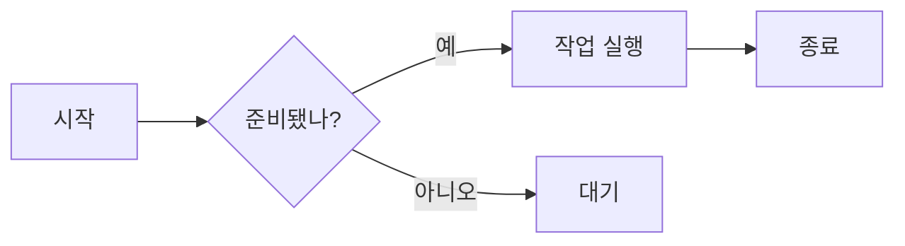
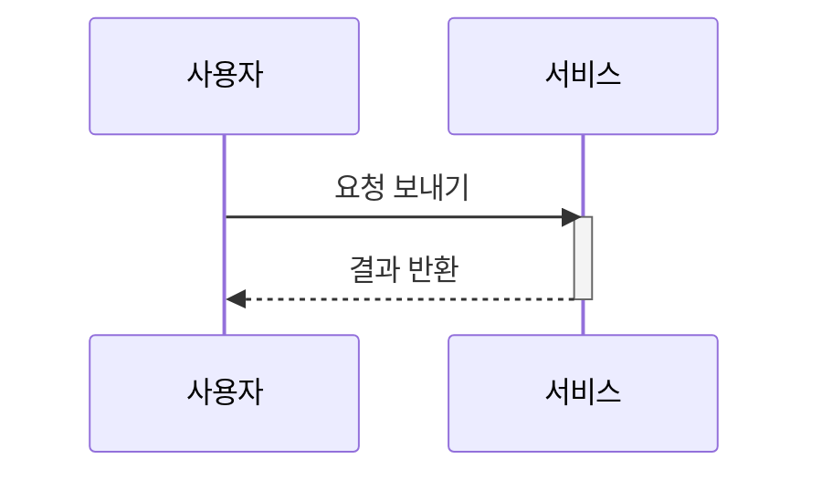

Markdown 문법 테스트 페이지에 오신 것을 환영합니다. 이 글은 Markdown, GFM(GitHub 스타일), 수식, Mermaid 다이어그램의 자주 쓰는 문법을 다루어 렌더링 파이프라인을 검증합니다.

## 제목 레벨

### 3단계 제목

h3 아래의 본문입니다. h2/h3/h4 제목에는 모두 앵커가 있으며, 제목 왼쪽에 마우스를 올리면 `#` 링크 아이콘이 나타납니다.

#### 4단계 제목

h4는 더 세부적인 절에 사용합니다. **굵게**, *기울임*, ***굵은 기울임***, ~~취소선~~을 여기서 섞어 쓸 수 있습니다.

## 단락과 줄바꿈

이것은 단락입니다. 단락 사이는 빈 줄로 구분하며, 인접한 단락은 자동으로 합쳐지지 않습니다.

이것은 두 번째 단락입니다. 줄 끝에 공백 두 개를 넣고 줄바꿈하면 강제 줄바꿈이 됩니다  
이렇게 하면 텍스트가 다음 줄로 이동합니다.

## 텍스트 스타일

- **굵게**:`**굵게**`
- *기울임*:`*기울임*`
- ***굵은 기울임***:`***굵은 기울임***`
- ~~취소선~~:`~~취소선~~`(GFM)
- 인라인 코드:`const x = 1`
- 위첨자/아래첨자:x<sup>2</sup>、H<sub>2</sub>O

## 링크

- 인라인 링크:[Nettix 블로그](https://luoyuhao.nettix.top)
- 제목 있는 링크:[문서 보기](https://luoyuhao.nettix.top "문서 홈")
- 참조 링크:[예시 사이트][ref]
- 자동 링크:<https://luoyuhao.nettix.top>

[ref]: https://luoyuhao.nettix.top "참조 링크 대상"

## 이미지


이미지는 alt와 title을 지원하며, 선택하거나 끌 수 없습니다.

## 목록

### 순서 없는 목록

- 항목 1
- 항목 2
  - 중첩 항목 A
  - 중첩 항목 B
- 항목 3

### 순서 있는 목록

1. 1단계
2. 2단계
3. 3단계
   1. 중첩 단계 a
   2. 중첩 단계 b

### 작업 목록(GFM)

- [x] 완료된 작업
- [ ] 미완료 작업
- [x] `code`가 있는 작업

## 인용

> 이것은 인용입니다.
>
> > 중첩 인용.
>
> 인용에는 **굵게**와 `인라인 코드`를 포함할 수 있습니다.

## 코드

인라인 코드:`npm run dev`。

펜스 코드 블록(JavaScript):

```javascript
function greet(name) {
  return `Hello, ${name}!`;
}
```

TypeScript:

```typescript
interface User {
  id: number;
  name: string;
}
const user: User = { id: 1, name: "Alice" };
```

Python:

```python
def fib(n):
    a, b = 0, 1
    for _ in range(n):
        a, b = b, a + b
    return a
```

Shell:

```bash
# 의존성 설치
pnpm install
```

## 표

| 정렬   | 왼쪽  | 가운데 | 오른쪽 |
| :----- | :---- | :----: | -----: |
| 예시   | 텍스트 | 텍스트 |   텍스트 |
| 값     | 100   | 200   |    300 |

## 구분선

위는 본문이고, 아래는 구분선으로 나눕니다:

---

구분선 뒤의 본문.

## 수식

인라인 수식:오일러 항등식 $e^{i\pi} + 1 = 0$。

블록 수식:

$$
\int_{-\infty}^{\infty} e^{-x^2}\,dx = \sqrt{\pi}
$$

## Mermaid 다이어그램

### 순서도



### 시퀀스 다이어그램



## 원시 HTML과 돌출 이미지

아래는 네이티브 HTML로 감싼 이미지로, 페이퍼 모드에서 종이 가장자리까지 돌출됩니다:

<figure class="full-bleed">
  
  <figcaption class="px-2 pt-2 text-center text-sm text-text-muted">종이 가장자리까지 돌출</figcaption>
</figure>

## 이모지와 특수 문자

😄 🚀 ✨ —— 그리고 이스케이프가 필요한 문자:`&`、`<`、`>`、`"`。

## 마무리

이상으로 자주 쓰는 문법의 대부분을 다루었습니다. 렌더링 이상을 발견하면 알려주세요.
