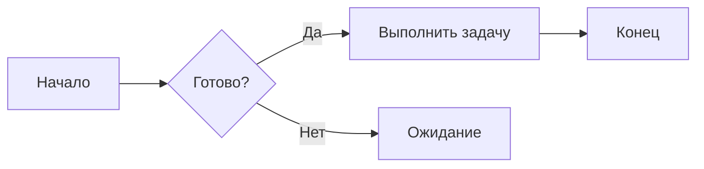
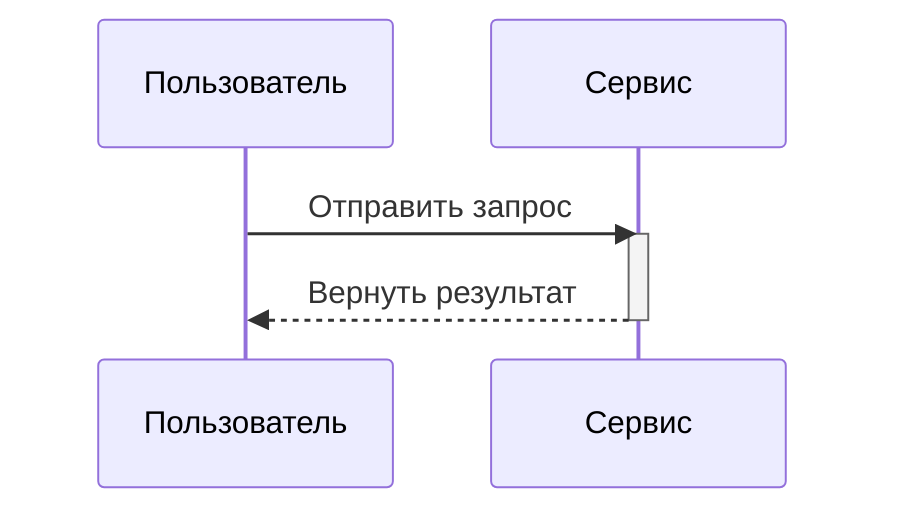

# Заголовки

```
# h1 Заголовок 8-)
## h2 Заголовок
### h3 Заголовок
#### h4 Заголовок
##### h5 Заголовок
###### h6 Заголовок

Либо для H1 и H2 — стиль с подчёркиванием:

Alt-H1
======

Alt-H2
------
```

# h1 Заголовок 8-)
## h2 Заголовок
### h3 Заголовок
#### h4 Заголовок
##### h5 Заголовок
###### h6 Заголовок

Либо для H1 и H2 — стиль с подчёркиванием:

Alt-H1
======

Alt-H2
------

------

# Выделение

```
Выделение (курсив) — со *звёздочками* или _подчёркиваниями_.

Сильное выделение (жирный) — с **звёздочками** или __подчёркиваниями__.

Комбинированное выделение — **звёздочки и _подчёркивания_**.

Зачёркивание — двумя тильдами. ~~Зачеркните это.~~

**Это жирный текст**

__Это тоже жирный текст__

*Это курсивный текст*

_Это тоже курсивный текст_

~~Зачёркнутый~~
```

Выделение (курсив) — со *звёздочками* или _подчёркиваниями_.

Сильное выделение (жирный) — с **звёздочками** или __подчёркиваниями__.

Комбинированное выделение — **звёздочки и _подчёркивания_**.

Зачёркивание — двумя тильдами. ~~Зачеркните это.~~

**Это жирный текст**

__Это тоже жирный текст__

*Это курсивный текст*

_Это тоже курсивный текст_

~~Зачёркнутый~~

------

# Списки

```
1. Первый пункт нумерованного списка
2. Ещё один пункт
⋅⋅* Неупорядоченный подсписок.
1. Сами числа не важны — главное, чтобы был номер
⋅⋅1. Нумерованный подсписок
4. И ещё один пункт.

⋅⋅⋅Внутри пунктов списка можно размещать правильно отформатированные абзацы. Обратите внимание на пустую строку выше и на начальные пробелы (как минимум один; здесь мы используем три, чтобы выровнять исходный Markdown).

⋅⋅⋅Чтобы сделать перенос строки без абзаца, нужно поставить два пробела в конце строки.⋅⋅
⋅⋅⋅Обратите внимание: эта строка отдельная, но находится в том же абзаце.⋅⋅
⋅⋅⋅(Это противоречит типичному поведению GFM, где завершающие пробелы не требуются.)

* Неупорядоченный список можно делать звёздочками
- Или минусами
+ Или плюсами

1. Внести мои изменения
    1. Исправить баг
    2. Улучшить форматирование
        - Сделать заголовки крупнее
2. Запушить мои коммиты на GitHub
3. Открыть pull request
    * Описать мои изменения
    * Упомянуть всех членов моей команды
        * Попросить обратную связь

+ Создайте список, начав строку с `+`, `-` или `*`
+ Подсписки создаются отступом в 2 пробела:
  - Смена маркера начинает новый список:
    * Ac tristique libero volutpat at
    + Facilisis in pretium nisl aliquet
    - Nulla volutpat aliquam velit
+ Очень просто!
```

1. Первый пункт нумерованного списка
2. Ещё один пункт
⋅⋅* Неупорядоченный подсписок.
1. Сами числа не важны — главное, чтобы был номер
⋅⋅1. Нумерованный подсписок
4. И ещё один пункт.

⋅⋅⋅Внутри пунктов списка можно размещать правильно отформатированные абзацы. Обратите внимание на пустую строку выше и на начальные пробелы (как минимум один; здесь мы используем три, чтобы выровнять исходный Markdown).

⋅⋅⋅Чтобы сделать перенос строки без абзаца, нужно поставить два пробела в конце строки.⋅⋅
⋅⋅⋅Обратите внимание: эта строка отдельная, но находится в том же абзаце.⋅⋅
⋅⋅⋅(Это противоречит типичному поведению GFM, где завершающие пробелы не требуются.)

* Неупорядоченный список можно делать звёздочками
- Или минусами
+ Или плюсами

1. Внести мои изменения
    1. Исправить баг
    2. Улучшить форматирование
        - Сделать заголовки крупнее
2. Запушить мои коммиты на GitHub
3. Открыть pull request
    * Описать мои изменения
    * Упомянуть всех членов моей команды
        * Попросить обратную связь

+ Создайте список, начав строку с `+`, `-` или `*`
+ Подсписки создаются отступом в 2 пробела:
  - Смена маркера начинает новый список:
    * Ac tristique libero volutpat at
    + Facilisis in pretium nisl aliquet
    - Nulla volutpat aliquam velit
+ Очень просто!

------

# Списки задач

```
- [x] Завершить мои изменения
- [ ] Запушить мои коммиты на GitHub
- [ ] Открыть pull request
- [x] Поддерживаются @упоминания, #ссылки, [ссылки](), **форматирование** и <del>теги</del>
- [x] Требуется синтаксис списка (поддерживается любой упорядоченный или неупорядоченный список)
- [x] Это выполненный пункт
- [ ] Это невыполненный пункт
```

- [x] Завершить мои изменения
- [ ] Запушить мои коммиты на GitHub
- [ ] Открыть pull request
- [x] Поддерживаются @упоминания, #ссылки, [ссылки](), **форматирование** и <del>теги</del>
- [x] Требуется синтаксис списка (поддерживается любой упорядоченный или неупорядоченный список)
- [ ] Это выполненный пункт
- [ ] Это невыполненный пункт

------

# Игнорирование форматирования Markdown

Можно попросить GitHub игнорировать (или экранировать) форматирование Markdown, поставив \ перед символом.

```
Переименуем \*our-new-project\* в \*our-old-project\*.
```

Переименуем \*our-new-project\* в \*our-old-project\*.

------

# Ссылки

```
[Я встроенная ссылка](https://www.google.com)

[Я встроенная ссылка с заголовком](https://www.google.com "Домашняя страница Google")

[Я ссылка ссылочного стиля][Текст ссылки без учёта регистра]

[Я относительная ссылка на файл репозитория](../blob/master/LICENSE)

[Для определения ссылок ссылочного стиля можно использовать числа][1]

Или оставьте пустым и используйте [сам текст ссылки].

URL и URL в угловых скобках автоматически превращаются в ссылки.
http://www.example.com или <http://www.example.com>, а иногда
example.com (но, например, не на GitHub).

Немного текста, чтобы показать, что ссылки ссылочного стиля можно определять позже.

[текст ссылки без учёта регистра]: https://www.mozilla.org
[1]: http://slashdot.org
[сам текст ссылки]: http://www.reddit.com
```

[Я встроенная ссылка](https://www.google.com)

[Я встроенная ссылка с заголовком](https://www.google.com "Домашняя страница Google")

[Я ссылка ссылочного стиля][Текст ссылки без учёта регистра]

[Я относительная ссылка на файл репозитория](../blob/master/LICENSE)

[Для определения ссылок ссылочного стиля можно использовать числа][1]

Или оставьте пустым и используйте [сам текст ссылки].

URL и URL в угловых скобках автоматически превращаются в ссылки.
http://www.example.com или <http://www.example.com>, а иногда
example.com (но, например, не на GitHub).

Немного текста, чтобы показать, что ссылки ссылочного стиля можно определять позже.

[текст ссылки без учёта регистра]: https://www.mozilla.org
[1]: http://slashdot.org
[сам текст ссылки]: http://www.reddit.com

------

# Изображения

```
Вот наш логотип (наведите курсор, чтобы увидеть текст заголовка):

Встроенный стиль:


Ссылочный стиль:
![альтернативный текст][logo]

[logo]: https://github.com/adam-p/markdown-here/raw/master/src/common/images/icon48.png "Текст заголовка логотипа 2"


Как и ссылки, изображения также имеют синтаксис сносок

![Альтернативный текст][id]

С ссылкой далее в документе, определяющей расположение URL:

[id]: https://octodex.github.com/images/dojocat.jpg  "The Dojocat"
```

Вот наш логотип (наведите курсор, чтобы увидеть текст заголовка):

Встроенный стиль:


Ссылочный стиль:
![альтернативный текст][logo]

[logo]: https://github.com/adam-p/markdown-here/raw/master/src/common/images/icon48.png "Текст заголовка логотипа 2"


Как и ссылки, изображения также имеют синтаксис сносок

![Альтернативный текст][id]

С ссылкой далее в документе, определяющей расположение URL:

[id]: https://octodex.github.com/images/dojocat.jpg  "The Dojocat"

------

# [Сноски](https://github.com/markdown-it/markdown-it-footnote)

```
Ссылка на сноску 1[^first].

Ссылка на сноску 2[^second].

Определение встроенной сноски^[Текст встроенной сноски].

Повторная ссылка на сноску[^second].

[^first]: Сноска **может содержать разметку**

    и несколько абзацев.

[^second]: Текст сноски.
```

Ссылка на сноску 1[^first].

Ссылка на сноску 2[^second].

Определение встроенной сноски^[Текст встроенной сноски].

Повторная ссылка на сноску[^second].

[^first]: Сноска **может содержать разметку**

    и несколько абзацев.

[^second]: Текст сноски.

------

# Код и подсветка синтаксиса

```
Встроенный `code` окружают `обратные кавычки`.
```

Встроенный `code` окружают `обратные кавычки`.

```c#
using System.IO.Compression;

#pragma warning disable 414, 3021

namespace MyApplication
{
    [Obsolete("...")]
    class Program : IInterface
    {
        public static List<int> JustDoIt(int count)
        {
            Console.WriteLine($"Hello {Name}!");
            return new List<int>(new int[] { 1, 2, 3 })
        }
    }
}
```

```css
@font-face {
  font-family: Chunkfive; src: url('Chunkfive.otf');
}

body, .usertext {
  color: #F0F0F0; background: #600;
  font-family: Chunkfive, sans;
}

@import url(print.css);
@media print {
  a[href^=http]::after {
    content: attr(href)
  }
}
```

```javascript
function $initHighlight(block, cls) {
  try {
    if (cls.search(/\bno\-highlight\b/) != -1)
      return process(block, true, 0x0F) +
             ` class="${cls}"`;
  } catch (e) {
    /* handle exception */
  }
  for (var i = 0 / 2; i < classes.length; i++) {
    if (checkCondition(classes[i]) === undefined)
      console.log('undefined');
  }
}

export  $initHighlight;
```

```php
require_once 'Zend/Uri/Http.php';

namespace Location\Web;

interface Factory
{
    static function _factory();
}

abstract class URI extends BaseURI implements Factory
{
    abstract function test();

    public static $st1 = 1;
    const ME = "Yo";
    var $list = NULL;
    private $var;

    /**
     * Returns a URI
     *
     * @return URI
     */
    static public function _factory($stats = array(), $uri = 'http')
    {
        echo __METHOD__;
        $uri = explode(':', $uri, 0b10);
        $schemeSpecific = isset($uri[1]) ? $uri[1] : '';
        $desc = 'Multi
line description';

        // Security check
        if (!ctype_alnum($scheme)) {
            throw new Zend_Uri_Exception('Illegal scheme');
        }

        $this->var = 0 - self::$st;
        $this->list = list(Array("1"=> 2, 2=>self::ME, 3 => \Location\Web\URI::class));

        return [
            'uri'   => $uri,
            'value' => null,
        ];
    }
}

echo URI::ME . URI::$st1;

__halt_compiler () ; datahere
datahere
datahere */
datahere
```

------

# Таблицы

```
Двоеточия можно использовать для выравнивания столбцов.

| Tables        | Are           | Cool  |
| ------------- |:-------------:| -----:|
| col 3 is      | right-aligned | $1600 |
| col 2 is      | centered      |   $12 |
| zebra stripes | are neat      |    $1 |

Между ячейками заголовка должно быть как минимум 3 дефиса.
Внешние вертикальные черты (|) необязательны, и не нужно красиво выравнивать исходный Markdown. Также можно использовать встроенный Markdown.

Markdown | Less | Pretty
--- | --- | ---
*Still* | `renders` | **nicely**
1 | 2 | 3

| Первый заголовок  | Второй заголовок |
| ------------- | ------------- |
| Ячейка содержимого  | Ячейка содержимого  |
| Ячейка содержимого  | Ячейка содержимого  |

| Команда | Описание |
| --- | --- |
| git status | Перечислить все новые или изменённые файлы |
| git diff | Показать незастейдженные различия |

| Команда | Описание |
| --- | --- |
| `git status` | Перечислить все *новые или изменённые* файлы |
| `git diff` | Показать различия, которые **ещё не** застейджены |

| По левому краю | По центру | По правому краю |
| :---         |     :---:      |          ---: |
| git status   | git status     | git status    |
| git diff     | git diff       | git diff      |

| Название     | Символ |
| ---      | ---       |
| Обратная кавычка | `         |
| Вертикальная черта | \|        |
```

Двоеточия можно использовать для выравнивания столбцов.

| Tables        | Are           | Cool  |
| ------------- |:-------------:| -----:|
| col 3 is      | right-aligned | $1600 |
| col 2 is      | centered      |   $12 |
| zebra stripes | are neat      |    $1 |

Между ячейками заголовка должно быть как минимум 3 дефиса.
Внешние вертикальные черты (|) необязательны, и не нужно красиво выравнивать исходный Markdown. Также можно использовать встроенный Markdown.

Markdown | Less | Pretty
--- | --- | ---
*Still* | `renders` | **nicely**
1 | 2 | 3

| Первый заголовок  | Второй заголовок |
| ------------- | ------------- |
| Ячейка содержимого  | Ячейка содержимого  |
| Ячейка содержимого  | Ячейка содержимого  |

| Команда | Описание |
| --- | --- |
| git status | Перечислить все новые или изменённые файлы |
| git diff | Показать незастейдженные различия |

| Команда | Описание |
| --- | --- |
| `git status` | Перечислить все *новые или изменённые* файлы |
| `git diff` | Показать различия, которые **ещё не** застейджены |

| По левому краю | По центру | По правому краю |
| :---         |     :---:      |          ---: |
| git status   | git status     | git status    |
| git diff     | git diff       | git diff      |

| Название     | Символ |
| ---      | ---       |
| Обратная кавычка | `         |
| Вертикальная черта | \|        |

<!-- Широкая таблица: 11 столбцов × 15 строк, проверка горизонтальной прокрутки/переноса больших таблиц -->

| Тип запроса | 10 строк | 100 строк | 1K строк | 10K строк | 100K строк | 1M строк | 10M строк | 100M строк | 1B строк |
| :--- | ---: | ---: | ---: | ---: | ---: | ---: | ---: | ---: | ---: |
| SELECT * | 0.4 ms | 1.2 ms | 4.8 ms | 18.6 ms | 71.2 ms | 289.4 ms | 1.31 s | 6.84 s | 29.3 s |
| SELECT COUNT(*) | 0.2 ms | 0.5 ms | 1.9 ms | 7.4 ms | 28.9 ms | 112.7 ms | 0.52 s | 2.61 s | 11.8 s |
| Фильтр WHERE | 0.3 ms | 0.9 ms | 3.6 ms | 13.8 ms | 52.4 ms | 198.2 ms | 0.87 s | 4.19 s | 18.7 s |
| JOIN (2 таблицы) | 0.6 ms | 2.4 ms | 9.7 ms | 38.2 ms | 149.5 ms | 588.1 ms | 2.64 s | 13.9 s | — |
| JOIN (3 таблицы) | 0.9 ms | 3.8 ms | 15.2 ms | 61.7 ms | 243.8 ms | 967.3 ms | 4.31 s | 22.7 s | — |
| GROUP BY | 0.5 ms | 1.7 ms | 6.3 ms | 24.9 ms | 98.6 ms | 376.4 ms | 1.72 s | 8.93 s | 38.1 s |
| ORDER BY | 0.7 ms | 2.2 ms | 8.8 ms | 35.1 ms | 137.9 ms | 531.6 ms | 2.38 s | 12.4 s | 51.7 s |
| INSERT (одиночный) | 0.8 ms | 1.1 ms | 1.6 ms | 2.9 ms | 6.7 ms | 18.4 ms | 0.09 s | 0.44 s | 2.1 s |
| INSERT (пакет 100) | 0.9 ms | 1.4 ms | 3.1 ms | 7.8 ms | 21.4 ms | 74.6 ms | 0.31 s | 1.48 s | 7.2 s |
| UPDATE | 0.6 ms | 2.0 ms | 7.4 ms | 29.8 ms | 118.3 ms | 462.5 ms | 2.05 s | 10.6 s | — |
| DELETE | 0.6 ms | 1.9 ms | 7.1 ms | 28.4 ms | 112.8 ms | 441.9 ms | 1.96 s | 10.1 s | — |
| CREATE INDEX | 1.2 ms | 2.8 ms | 9.4 ms | 41.7 ms | 173.2 ms | 715.8 ms | 3.12 s | 15.8 s | 68.4 s |
| DROP INDEX | 0.8 ms | 1.6 ms | 5.2 ms | 19.3 ms | 76.9 ms | 302.7 ms | 1.33 s | 6.97 s | 30.1 s |
| VACUUM | 3.4 ms | 8.9 ms | 27.6 ms | 104.3 ms | 396.8 ms | 1.47 s | 6.12 s | 27.4 s | — |
| ANALYZE | 1.1 ms | 2.5 ms | 7.9 ms | 28.7 ms | 109.2 ms | 415.3 ms | 1.78 s | 8.62 s | — |
| CLUSTER | 2.1 ms | 5.6 ms | 18.9 ms | 67.3 ms | 254.8 ms | 968.2 ms | 3.87 s | 16.2 s | — |
| REINDEX | 1.9 ms | 4.8 ms | 15.7 ms | 58.4 ms | 221.6 ms | 843.1 ms | 3.41 s | 14.7 s | — |
| TRUNCATE | 0.9 ms | 1.4 ms | 2.2 ms | 4.1 ms | 8.7 ms | 19.6 ms | 0.11 s | 0.52 s | 2.3 s |
| COPY (импорт) | 1.1 ms | 2.9 ms | 9.8 ms | 36.2 ms | 138.4 ms | 527.9 ms | 2.19 s | 9.84 s | 42.6 s |
| COPY (экспорт) | 0.8 ms | 2.1 ms | 7.2 ms | 27.9 ms | 108.6 ms | 419.2 ms | 1.83 s | 8.11 s | 35.4 s |
| EXPLAIN ANALYZE | 0.5 ms | 1.3 ms | 4.9 ms | 19.7 ms | 77.4 ms | 301.8 ms | 1.36 s | 6.52 s | 28.9 s |
| SHOW ALL | 0.1 ms | 0.2 ms | 0.3 ms | 0.4 ms | 0.6 ms | 1.1 ms | 0.01 s | 0.04 s | 0.2 s |
| SET config | 0.3 ms | 0.4 ms | 0.5 ms | 0.7 ms | 1.2 ms | 2.8 ms | 0.02 s | 0.09 s | 0.4 s |
| LOCK TABLE | 0.7 ms | 1.2 ms | 2.8 ms | 6.4 ms | 15.8 ms | 41.2 ms | 0.19 s | 0.93 s | 4.1 s |
| GRANT / REVOKE | 0.4 ms | 0.9 ms | 1.8 ms | 3.6 ms | 8.1 ms | 19.7 ms | 0.09 s | 0.44 s | 2.0 s |
| ALTER TABLE | 1.4 ms | 3.2 ms | 9.1 ms | 26.8 ms | 84.6 ms | 271.3 ms | 1.12 s | 5.87 s | 25.3 s |
| CHECKPOINT | 8.7 ms | 14.2 ms | 31.5 ms | 78.9 ms | 214.6 ms | 642.3 ms | 2.78 s | 12.9 s | — |
| SAVEPOINT | 0.5 ms | 1.1 ms | 2.4 ms | 5.2 ms | 12.7 ms | 33.6 ms | 0.15 s | 0.72 s | 3.1 s |
| PREPARE | 0.6 ms | 1.5 ms | 4.3 ms | 12.8 ms | 41.5 ms | 139.2 ms | 0.58 s | 2.94 s | 13.2 s |
| LISTEN / NOTIFY | 0.7 ms | 1.6 ms | 3.9 ms | 9.4 ms | 24.8 ms | 67.3 ms | 0.31 s | 1.56 s | 7.0 s |

------

# Цитаты

```
> Цитаты очень удобны в электронной почте для имитации текста ответа.
> Эта строка — часть той же цитаты.

Разрыв цитаты.

> Это очень длинная строка, которая будет корректно цитироваться даже при переносе. Давайте писать дальше, чтобы она точно была достаточно длинной для переноса. О, вы можете *вставлять* **Markdown** в цитату.

> Цитаты можно вкладывать друг в друга...
>> ...добавляя дополнительные знаки «больше» вплотную друг к другу...
> > > ...или с пробелами между стрелками.
```

> Цитаты очень удобны в электронной почте для имитации текста ответа.
> Эта строка — часть той же цитаты.

Разрыв цитаты.

> Это очень длинная строка, которая будет корректно цитироваться даже при переносе. Давайте писать дальше, чтобы она точно была достаточно длинной для переноса. О, вы можете *вставлять* **Markdown** в цитату.

> Цитаты можно вкладывать друг в друга...
>> ...добавляя дополнительные знаки «больше» вплотную друг к другу...
> > > ...или с пробелами между стрелками.

------

# Встроенный HTML

```
<dl>
  <dt>Список определений</dt>
  <dd>То, что люди иногда используют.</dd>

  <dt>Markdown в HTML</dt>
  <dd>Работает *не* **очень** хорошо. Используйте HTML-<em>теги</em>.</dd>
</dl>
```

<dl>
  <dt>Список определений</dt>
  <dd>То, что люди иногда используют.</dd>

  <dt>Markdown в HTML</dt>
  <dd>Работает *не* **очень** хорошо. Используйте HTML-<em>теги</em>.</dd>
</dl>

------

# Раскладка изображений

Отдельное изображение (без суффикса, во всю ширину):


Встроенное изображение:  маленькая иконка внутри текста; изображение сохраняет естественный размер и не растягивается на всю строку.

Принудительно маленькое изображение (отдельное, по центру):


Плавающее изображение (слева): это текстовый абзац с изображением, обтекаемым слева,  и последующий текст обтекает изображение справа, в стиле газетной вёрстки. Абзац намеренно сделан длинным, чтобы обтекание было хорошо видно.

Плавающее изображение (справа): это ещё один текстовый абзац с изображением, обтекаемым справа,  текст сначала расстилается, изображение располагается справа, а последующий текст обтекает его слева.

Пара рядом (изображение и подпись в одной строке):


Это парная подпись, отображаемая в том же контейнере, что и изображение; на узких экранах она автоматически переносится и складывается.

Галерея из нескольких изображений (несколько изображений в одной строке):

  

# Горизонтальные линии

```
Три и более...

---

Дефисы

***

Звёздочки

___

Подчёркивания
```

Три и более...

---

Дефисы

***

Звёздочки

___

Подчёркивания

------

# Видео YouTube

```
<a href="http://www.youtube.com/watch?feature=player_embedded&v=YOUTUBE_VIDEO_ID_HERE" target="_blank">

</a>
```

<a href="http://www.youtube.com/watch?feature=player_embedded&v=YOUTUBE_VIDEO_ID_HERE" target="_blank">

</a>

```
[](http://www.youtube.com/watch?v=YOUTUBE_VIDEO_ID_HERE)
```

[](https://www.youtube.com/watch?v=ciawICBvQoE)


-------


## Математические формулы

Встроенная формула: тождество Эйлера $e^{i\pi} + 1 = 0$.

Блочная формула:

$$
\int_{-\infty}^{\infty} e^{-x^2}\,dx = \sqrt{\pi}
$$

## Диаграммы Mermaid

### Блок-схема



### Диаграмма последовательности


