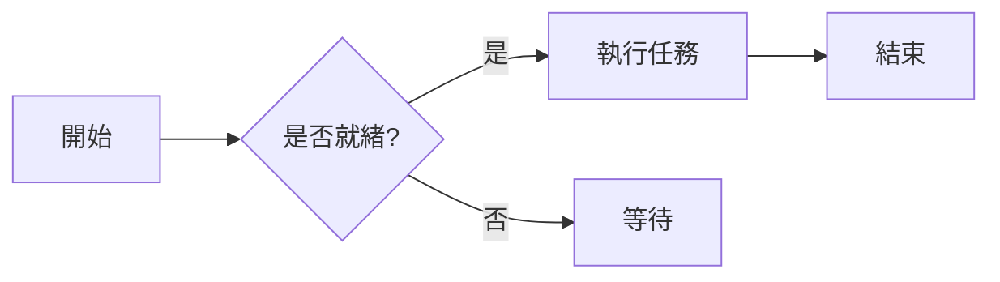
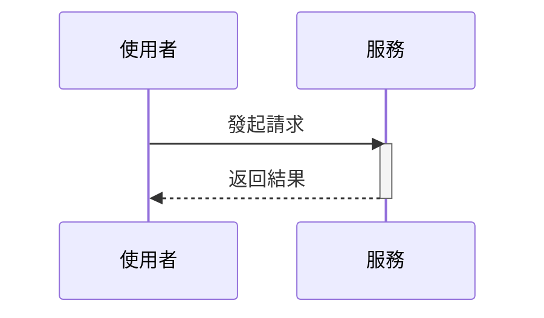

# 標題

```
# h1 一級標題 8-)
## h2 二級標題
### h3 三級標題
#### h4 四級標題
##### h5 五級標題
###### h6 六級標題

或者，H1 和 H2 也可以使用底線式寫法：

Alt-H1
======

Alt-H2
------
```

# h1 一級標題 8-)
## h2 二級標題
### h3 三級標題
#### h4 四級標題
##### h5 五級標題
###### h6 六級標題

或者，H1 和 H2 也可以使用底線式寫法：

Alt-H1
======

Alt-H2
------

------

# 強調

```
斜體（emphasis）：用 *星號* 或 _底線_ 包圍。

粗體（strong）：用 **星號** 或 __底線__ 包圍。

粗體加斜體：**星號與 _底線_ 組合**。

刪除線用兩個波浪線：~~劃掉這句。~~

**這是粗體文字**

__這也是粗體文字__

*這是斜體文字*

_這也是斜體文字_

~~刪除線~~
```

斜體（emphasis）：用 *星號* 或 _底線_ 包圍。

粗體（strong）：用 **星號** 或 __底線__ 包圍。

粗體加斜體：**星號與 _底線_ 組合**。

刪除線用兩個波浪線：~~劃掉這句。~~

**這是粗體文字**

__這也是粗體文字__

*這是斜體文字*

_這也是斜體文字_

~~刪除線~~

------

# 清單

```
1. 有序清單第一項
2. 另一項
⋅⋅* 無序子清單。
1. 數字本身不重要，只要是數字就行
⋅⋅1. 有序子清單
4. 再來一項。

⋅⋅⋅清單項裡可以放正確縮排的段落。注意上面的空行，以及行首空格（至少一個，這裡用三個以便和原始 Markdown 對齊）。

⋅⋅⋅想不換段落地換行，需要在行尾加兩個空格。⋅⋅
⋅⋅⋅注意這一行是獨立的，但仍在同一個段落裡。⋅⋅
⋅⋅⋅（這與典型的 GFM 換行行為不同——GFM 裡行尾空格不是必須的。）

* 無序清單可以用星號
- 也可以用減號
+ 或者加號

1. 改好我的程式碼
    1. 修 bug
    2. 最佳化排版
        - 把標題調大
2. 把提交推送到 GitHub
3. 開一個 pull request
    * 描述我的變更
    * 提一下組裡所有成員
        * 請他們 review

+ 用 `+`、`-` 或 `*` 開頭就能建立清單
+ 縮排兩格可以建立子清單：
  - 換一個清單標記符會強制開始新清單：
    * Ac tristique libero volutpat at
    + Facilisis in pretium nisl aliquet
    - Nulla volutpat aliquam velit
+ 很簡單！
```

1. 有序清單第一項
2. 另一項
⋅⋅* 無序子清單。
1. 數字本身不重要，只要是數字就行
⋅⋅1. 有序子清單
4. 再來一項。

⋅⋅⋅清單項裡可以放正確縮排的段落。注意上面的空行，以及行首空格（至少一個，這裡用三個以便和原始 Markdown 對齊）。

⋅⋅⋅想不換段落地換行，需要在行尾加兩個空格。⋅⋅
⋅⋅⋅注意這一行是獨立的，但仍在同一個段落裡。⋅⋅
⋅⋅⋅（這與典型的 GFM 換行行為不同——GFM 裡行尾空格不是必須的。）

* 無序清單可以用星號
- 也可以用減號
+ 或者加號

1. 改好我的程式碼
    1. 修 bug
    2. 最佳化排版
        - 把標題調大
2. 把提交推送到 GitHub
3. 開一個 pull request
    * 描述我的變更
    * 提一下組裡所有成員
        * 請他們 review

+ 用 `+`、`-` 或 `*` 開頭就能建立清單
+ 縮排兩格可以建立子清單：
  - 換一個清單標記符會強制開始新清單：
    * Ac tristique libero volutpat at
    + Facilisis in pretium nisl aliquet
    - Nulla volutpat aliquam velit
+ 很簡單！

------

# 任務清單

```
- [x] 完成我的變更
- [ ] 把提交推送到 GitHub
- [ ] 開一個 pull request
- [x] 支援 @提及、#引用、[連結](),**格式**以及 <del>標籤</del>
- [x] 需要清單語法（無序或有序清單都支援）
- [x] 這是已完成項目
- [ ] 這是未完成項目
```

- [x] 完成我的變更
- [ ] 把提交推送到 GitHub
- [ ] 開一個 pull request
- [x] 支援 @提及、#引用、[連結](),**格式**以及 <del>標籤</del>
- [x] 需要清單語法（無序或有序清單都支援）
- [ ] 這是已完成項目
- [ ] 這是未完成項目

------

# 忽略 Markdown 格式

在 Markdown 字元前加 \ 可以告訴 GitHub 忽略（或跳脫）Markdown 格式。

```
把 \*our-new-project\* 改名為 \*our-old-project\*。
```

把 \*our-new-project\* 改名為 \*our-old-project\*。

------

# 連結

```
[我是行內式連結](https://www.google.com)

[我是帶標題的行內式連結](https://www.google.com "Google 首頁")

[我是引用式連結][大小寫不敏感的引用文字]

[我是相對引用的儲存庫檔案連結](../blob/master/LICENSE)

[引用式連結定義也可以使用數字][1]

或者留空，直接使用[連結文字本身]。

URL 和尖括號裡的 URL 會自動變成連結。
http://www.example.com 或 <http://www.example.com>，有時候
example.com 也行（比如在 GitHub 上就不行）。

下面這段文字用來展示引用連結可以在後面定義。

[大小寫不敏感的引用文字]: https://www.mozilla.org
[1]: http://slashdot.org
[連結文字本身]: http://www.reddit.com
```

[我是行內式連結](https://www.google.com)

[我是帶標題的行內式連結](https://www.google.com "Google 首頁")

[我是引用式連結][大小寫不敏感的引用文字]

[我是相對引用的儲存庫檔案連結](../blob/master/LICENSE)

[引用式連結定義也可以使用數字][1]

或者留空，直接使用[連結文字本身]。

URL 和尖括號裡的 URL 會自動變成連結。
http://www.example.com 或 <http://www.example.com>，有時候
example.com 也行（比如在 GitHub 上就不行）。

下面這段文字用來展示引用連結可以在後面定義。

[大小寫不敏感的引用文字]: https://www.mozilla.org
[1]: http://slashdot.org
[連結文字本身]: http://www.reddit.com

------

# 圖片

```
這是我們的 logo（懸停可以看標題文字）：

行內式：


引用式：
![替代文字][logo]

[logo]: https://github.com/adam-p/markdown-here/raw/master/src/common/images/icon48.png "Logo 標題文字 2"


和連結一樣，圖片也有註腳式語法

![替代文字][id]

引用在後面的文件中定義 URL 位置：

[id]: https://octodex.github.com/images/dojocat.jpg  "Dojocat"
```

這是我們的 logo（懸停可以看標題文字）：

行內式：


引用式：
![替代文字][logo]

[logo]: https://github.com/adam-p/markdown-here/raw/master/src/common/images/icon48.png "Logo 標題文字 2"


和連結一樣，圖片也有註腳式語法

![替代文字][id]

引用在後面的文件中定義 URL 位置：

[id]: https://octodex.github.com/images/dojocat.jpg  "Dojocat"

------

# [註腳](https://github.com/markdown-it/markdown-it-footnote)

```
註腳 1 連結[^first]。

註腳 2 連結[^second]。

行內註腳^[行內註腳的文字]定義。

重複的註腳引用[^second]。

[^first]: 註腳 **可以包含標記**

    以及多個段落。

[^second]: 註腳文字。
```

註腳 1 連結[^first]。

註腳 2 連結[^second]。

行內註腳^[行內註腳的文字]定義。

重複的註腳引用[^second]。

[^first]: 註腳 **可以包含標記**

    以及多個段落。

[^second]: 註腳文字。

------

# 程式碼與語法高亮

```
行內 `code` 用 `反引號` 包起來。
```

行內 `code` 用 `反引號` 包起來。

```c#
using System.IO.Compression;

#pragma warning disable 414, 3021

namespace MyApplication
{
    [Obsolete("...")]
    class Program : IInterface
    {
        public static List<int> JustDoIt(int count)
        {
            Console.WriteLine($"Hello {Name}!");
            return new List<int>(new int[] { 1, 2, 3 })
        }
    }
}
```

```css
@font-face {
  font-family: Chunkfive; src: url('Chunkfive.otf');
}

body, .usertext {
  color: #F0F0F0; background: #600;
  font-family: Chunkfive, sans;
}

@import url(print.css);
@media print {
  a[href^=http]::after {
    content: attr(href)
  }
}
```

```javascript
function $initHighlight(block, cls) {
  try {
    if (cls.search(/\bno\-highlight\b/) != -1)
      return process(block, true, 0x0F) +
             ` class="${cls}"`;
  } catch (e) {
    /* handle exception */
  }
  for (var i = 0 / 2; i < classes.length; i++) {
    if (checkCondition(classes[i]) === undefined)
      console.log('undefined');
  }
}

export  $initHighlight;
```

```php
require_once 'Zend/Uri/Http.php';

namespace Location\Web;

interface Factory
{
    static function _factory();
}

abstract class URI extends BaseURI implements Factory
{
    abstract function test();

    public static $st1 = 1;
    const ME = "Yo";
    var $list = NULL;
    private $var;

    /**
     * Returns a URI
     *
     * @return URI
     */
    static public function _factory($stats = array(), $uri = 'http')
    {
        echo __METHOD__;
        $uri = explode(':', $uri, 0b10);
        $schemeSpecific = isset($uri[1]) ? $uri[1] : '';
        $desc = 'Multi
line description';

        // Security check
        if (!ctype_alnum($scheme)) {
            throw new Zend_Uri_Exception('Illegal scheme');
        }

        $this->var = 0 - self::$st;
        $this->list = list(Array("1"=> 2, 2=>self::ME, 3 => \Location\Web\URI::class));

        return [
            'uri'   => $uri,
            'value' => null,
        ];
    }
}

echo URI::ME . URI::$st1;

__halt_compiler () ; datahere
datahere
datahere */
datahere
```

------

# 表格

```
冒號可以用來對齊欄位。

| Tables        | Are           | Cool  |
| ------------- |:-------------:| -----:|
| col 3 is      | right-aligned | $1600 |
| col 2 is      | centered      |   $12 |
| zebra stripes | are neat      |    $1 |

每個表頭儲存格之間至少要有 3 個短橫線。
最外層直線（|）可以省略，原始 Markdown 也不必排得整整齊齊。還可以使用行內 Markdown。

Markdown | Less | Pretty
--- | --- | ---
*Still* | `renders` | **nicely**
1 | 2 | 3

| 第一個表頭  | 第二個表頭 |
| ------------- | ------------- |
| 內容儲存格  | 內容儲存格  |
| 內容儲存格  | 內容儲存格  |

| 指令 | 說明 |
| --- | --- |
| git status | 列出所有新增或修改的檔案 |
| git diff | 顯示尚未暫存的差異 |

| 指令 | 說明 |
| --- | --- |
| `git status` | 列出所有*新增或修改*的檔案 |
| `git diff` | 顯示**尚未暫存**的差異 |

| 靠左對齊 | 置中對齊 | 靠右對齊 |
| :---         |     :---:      |          ---: |
| git status   | git status     | git status    |
| git diff     | git diff       | git diff      |

| 名稱     | 字元 |
| ---      | ---       |
| 反引號 | `         |
| 直線     | \|        |
```

冒號可以用來對齊欄位。

| Tables        | Are           | Cool  |
| ------------- |:-------------:| -----:|
| col 3 is      | right-aligned | $1600 |
| col 2 is      | centered      |   $12 |
| zebra stripes | are neat      |    $1 |

每個表頭儲存格之間至少要有 3 個短橫線。
最外層直線（|）可以省略，原始 Markdown 也不必排得整整齊齊。還可以使用行內 Markdown。

Markdown | Less | Pretty
--- | --- | ---
*Still* | `renders` | **nicely**
1 | 2 | 3

| 第一個表頭  | 第二個表頭 |
| ------------- | ------------- |
| 內容儲存格  | 內容儲存格  |
| 內容儲存格  | 內容儲存格  |

| 指令 | 說明 |
| --- | --- |
| git status | 列出所有新增或修改的檔案 |
| git diff | 顯示尚未暫存的差異 |

| 指令 | 說明 |
| --- | --- |
| `git status` | 列出所有*新增或修改*的檔案 |
| `git diff` | 顯示**尚未暫存**的差異 |

| 靠左對齊 | 置中對齊 | 靠右對齊 |
| :---         |     :---:      |          ---: |
| git status   | git status     | git status    |
| git diff     | git diff       | git diff      |

| 名稱     | 字元 |
| ---      | ---       |
| 反引號 | `         |
| 直線     | \|        |

<!-- 寬大表格：11 欄 × 15 列，測試超寬表格橫向捲動/折行渲染 -->

| 查詢類型 | 10 列 | 100 列 | 1K 列 | 10K 列 | 100K 列 | 1M 列 | 10M 列 | 100M 列 | 1B 列 |
| :--- | ---: | ---: | ---: | ---: | ---: | ---: | ---: | ---: | ---: |
| SELECT * | 0.4 ms | 1.2 ms | 4.8 ms | 18.6 ms | 71.2 ms | 289.4 ms | 1.31 s | 6.84 s | 29.3 s |
| SELECT COUNT(*) | 0.2 ms | 0.5 ms | 1.9 ms | 7.4 ms | 28.9 ms | 112.7 ms | 0.52 s | 2.61 s | 11.8 s |
| WHERE 篩選 | 0.3 ms | 0.9 ms | 3.6 ms | 13.8 ms | 52.4 ms | 198.2 ms | 0.87 s | 4.19 s | 18.7 s |
| JOIN（2 表） | 0.6 ms | 2.4 ms | 9.7 ms | 38.2 ms | 149.5 ms | 588.1 ms | 2.64 s | 13.9 s | — |
| JOIN（3 表） | 0.9 ms | 3.8 ms | 15.2 ms | 61.7 ms | 243.8 ms | 967.3 ms | 4.31 s | 22.7 s | — |
| GROUP BY | 0.5 ms | 1.7 ms | 6.3 ms | 24.9 ms | 98.6 ms | 376.4 ms | 1.72 s | 8.93 s | 38.1 s |
| ORDER BY | 0.7 ms | 2.2 ms | 8.8 ms | 35.1 ms | 137.9 ms | 531.6 ms | 2.38 s | 12.4 s | 51.7 s |
| INSERT（單筆） | 0.8 ms | 1.1 ms | 1.6 ms | 2.9 ms | 6.7 ms | 18.4 ms | 0.09 s | 0.44 s | 2.1 s |
| INSERT（批次 100） | 0.9 ms | 1.4 ms | 3.1 ms | 7.8 ms | 21.4 ms | 74.6 ms | 0.31 s | 1.48 s | 7.2 s |
| UPDATE | 0.6 ms | 2.0 ms | 7.4 ms | 29.8 ms | 118.3 ms | 462.5 ms | 2.05 s | 10.6 s | — |
| DELETE | 0.6 ms | 1.9 ms | 7.1 ms | 28.4 ms | 112.8 ms | 441.9 ms | 1.96 s | 10.1 s | — |
| CREATE INDEX | 1.2 ms | 2.8 ms | 9.4 ms | 41.7 ms | 173.2 ms | 715.8 ms | 3.12 s | 15.8 s | 68.4 s |
| DROP INDEX | 0.8 ms | 1.6 ms | 5.2 ms | 19.3 ms | 76.9 ms | 302.7 ms | 1.33 s | 6.97 s | 30.1 s |
| VACUUM | 3.4 ms | 8.9 ms | 27.6 ms | 104.3 ms | 396.8 ms | 1.47 s | 6.12 s | 27.4 s | — |
| ANALYZE | 1.1 ms | 2.5 ms | 7.9 ms | 28.7 ms | 109.2 ms | 415.3 ms | 1.78 s | 8.62 s | — |
| CLUSTER | 2.1 ms | 5.6 ms | 18.9 ms | 67.3 ms | 254.8 ms | 968.2 ms | 3.87 s | 16.2 s | — |
| REINDEX | 1.9 ms | 4.8 ms | 15.7 ms | 58.4 ms | 221.6 ms | 843.1 ms | 3.41 s | 14.7 s | — |
| TRUNCATE | 0.9 ms | 1.4 ms | 2.2 ms | 4.1 ms | 8.7 ms | 19.6 ms | 0.11 s | 0.52 s | 2.3 s |
| COPY（匯入） | 1.1 ms | 2.9 ms | 9.8 ms | 36.2 ms | 138.4 ms | 527.9 ms | 2.19 s | 9.84 s | 42.6 s |
| COPY（匯出） | 0.8 ms | 2.1 ms | 7.2 ms | 27.9 ms | 108.6 ms | 419.2 ms | 1.83 s | 8.11 s | 35.4 s |
| EXPLAIN ANALYZE | 0.5 ms | 1.3 ms | 4.9 ms | 19.7 ms | 77.4 ms | 301.8 ms | 1.36 s | 6.52 s | 28.9 s |
| SHOW ALL | 0.1 ms | 0.2 ms | 0.3 ms | 0.4 ms | 0.6 ms | 1.1 ms | 0.01 s | 0.04 s | 0.2 s |
| SET config | 0.3 ms | 0.4 ms | 0.5 ms | 0.7 ms | 1.2 ms | 2.8 ms | 0.02 s | 0.09 s | 0.4 s |
| LOCK TABLE | 0.7 ms | 1.2 ms | 2.8 ms | 6.4 ms | 15.8 ms | 41.2 ms | 0.19 s | 0.93 s | 4.1 s |
| GRANT / REVOKE | 0.4 ms | 0.9 ms | 1.8 ms | 3.6 ms | 8.1 ms | 19.7 ms | 0.09 s | 0.44 s | 2.0 s |
| ALTER TABLE | 1.4 ms | 3.2 ms | 9.1 ms | 26.8 ms | 84.6 ms | 271.3 ms | 1.12 s | 5.87 s | 25.3 s |
| CHECKPOINT | 8.7 ms | 14.2 ms | 31.5 ms | 78.9 ms | 214.6 ms | 642.3 ms | 2.78 s | 12.9 s | — |
| SAVEPOINT | 0.5 ms | 1.1 ms | 2.4 ms | 5.2 ms | 12.7 ms | 33.6 ms | 0.15 s | 0.72 s | 3.1 s |
| PREPARE | 0.6 ms | 1.5 ms | 4.3 ms | 12.8 ms | 41.5 ms | 139.2 ms | 0.58 s | 2.94 s | 13.2 s |
| LISTEN / NOTIFY | 0.7 ms | 1.6 ms | 3.9 ms | 9.4 ms | 24.8 ms | 67.3 ms | 0.31 s | 1.56 s | 7.0 s |

------

# 引用區塊

```
> 引用區塊在郵件中非常常用，用來模擬回覆文字。
> 這一行屬於同一段引用。

引用中斷。

> 這是一段很長的文字，換行時依然會被正確引用。寫長一點以確保大家都能看到換行效果。喔，你還可以在引用區塊裡*使用* **Markdown**。

> 引用區塊還可以巢狀……
>> ……在緊挨著的下一行加一個大於號……
> > > ……或者在大於號之間加空格。
```

> 引用區塊在郵件中非常常用，用來模擬回覆文字。
> 這一行屬於同一段引用。

引用中斷。

> 這是一段很長的文字，換行時依然會被正確引用。寫長一點以確保大家都能看到換行效果。喔，你還可以在引用區塊裡*使用* **Markdown**。

> 引用區塊還可以巢狀……
>> ……在緊挨著的下一行加一個大於號……
> > > ……或者在大於號之間加空格。

------

# 行內 HTML

```
<dl>
  <dt>定義清單</dt>
  <dd>有時人們會用到的東西。</dd>

  <dt>HTML 裡的 Markdown</dt>
  <dd>*不*太**好用**。請使用 HTML <em>標籤</em>。</dd>
</dl>
```

<dl>
  <dt>定義清單</dt>
  <dd>有時人們會用到的東西。</dd>

  <dt>HTML 裡的 Markdown</dt>
  <dd>*不*太**好用**。請使用 HTML <em>標籤</em>。</dd>
</dl>

------

# 圖片版面

獨立段圖片（無後綴，自動頂格大圖）：


行內小圖：文字裡夾一個  小圖示，繼續後面的文字，圖片按原尺寸行內顯示，不拉滿整行。

強制小圖（獨立段置中）：


浮動圖文（左）：這是文字段落，圖片浮動在左側， 後面的文字會環繞在圖片右側繼續排列，形成報紙式的圖文混排效果，段落會變得比較長以便展示文字環繞。

浮動圖文（右）：這是另一個文字段落，圖片浮動在右側， 前面的文字先鋪開，圖片靠右，後續文字環繞在圖片左側繼續。

圖文並排對（圖片與說明文字並排成一行）：


這是配對的說明文字，與左側圖片並排顯示在同一個容器裡，窄螢幕時自動換行堆疊。

多圖並排藝廊（同一行多個圖排成一排）：

  

# 水平分隔線

```
三個或更多……

---

連字號

***

星號

___

底線
```

三個或更多……

---

連字號

***

星號

___

底線

------

# YouTube 影片

```
<a href="http://www.youtube.com/watch?feature=player_embedded&v=YOUTUBE_VIDEO_ID_HERE" target="_blank">

</a>
```

<a href="http://www.youtube.com/watch?feature=player_embedded&v=YOUTUBE_VIDEO_ID_HERE" target="_blank">

</a>

```
[](http://www.youtube.com/watch?v=YOUTUBE_VIDEO_ID_HERE)
```

[](https://www.youtube.com/watch?v=ciawICBvQoE)


-------


## 數學公式

行內公式：歐拉恆等式 $e^{i\pi} + 1 = 0$。

區塊公式：

$$
\int_{-\infty}^{\infty} e^{-x^2}\,dx = \sqrt{\pi}
$$

## Mermaid 圖表

### 流程圖



### 時序圖


