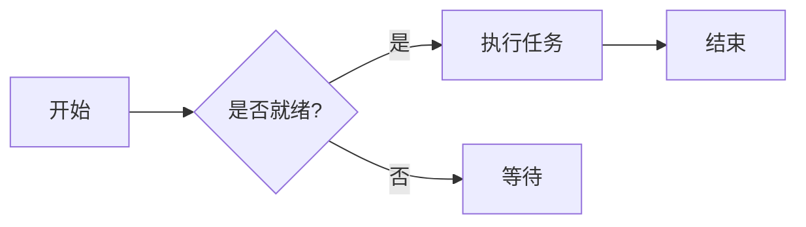
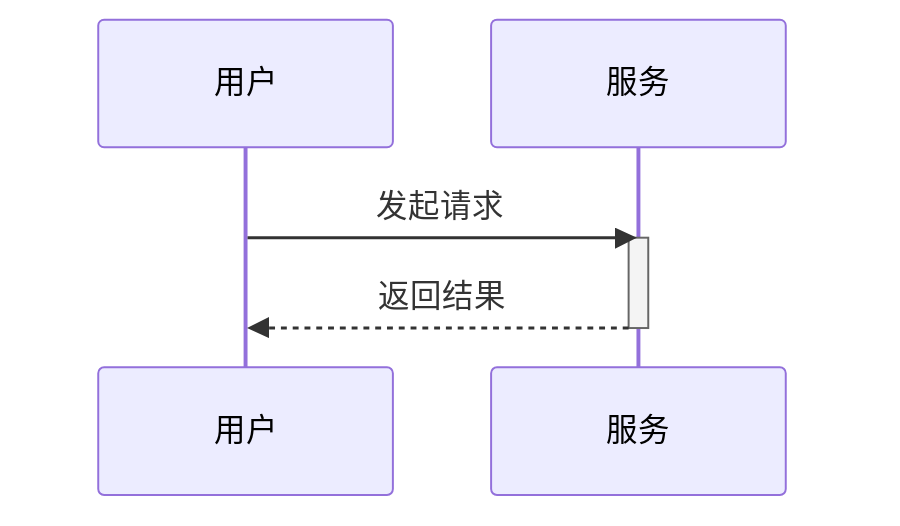

歡迎來到 Markdown 語法測試頁。這篇文章涵蓋了 Markdown、GFM（GitHub 風格）、數學公式與 Mermaid 圖的常用語法,用來驗證渲染管線。

## 標題層級

### 三級標題

這是 h3 下的正文。所有 h2/h3/h4 標題都有錨點——將滑鼠移到標題左側,會出現 `#` 連結圖示。

#### 四級標題

h4 用於更細的分節。**粗體**、*斜體*、***粗斜體***、~~刪除線~~都可以在這裡混排。

## 段落與換行

這是一個段落。段落之間用空行分隔,相鄰段落不會自動合併。

這是第二段。行尾加兩個空格再換行,可以強制軟換行
這樣文字就到了下一行。

## 文字樣式

- **粗體**:`**加粗**`
- *斜體*:`*斜体*`
- ***粗斜體***:`***粗斜体***`
- ~~刪除線~~:`~~删除线~~`(GFM)
- 行內程式碼:`const x = 1`
- 上標/下標:x<sup>2</sup>、H<sub>2</sub>O

## 連結

- 行內連結:[Nettix 博客](https://luoyuhao.nettix.top)
- 帶標題的連結:[访问文档](https://luoyuhao.nettix.top "文档首页")
- 引用式連結:[示例站][ref]
- 自動連結:<https://luoyuhao.nettix.top>

[ref]: https://luoyuhao.nettix.top "引用式链接目标"

## 圖片


圖片支援 alt 與 title,且不可選取、不可拖曳。

## 清單

### 無序清單

- 項目一
- 項目二
  - 巢狀項目 A
  - 巢狀項目 B
- 項目三

### 有序清單

1. 第一步
2. 第二步
3. 第三步
   1. 巢狀步驟 a
   2. 巢狀步驟 b

### 任務清單(GFM)

- [x] 已完成的任務
- [ ] 未完成的任務
- [x] 帶 `code` 的任務

## 引用

> 这是一段引用。
>
> > 嵌套引用。
>
> 引用里可以包含 **粗体** 与 `行内代码`。

## 程式碼

行內程式碼:`npm run dev`。

圍欄程式碼區塊(JavaScript):

```javascript
function greet(name) {
  return `Hello, ${name}!`;
}
```

TypeScript:

```typescript
interface User {
  id: number;
  name: string;
}
const user: User = { id: 1, name: "Alice" };
```

Python:

```python
def fib(n):
    a, b = 0, 1
    for _ in range(n):
        a, b = b, a + b
    return a
```

Shell:

```bash
# 安装依赖
pnpm install
```

## 表格

| 对齐方式 | 左对齐   | 居中 | 右对齐 |
| :------- | :------- | :--: | -----: |
| 示例     | 文本     | 文本 |   文本 |
| 值       | 100      | 200  |    300 |

## 分隔線

上面是內容,下面用分隔線斷開:

---

分隔線之後的內容。

## 數學公式

行內公式:歐拉恆等式 $e^{i\pi} + 1 = 0$。

區塊公式:

$$
\int_{-\infty}^{\infty} e^{-x^2}\,dx = \sqrt{\pi}
$$

## Mermaid 圖

### 流程圖



### 時序圖



## 原始 HTML 與破格圖

下面這張用原生 HTML 包裹,在紙張模式下頂格到紙張邊緣:

<figure class="full-bleed">
  
  <figcaption class="px-2 pt-2 text-center text-sm text-text-muted">顶格到纸张边缘</figcaption>
</figure>

## Emoji 與特殊字元

😄 🚀 ✨ —— 以及需要轉義的字元:`&`、`<`、`>`、`"`。

## 結語

以上涵蓋了大部分常用語法。若發現渲染異常,歡迎回報。
