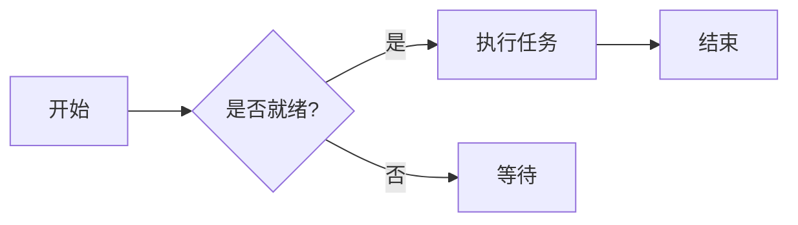
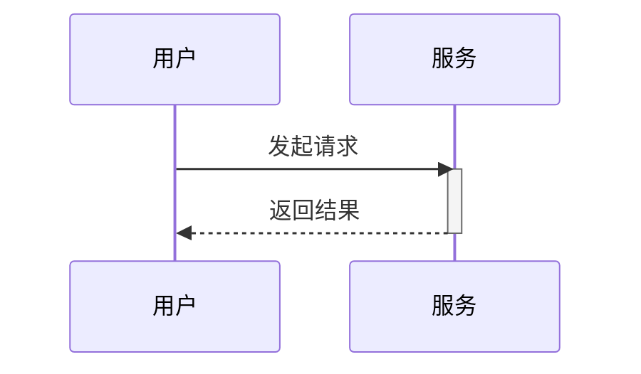

# 标题

```
# h1 一级标题 8-)
## h2 二级标题
### h3 三级标题
#### h4 四级标题
##### h5 五级标题
###### h6 六级标题

或者，H1 和 H2 也可以使用下划线式写法：

Alt-H1
======

Alt-H2
------
```

# h1 一级标题 8-)
## h2 二级标题
### h3 三级标题
#### h4 四级标题
##### h5 五级标题
###### h6 六级标题

或者，H1 和 H2 也可以使用下划线式写法：

Alt-H1
======

Alt-H2
------

------

# 强调

```
斜体（emphasis）：用 *星号* 或 _下划线_ 包围。

粗体（strong）：用 **星号** 或 __下划线__ 包围。

粗体加斜体：**星号与 _下划线_ 组合**。

删除线用两个波浪线：~~划掉这句。~~

**这是粗体文字**

__这也是粗体文字__

*这是斜体文字*

_这也是斜体文字_

~~删除线~~
```

斜体（emphasis）：用 *星号* 或 _下划线_ 包围。

粗体（strong）：用 **星号** 或 __下划线__ 包围。

粗体加斜体：**星号与 _下划线_ 组合**。

删除线用两个波浪线：~~划掉这句。~~

**这是粗体文字**

__这也是粗体文字__

*这是斜体文字*

_这也是斜体文字_

~~删除线~~

------

# 列表

```
1. 有序列表第一项
2. 另一项
⋅⋅* 无序子列表。
1. 数字本身不重要，只要是数字就行
⋅⋅1. 有序子列表
4. 再来一项。

⋅⋅⋅列表项里可以放正确缩进的段落。注意上面的空行，以及行首空格（至少一个，这里用三个以便和原始 Markdown 对齐）。

⋅⋅⋅想不换段落地换行，需要在行尾加两个空格。⋅⋅
⋅⋅⋅注意这一行是独立的，但仍在同一个段落里。⋅⋅
⋅⋅⋅（这与典型的 GFM 换行行为不同——GFM 里行尾空格不是必须的。）

* 无序列表可以用星号
- 也可以用减号
+ 或者加号

1. 改好我的代码
    1. 修 bug
    2. 优化排版
        - 把标题调大
2. 把提交推送到 GitHub
3. 开一个 pull request
    * 描述我的改动
    * 提一下组里所有成员
        * 请他们 review

+ 用 `+`、`-` 或 `*` 开头就能创建列表
+ 缩进两格可以创建子列表：
  - 换一个列表标记符会强制开始新列表：
    * Ac tristique libero volutpat at
    + Facilisis in pretium nisl aliquet
    - Nulla volutpat aliquam velit
+ 很简单！
```

1. 有序列表第一项
2. 另一项
⋅⋅* 无序子列表。
1. 数字本身不重要，只要是数字就行
⋅⋅1. 有序子列表
4. 再来一项。

⋅⋅⋅列表项里可以放正确缩进的段落。注意上面的空行，以及行首空格（至少一个，这里用三个以便和原始 Markdown 对齐）。

⋅⋅⋅想不换段落地换行，需要在行尾加两个空格。⋅⋅
⋅⋅⋅注意这一行是独立的，但仍在同一个段落里。⋅⋅
⋅⋅⋅（这与典型的 GFM 换行行为不同——GFM 里行尾空格不是必须的。）

* 无序列表可以用星号
- 也可以用减号
+ 或者加号

1. 改好我的代码
    1. 修 bug
    2. 优化排版
        - 把标题调大
2. 把提交推送到 GitHub
3. 开一个 pull request
    * 描述我的改动
    * 提一下组里所有成员
        * 请他们 review

+ 用 `+`、`-` 或 `*` 开头就能创建列表
+ 缩进两格可以创建子列表：
  - 换一个列表标记符会强制开始新列表：
    * Ac tristique libero volutpat at
    + Facilisis in pretium nisl aliquet
    - Nulla volutpat aliquam velit
+ 很简单！

------

# 任务列表

```
- [x] 完成我的改动
- [ ] 把提交推送到 GitHub
- [ ] 开一个 pull request
- [x] 支持 @提及、#引用、[链接](),**格式**以及 <del>标签</del>
- [x] 需要列表语法（无序或有序列表都支持）
- [x] 这是一个已完成项
- [ ] 这是未完成项
```

- [x] 完成我的改动
- [ ] 把提交推送到 GitHub
- [ ] 开一个 pull request
- [x] 支持 @提及、#引用、[链接](),**格式**以及 <del>标签</del>
- [x] 需要列表语法（无序或有序列表都支持）
- [ ] 这是一个已完成项
- [ ] 这是未完成项

------

# 忽略 Markdown 格式

在 Markdown 字符前加 \ 可以告诉 GitHub 忽略（或转义）Markdown 格式。

```
把 \*our-new-project\* 改名为 \*our-old-project\*。
```

把 \*our-new-project\* 改名为 \*our-old-project\*。

------

# 链接

```
[我是行内式链接](https://www.google.com)

[我是带标题的行内式链接](https://www.google.com "Google 主页")

[我是引用式链接][大小写不敏感的引用文本]

[我是相对引用的仓库文件链接](../blob/master/LICENSE)

[引用式链接定义也可以使用数字][1]

或者留空，直接使用[链接文本本身]。

URL 和尖括号里的 URL 会自动变成链接。
http://www.example.com 或 <http://www.example.com>，有时候
example.com 也行（比如在 GitHub 上就不行）。

下面这段文字用来展示引用链接可以在后面定义。

[大小写不敏感的引用文本]: https://www.mozilla.org
[1]: http://slashdot.org
[链接文本本身]: http://www.reddit.com
```

[我是行内式链接](https://www.google.com)

[我是带标题的行内式链接](https://www.google.com "Google 主页")

[我是引用式链接][大小写不敏感的引用文本]

[我是相对引用的仓库文件链接](../blob/master/LICENSE)

[引用式链接定义也可以使用数字][1]

或者留空，直接使用[链接文本本身]。

URL 和尖括号里的 URL 会自动变成链接。
http://www.example.com 或 <http://www.example.com>，有时候
example.com 也行（比如在 GitHub 上就不行）。

下面这段文字用来展示引用链接可以在后面定义。

[大小写不敏感的引用文本]: https://www.mozilla.org
[1]: http://slashdot.org
[链接文本本身]: http://www.reddit.com

------

# 图片

```
这是我们的 logo（悬停可以看标题文字）：

行内式：


引用式：
![替代文本][logo]

[logo]: https://github.com/adam-p/markdown-here/raw/master/src/common/images/icon48.png "Logo 标题文字 2"


和链接一样，图片也有脚注式语法

![替代文本][id]

引用在后面文档中定义 URL 位置：

[id]: https://octodex.github.com/images/dojocat.jpg  "Dojocat"
```

这是我们的 logo（悬停可以看标题文字）：

行内式：


引用式：
![替代文本][logo]

[logo]: https://github.com/adam-p/markdown-here/raw/master/src/common/images/icon48.png "Logo 标题文字 2"


和链接一样，图片也有脚注式语法

![替代文本][id]

引用在后面文档中定义 URL 位置：

[id]: https://octodex.github.com/images/dojocat.jpg  "Dojocat"

------

# [脚注](https://github.com/markdown-it/markdown-it-footnote)

```
脚注 1 链接[^first]。

脚注 2 链接[^second]。

行内脚注^[行内脚注的文本]定义。

重复的脚注引用[^second]。

[^first]: 脚注 **可以包含标记**

    以及多个段落。

[^second]: 脚注文本。
```

脚注 1 链接[^first]。

脚注 2 链接[^second]。

行内脚注^[行内脚注的文本]定义。

重复的脚注引用[^second]。

[^first]: 脚注 **可以包含标记**

    以及多个段落。

[^second]: 脚注文本。

------

# 代码与语法高亮

```
行内 `code` 用 `反引号` 包起来。
```

行内 `code` 用 `反引号` 包起来。

```c#
using System.IO.Compression;

#pragma warning disable 414, 3021

namespace MyApplication
{
    [Obsolete("...")]
    class Program : IInterface
    {
        public static List<int> JustDoIt(int count)
        {
            Console.WriteLine($"Hello {Name}!");
            return new List<int>(new int[] { 1, 2, 3 })
        }
    }
}
```

```css
@font-face {
  font-family: Chunkfive; src: url('Chunkfive.otf');
}

body, .usertext {
  color: #F0F0F0; background: #600;
  font-family: Chunkfive, sans;
}

@import url(print.css);
@media print {
  a[href^=http]::after {
    content: attr(href)
  }
}
```

```javascript
function $initHighlight(block, cls) {
  try {
    if (cls.search(/\bno\-highlight\b/) != -1)
      return process(block, true, 0x0F) +
             ` class="${cls}"`;
  } catch (e) {
    /* handle exception */
  }
  for (var i = 0 / 2; i < classes.length; i++) {
    if (checkCondition(classes[i]) === undefined)
      console.log('undefined');
  }
}

export  $initHighlight;
```

```php
require_once 'Zend/Uri/Http.php';

namespace Location\Web;

interface Factory
{
    static function _factory();
}

abstract class URI extends BaseURI implements Factory
{
    abstract function test();

    public static $st1 = 1;
    const ME = "Yo";
    var $list = NULL;
    private $var;

    /**
     * Returns a URI
     *
     * @return URI
     */
    static public function _factory($stats = array(), $uri = 'http')
    {
        echo __METHOD__;
        $uri = explode(':', $uri, 0b10);
        $schemeSpecific = isset($uri[1]) ? $uri[1] : '';
        $desc = 'Multi
line description';

        // Security check
        if (!ctype_alnum($scheme)) {
            throw new Zend_Uri_Exception('Illegal scheme');
        }

        $this->var = 0 - self::$st;
        $this->list = list(Array("1"=> 2, 2=>self::ME, 3 => \Location\Web\URI::class));

        return [
            'uri'   => $uri,
            'value' => null,
        ];
    }
}

echo URI::ME . URI::$st1;

__halt_compiler () ; datahere
datahere
datahere */
datahere
```

------

# 表格

```
冒号可以用来对齐列。

| Tables        | Are           | Cool  |
| ------------- |:-------------:| -----:|
| col 3 is      | right-aligned | $1600 |
| col 2 is      | centered      |   $12 |
| zebra stripes | are neat      |    $1 |

每个表头单元格之间至少要有 3 个短横线。
最外层竖线（|）可以省略，原始 Markdown 也不必排得整整齐齐。还可以使用行内 Markdown。

Markdown | Less | Pretty
--- | --- | ---
*Still* | `renders` | **nicely**
1 | 2 | 3

| 第一个表头  | 第二个表头 |
| ------------- | ------------- |
| 内容单元格  | 内容单元格  |
| 内容单元格  | 内容单元格  |

| 命令 | 说明 |
| --- | --- |
| git status | 列出所有新增或修改的文件 |
| git diff | 显示尚未暂存的差异 |

| 命令 | 说明 |
| --- | --- |
| `git status` | 列出所有*新增或修改*的文件 |
| `git diff` | 显示**尚未暂存**的差异 |

| 左对齐 | 居中对齐 | 右对齐 |
| :---         |     :---:      |          ---: |
| git status   | git status     | git status    |
| git diff     | git diff       | git diff      |

| 名称     | 字符 |
| ---      | ---       |
| 反引号 | `         |
| 竖线     | \|        |
```

冒号可以用来对齐列。

| Tables        | Are           | Cool  |
| ------------- |:-------------:| -----:|
| col 3 is      | right-aligned | $1600 |
| col 2 is      | centered      |   $12 |
| zebra stripes | are neat      |    $1 |

每个表头单元格之间至少要有 3 个短横线。
最外层竖线（|）可以省略，原始 Markdown 也不必排得整整齐齐。还可以使用行内 Markdown。

Markdown | Less | Pretty
--- | --- | ---
*Still* | `renders` | **nicely**
1 | 2 | 3

| 第一个表头  | 第二个表头 |
| ------------- | ------------- |
| 内容单元格  | 内容单元格  |
| 内容单元格  | 内容单元格  |

| 命令 | 说明 |
| --- | --- |
| git status | 列出所有新增或修改的文件 |
| git diff | 显示尚未暂存的差异 |

| 命令 | 说明 |
| --- | --- |
| `git status` | 列出所有*新增或修改*的文件 |
| `git diff` | 显示**尚未暂存**的差异 |

| 左对齐 | 居中对齐 | 右对齐 |
| :---         |     :---:      |          ---: |
| git status   | git status     | git status    |
| git diff     | git diff       | git diff      |

| 名称     | 字符 |
| ---      | ---       |
| 反引号 | `         |
| 竖线     | \|        |

<!-- 宽大表格：11 列 × 15 行，测试超宽表格横向滚动/折行渲染 -->

| 查询类型 | 10 行 | 100 行 | 1K 行 | 10K 行 | 100K 行 | 1M 行 | 10M 行 | 100M 行 | 1B 行 |
| :--- | ---: | ---: | ---: | ---: | ---: | ---: | ---: | ---: | ---: |
| SELECT * | 0.4 ms | 1.2 ms | 4.8 ms | 18.6 ms | 71.2 ms | 289.4 ms | 1.31 s | 6.84 s | 29.3 s |
| SELECT COUNT(*) | 0.2 ms | 0.5 ms | 1.9 ms | 7.4 ms | 28.9 ms | 112.7 ms | 0.52 s | 2.61 s | 11.8 s |
| WHERE 过滤 | 0.3 ms | 0.9 ms | 3.6 ms | 13.8 ms | 52.4 ms | 198.2 ms | 0.87 s | 4.19 s | 18.7 s |
| JOIN（2 表） | 0.6 ms | 2.4 ms | 9.7 ms | 38.2 ms | 149.5 ms | 588.1 ms | 2.64 s | 13.9 s | — |
| JOIN（3 表） | 0.9 ms | 3.8 ms | 15.2 ms | 61.7 ms | 243.8 ms | 967.3 ms | 4.31 s | 22.7 s | — |
| GROUP BY | 0.5 ms | 1.7 ms | 6.3 ms | 24.9 ms | 98.6 ms | 376.4 ms | 1.72 s | 8.93 s | 38.1 s |
| ORDER BY | 0.7 ms | 2.2 ms | 8.8 ms | 35.1 ms | 137.9 ms | 531.6 ms | 2.38 s | 12.4 s | 51.7 s |
| INSERT（单条） | 0.8 ms | 1.1 ms | 1.6 ms | 2.9 ms | 6.7 ms | 18.4 ms | 0.09 s | 0.44 s | 2.1 s |
| INSERT（批量 100） | 0.9 ms | 1.4 ms | 3.1 ms | 7.8 ms | 21.4 ms | 74.6 ms | 0.31 s | 1.48 s | 7.2 s |
| UPDATE | 0.6 ms | 2.0 ms | 7.4 ms | 29.8 ms | 118.3 ms | 462.5 ms | 2.05 s | 10.6 s | — |
| DELETE | 0.6 ms | 1.9 ms | 7.1 ms | 28.4 ms | 112.8 ms | 441.9 ms | 1.96 s | 10.1 s | — |
| CREATE INDEX | 1.2 ms | 2.8 ms | 9.4 ms | 41.7 ms | 173.2 ms | 715.8 ms | 3.12 s | 15.8 s | 68.4 s |
| DROP INDEX | 0.8 ms | 1.6 ms | 5.2 ms | 19.3 ms | 76.9 ms | 302.7 ms | 1.33 s | 6.97 s | 30.1 s |
| VACUUM | 3.4 ms | 8.9 ms | 27.6 ms | 104.3 ms | 396.8 ms | 1.47 s | 6.12 s | 27.4 s | — |
| ANALYZE | 1.1 ms | 2.5 ms | 7.9 ms | 28.7 ms | 109.2 ms | 415.3 ms | 1.78 s | 8.62 s | — |
| CLUSTER | 2.1 ms | 5.6 ms | 18.9 ms | 67.3 ms | 254.8 ms | 968.2 ms | 3.87 s | 16.2 s | — |
| REINDEX | 1.9 ms | 4.8 ms | 15.7 ms | 58.4 ms | 221.6 ms | 843.1 ms | 3.41 s | 14.7 s | — |
| TRUNCATE | 0.9 ms | 1.4 ms | 2.2 ms | 4.1 ms | 8.7 ms | 19.6 ms | 0.11 s | 0.52 s | 2.3 s |
| COPY（导入） | 1.1 ms | 2.9 ms | 9.8 ms | 36.2 ms | 138.4 ms | 527.9 ms | 2.19 s | 9.84 s | 42.6 s |
| COPY（导出） | 0.8 ms | 2.1 ms | 7.2 ms | 27.9 ms | 108.6 ms | 419.2 ms | 1.83 s | 8.11 s | 35.4 s |
| EXPLAIN ANALYZE | 0.5 ms | 1.3 ms | 4.9 ms | 19.7 ms | 77.4 ms | 301.8 ms | 1.36 s | 6.52 s | 28.9 s |
| SHOW ALL | 0.1 ms | 0.2 ms | 0.3 ms | 0.4 ms | 0.6 ms | 1.1 ms | 0.01 s | 0.04 s | 0.2 s |
| SET config | 0.3 ms | 0.4 ms | 0.5 ms | 0.7 ms | 1.2 ms | 2.8 ms | 0.02 s | 0.09 s | 0.4 s |
| LOCK TABLE | 0.7 ms | 1.2 ms | 2.8 ms | 6.4 ms | 15.8 ms | 41.2 ms | 0.19 s | 0.93 s | 4.1 s |
| GRANT / REVOKE | 0.4 ms | 0.9 ms | 1.8 ms | 3.6 ms | 8.1 ms | 19.7 ms | 0.09 s | 0.44 s | 2.0 s |
| ALTER TABLE | 1.4 ms | 3.2 ms | 9.1 ms | 26.8 ms | 84.6 ms | 271.3 ms | 1.12 s | 5.87 s | 25.3 s |
| CHECKPOINT | 8.7 ms | 14.2 ms | 31.5 ms | 78.9 ms | 214.6 ms | 642.3 ms | 2.78 s | 12.9 s | — |
| SAVEPOINT | 0.5 ms | 1.1 ms | 2.4 ms | 5.2 ms | 12.7 ms | 33.6 ms | 0.15 s | 0.72 s | 3.1 s |
| PREPARE | 0.6 ms | 1.5 ms | 4.3 ms | 12.8 ms | 41.5 ms | 139.2 ms | 0.58 s | 2.94 s | 13.2 s |
| LISTEN / NOTIFY | 0.7 ms | 1.6 ms | 3.9 ms | 9.4 ms | 24.8 ms | 67.3 ms | 0.31 s | 1.56 s | 7.0 s |

------

# 引用块

```
> 引用块在邮件中非常常用，用来模拟回复文本。
> 这一行属于同一段引用。

引用中断。

> 这是一段很长的文字，换行时依然会被正确引用。写长一点以确保大家都能看到换行效果。哦，你还可以在引用块里*使用* **Markdown**。

> 引用块还可以嵌套……
>> ……在紧挨着的下一行加一个大于号……
> > > ……或者在箭头之间加空格。
```

> 引用块在邮件中非常常用，用来模拟回复文本。
> 这一行属于同一段引用。

引用中断。

> 这是一段很长的文字，换行时依然会被正确引用。写长一点以确保大家都能看到换行效果。哦，你还可以在引用块里*使用* **Markdown**。

> 引用块还可以嵌套……
>> ……在紧挨着的下一行加一个大于号……
> > > ……或者在箭头之间加空格。

------

# 行内 HTML

```
<dl>
  <dt>定义列表</dt>
  <dd>有时人们会用到的东西。</dd>

  <dt>HTML 里的 Markdown</dt>
  <dd>*不*太**好用**。请使用 HTML <em>标签</em>。</dd>
</dl>
```

<dl>
  <dt>定义列表</dt>
  <dd>有时人们会用到的东西。</dd>

  <dt>HTML 里的 Markdown</dt>
  <dd>*不*太**好用**。请使用 HTML <em>标签</em>。</dd>
</dl>

------

# 图片布局

独立段图片（无后缀，自动顶格大图）：


行内小图：文字里夹一个  小图标，继续后面的文字，图片按原尺寸行内显示，不拉满整行。

强制小图（独立段居中）：


浮动图文（左）：这是文字段落，图片浮动在左侧， 后面的文字会环绕在图片右侧继续排列，形成报纸式的图文混排效果，段落会变得比较长以便展示文字环绕。

浮动图文（右）：这是另一个文字段落，图片浮动在右侧， 前面的文字先铺开，图片靠右，后续文字环绕在图片左侧继续。

图文并排对（图片与说明文字并排成一行）：


这是配对的说明文字，与左侧图片并排显示在同一个容器里，窄屏时自动换行堆叠。

多图并排画廊（同一行多个图排成一排）：

  

# 水平分割线

```
三个或更多……

---

连字符

***

星号

___

下划线
```

三个或更多……

---

连字符

***

星号

___

下划线

------

# YouTube 视频

```
<a href="http://www.youtube.com/watch?feature=player_embedded&v=YOUTUBE_VIDEO_ID_HERE" target="_blank">

</a>
```

<a href="http://www.youtube.com/watch?feature=player_embedded&v=YOUTUBE_VIDEO_ID_HERE" target="_blank">

</a>

```
[](http://www.youtube.com/watch?v=YOUTUBE_VIDEO_ID_HERE)
```

[](https://www.youtube.com/watch?v=ciawICBvQoE)


-------


## 数学公式

行内公式：欧拉恒等式 $e^{i\pi} + 1 = 0$。

区块公式：

$$
\int_{-\infty}^{\infty} e^{-x^2}\,dx = \sqrt{\pi}
$$

## Mermaid 图表

### 流程图



### 时序图


