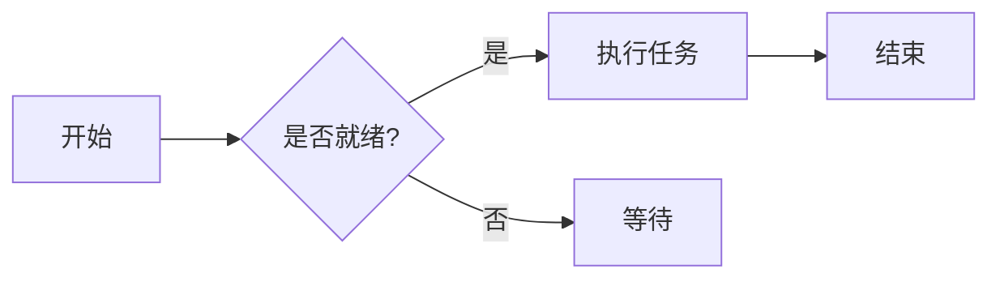
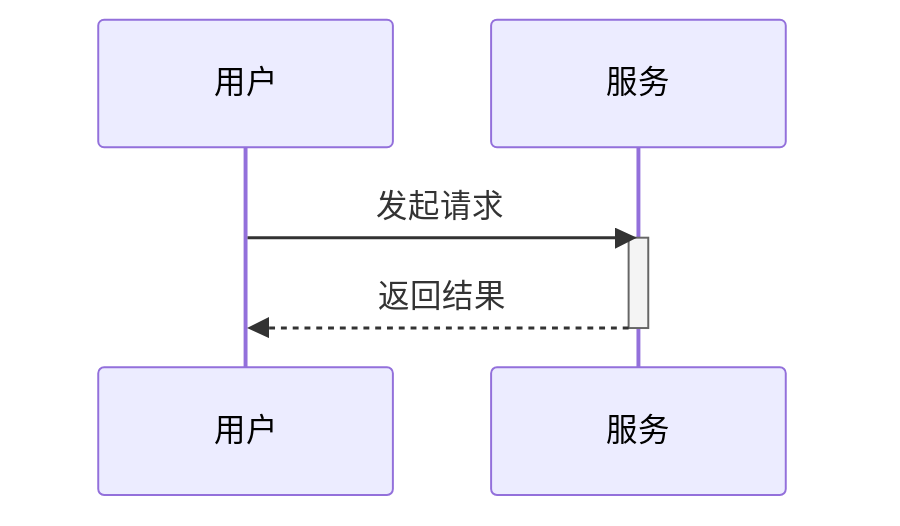

欢迎来到 Markdown 语法测试页。这篇文章覆盖了 Markdown、GFM（GitHub 风格）、数学公式与 Mermaid 图的常用语法,用来验证渲染管线。

## 标题层级

### 三级标题

这是 h3 下的正文。所有 h2/h3/h4 标题都有锚点——悬停标题左侧,会出现 `#` 链接图标。

#### 四级标题

h4 用于更细的分节。**加粗**、*斜体*、***粗斜体***、~~删除线~~都可以在这里混排。

## 段落与换行

这是一个段落。段落之间用空行分隔,相邻段落不会自动合并。

这是第二段。行尾加两个空格再换行,可以强制软换行  
这样文字就到了下一行。

## 文字样式

- **粗体**:`**加粗**`
- *斜体*:`*斜体*`
- ***粗斜体***:`***粗斜体***`
- ~~删除线~~:`~~删除线~~`(GFM)
- 行内代码:`const x = 1`
- 上标/下标:x<sup>2</sup>、H<sub>2</sub>O

## 链接

- 行内链接:[Nettix 博客](https://luoyuhao.nettix.top)
- 带标题的链接:[访问文档](https://luoyuhao.nettix.top "文档首页")
- 引用式链接:[示例站][ref]
- 自动链接:<https://luoyuhao.nettix.top>

[ref]: https://luoyuhao.nettix.top "引用式链接目标"

## 图片


图片支持 alt 与 title,且不可选中、不可拖拽。

## 列表

### 无序列表

- 项目一
- 项目二
  - 嵌套项目 A
  - 嵌套项目 B
- 项目三

### 有序列表

1. 第一步
2. 第二步
3. 第三步
   1. 嵌套步骤 a
   2. 嵌套步骤 b

### 任务列表(GFM)

- [x] 已完成的任务
- [ ] 未完成的任务
- [x] 带 `code` 的任务

## 引用

> 这是一段引用。
>
> > 嵌套引用。
>
> 引用里可以包含 **粗体** 与 `行内代码`。

## 代码

行内代码:`npm run dev`。

围栏代码块(JavaScript):

```javascript
function greet(name) {
  return `Hello, ${name}!`;
}
```

TypeScript:

```typescript
interface User {
  id: number;
  name: string;
}
const user: User = { id: 1, name: "Alice" };
```

Python:

```python
def fib(n):
    a, b = 0, 1
    for _ in range(n):
        a, b = b, a + b
    return a
```

Shell:

```bash
# 安装依赖
pnpm install
```

## 表格

| 对齐方式 | 左对齐   | 居中 | 右对齐 |
| :------- | :------- | :--: | -----: |
| 示例     | 文本     | 文本 |   文本 |
| 值       | 100      | 200  |    300 |

## 分割线

上面是内容,下面用分割线断开:

---

分割线之后的内容。

## 数学公式

行内公式:欧拉恒等式 $e^{i\pi} + 1 = 0$。

块级公式:

$$
\int_{-\infty}^{\infty} e^{-x^2}\,dx = \sqrt{\pi}
$$

## Mermaid 图

### 流程图



### 时序图



## 原始 HTML 与破格图

下面这张用原生 HTML 包裹,在纸张模式下顶格到纸张边缘:

<figure class="full-bleed">
  
  <figcaption class="px-2 pt-2 text-center text-sm text-text-muted">顶格到纸张边缘</figcaption>
</figure>

## Emoji 与特殊字符

😄 🚀 ✨ —— 以及需要转义的字符:`&`、`<`、`>`、`"`。

## 结语

以上覆盖了大部分常用语法。若发现渲染异常,欢迎反馈。
