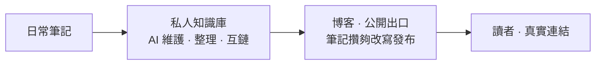

## 都說 AI 能寫了，真人博客反而在回暖

2024年11月，英文網際網路上 AI 生成的文章，數量上第一次超過了真人寫的[^1]。到2025年5月，Graphite 抽查了65000篇英文網路文章，AI 生成的已經佔到了52%。澳洲麥格理辭典乾脆把「AI slop」選成2025年度詞彙，中文網際網路這邊，有個更傳神的叫法：AI味[^2]。

按理說，AI 都能替你寫了，誰還費勁自己寫？

可現實是反的。真人寫的獨立博客正在回暖，國外叫 Blogging Renaissance，國內喊「部落格文藝復興」[^3]。

為什麼？滿世界都是「AI味」的時候，帶著個人氣味的東西反而成了稀缺品。AI 越能寫，真人寫的那份越值錢——這大概就是回暖的原因。

但「該寫」是一回事，「寫在哪」是另一回事：是寫在平台帳號上，還是寫在自己能說了算的地方？這得先從平台上的那些事說起。

## 租來的地方，你說了不算

### 說刪就刪，連個說理的地方都沒有

2026年3月，某信更新了營運規範，明確禁止「非真人自動化創作行為」（3.27條）[^4]。新規一出，誤傷跟著就來了：有作者的文章一字一句全是手寫的，只是用了第三方排版工具、統一了段落格式，就被系統判定成 AI 創作，直接刪了[^4]。有營運者手動上傳圖片，也被誤判成「非真人自動化創作行為」，申訴之後只收到一句「確實存在違規行為」——哪句話違規、證據是什麼，一概不告訴你[^4]。

申訴機制更讓人不解：後台或用戶投訴觸發的違規判定，文章基本直接刪，沒有申訴途徑；唯一有申訴通道的情形，作者卻看不到投訴內容——被刪的是哪句話、證據是否充分，一概不知[^4]。

某乎那邊，2026年也多次發布 AIGC 治理公告，對低質 AI 內容做摺疊、限流、禁言。判定邏輯不是「你用了 AI 沒有」，而是「內容有沒有觸發偵測模型」——句式重複、詞彙分布、情感扁平，都可能中招。有創作者申訴多次沒成功，「後來就放棄了」。

這些事的共同點是：**你對自己寫的東西，沒有最終解釋權。** 平台演算法只盯著排版、句式、發布頻率這些表面特徵，文章到底寫了什麼，它不關心。這就是「租」來的關係最要命的地方——你以為你在自己的帳號上寫作，其實只是在一個隨時可能收回的房子裡擺家具。

### 平台用戶刷不到你，更別說變成你的讀者

2026年，Instagram 一條貼文的平均粉絲觸達率跌到3.5%到7.6%，相比2020年的10%到15%幾乎腰斬；Facebook 主頁的有機觸達常年在5%左右徘徊，大號更慘[^5]。十年前發一條貼文，粉絲裡可能有16%的人看到；現在能穩定觸達1/10就不錯了。

這不是「暫時波動」，是平台故意的：演算法把位置優先留給能直接變現的內容，不給錢就沒曝光，目的就是推廣告收入。有機觸達率下降和廣告收入增長，是同一件事的兩面。

我也想過郵件訂閱，打開率通常有30%到40%，觸達的是主動訂閱你的那批人[^6]。差距是幾倍到幾十倍。

但關鍵還不只是「觸達率低」。**平台用戶不是你的粉絲，是平台的用戶。** 演算法不讓他們看到你，他們就永遠成不了你的讀者。你在平台上攢的所謂粉絲，本質上是租來的觀眾。演算法決定今天讓誰看到你，改規則的時候不會提前通知你。

### AI 一來，誤殺更狠了

平台拿 AI 來抓 AI 內容，可這偵測本身就不靠譜。Graphite 用的 Surfer 偵測工具，在 Graphite 自己的測試裡，對真人文章的誤報率是4.2%[^1]；中文這邊，南方都市報2025年測評過10款主流 AI 偵測工具，把名家名作都判成了 AI[^7]：

| 被檢作品 | 偵測工具 | 判定結果 |
| --- | --- | --- |
| 老舍《林海》 | 茅茅蟲 | 99.9% AI 生成率 |
| 老舍《林海》（1300 餘字） | 萬方 | 35.6% 誤判比例 |
| 朱自清《荷塘月色》 | 某主流工具 | 62.88% AI 創作 |

創作者兩頭堵：用 AI 輔助，說你「非真人創作」；老老實實手寫，又可能因為文風太「標準化」被誤判。平台拿演算法治理 AI，可演算法本身就是 AI。誤判的代價，全由真人創作者扛。

## AI 什麼都能寫，唯獨寫不了你

### 答案可以給，思考得自己來

大語言模型的生成邏輯，是「預測下一個詞的機率」，輸出統計上最可能的詞序列，而不是最有洞見的表達[^8]。它沒有自我意識，沒有你的經歷，不承擔選擇的後果，也不在乎寫出來的東西對不對。

寫作不是「把想清楚的東西倒出來」。寫作本身就是思考。你坐下來寫一個觀點，寫到第三段發現邏輯斷了，回頭重新審視前提——這個過程，AI 替你寫初稿的時候不會發生。你寫不清楚，就是沒想清楚。阮一峰說過一句樸素的話：「博客首先是一種知識管理工具，其次才是傳播工具。我只寫那些我還沒有完全掌握的東西。」[^9]他從2003年寫到今天，1500多篇博文，就是二十多年思考的完整脈絡。

Hacker News 上有篇討論也在聊這件事。一位博主說：「我寫博客主要是想提升自己的寫作能力，這是我歷史上一直很弱的地方。這件事本身就有價值。我不介意沒人看。」有人回覆：「即使沒人讀我的博客，把想法寫下來的過程迫使你主動思考它們，主動面對你可能存在的矛盾。」[^10]

寫著寫著，你的自我會變得越來越清晰。這件事 AI 替不了，因為 AI 沒有「自我」可以變清晰。計算器沒讓人放棄數學，AI 也不該讓人放棄寫作。

### 內容可以量產，經歷沒法複製

一篇深度文章勝過十張名片，因為文章是**可驗證的**。

AI 可以總結一千篇「如何最佳化資料庫」的通用方法，但沒有「我們如何把查詢延遲從2秒降到50毫秒」這個真實案例的原始素材——你沒踩過這個坑，就沒有這套經驗可寫。真實的踩坑經歷、具體的數據、做選擇時的猶豫和事後的反思，這才是人的獨特資產。

### 一個人幹一家公司，博客就是你的信用資產

2026年，「一人公司」（One Person Company, OPC）正從概念走向大規模實踐。據中關村人才協會《中國OPC發展趨勢報告（2025-2030年）》，截至2025年6月，全國一人有限責任公司存量已突破1600萬家，占企業總量的27.4%；僅2025年上半年，新註冊就達286萬戶，同比增長47%，占全部新註冊企業的23.8%[^11]。在杭州、深圳、北京、上海等地，OPC 在新設企業中的占比超過50%。

OPC 創業者裡，非技術背景的已經占了大頭，營運、增長、設計、內容出身的人大量湧入[^12]。啟動資金的門檻被 AI 大幅拉低——一個人、一台電腦、一套 AI 工具，就能跑通過去需要團隊才能完成的業務。當一個人能獨立跑通這些，外部世界靠什麼判斷你靠不靠譜？靠履歷？靠自我介紹？都不如靠持續輸出的公開記錄。

你的博客，就是你戰略判斷、技術能力和產品審美的可驗證信用資產。潛在客戶或合作夥伴打開你的博客，看到你過去兩年持續寫的技術分析、產品思考、行業判斷——信任就在這個過程中建立了。不需要面對面，不需要銷售話術。

AI 大幅壓縮了產品開發週期，「能做出產品」不再是差異化優勢。「能清晰地解釋你為什麼做這個產品、它解決了什麼問題、你的判斷邏輯是什麼」——這才是。博客正是這種解釋能力的載體。

### 罐頭味的東西遍地是，真人寫的才金貴

「AI味」不是一個玄學感受，它有可以被客觀分析的文本特徵。《中國社會科學報》把 AI 文章的特徵拆成三層[^8]：

| 層面 | AI 寫的文章 |
| --- | --- |
| 詞彙 | 偏好高頻中性的「安全詞彙」，迴避方言、俚語和帶個人色彩的表達 |
| 句式 | 句子長度過於均衡，缺乏人類語言的節奏張力 |
| 結構 | 高度模板化，用「首先、其次、總之」充當「虛假邏輯連貫性的裝飾」 |

PNAS 和 Computers in Human Behavior: Artificial Humans 上的兩項研究也指向同一結論：AI 生成的故事重複度高，對人類創意多樣性的貢獻低於人類寫作，而且生成越多差距越大[^13][^14]。說人話就是：AI 寫的東西，你讀得越多，越覺得都一樣。

Ann Handley 在2025年的分析裡說得一針見血：「AI makes information abundant and cheap. Humans create what's scarce—and therefore valuable.」[^15]真正稀缺的是三樣東西：**意義、信任、注意力**。

還有一件順手的事：GEO（生成式引擎最佳化）——讓 AI 在「轉述」你的內容時不歪曲原意。最佳化重點包括清晰的標題層級、開頭給結論、列表化要點[^16]。

但 Ann Handley 還有另一條發現：「你越讓它替你寫，你的結果就越差。」[^15]AI 適合做粗活：轉錄、格式化、生成初稿、整理思路；不適合做「講故事的人」——注入判斷、決定說什麼、用什麼語氣說。AI 可以把一段想法擴展成800字，但那段只有你才能產生的、基於真實經歷的判斷，它給不了。

### 飯碗搶不走，力氣倒是能省

把 AI 嵌進創作流程，讓它承擔重複、瑣碎、耗時的部分：選題時查資料、做競品分析，初稿時擴展思路、梳理結構，審校時檢查語法、最佳化排版。但核心判斷——文章到底要說什麼、用什麼語氣說、哪些內容該保留——還是你自己來。

有個很實用的工作流：

AI 負責管理知識的輸入和整理，你負責知識的輸出和表達。

所以，當所有人都在用 AI 生成內容時，**真人寫作的邊際價值反而在上升**。

## 搭個博客花不了幾個錢

靜態博客託管這件事，2026 年的「窮鬼套餐」已經很成熟了。搭博客要打交道的，就三樣：**工具**、**平台**和**域名**——前兩樣免費，域名要花錢。

### 工具全是免費的

工具是跑在你電腦上的軟體，不依賴任何平台。**靜態生成器**把 Markdown 變成 HTML，**部署工具**把檔案推上線。

生成器按習慣選就行：要快用 Hugo（毫秒級，單二進位檔案）；要新用 Astro，預設零 JS 輸出，還能混用 React/Vue/Svelte 組件；Hexo 基於 Node.js，中文資料最多；用 GitHub Pages 就配 Jekyll，原生支援，就是建構慢些。

部署更省事：`git push` 到倉庫，GitHub Actions 或平台的 Git 整合自動建構上線，Cloudflare 的官方 CLI（Wrangler）還能本地預覽。

這一層全免費：上面這些生成器都開源，GitHub Actions 對公開倉庫無限免費。你唯一要準備的，是一個文字編輯器和一條命令列。[^17]

### 平台都有免費額度

平台是託管服務，CDN、SSL、存取控制都是它的事。Cloudflare、Vercel、Netlify、GitHub Pages、EdgeOne Makers 這些主流方案，免費額度都夠個人博客用——頻寬、建構次數、HTTPS 這些基礎項，不花錢就能滿足[^18]。

### 唯一要花錢的是域名

域名約 10 到 15 美元一年，平攤下來每月不到 1 美元。

### 能搬走的，才不算被綁住

工具和平台說到底也是別人的東西，和平台上的帳號一樣，都是租來的。區別在於能不能換：工具都開源，隨時能換；靜態檔案在自己手裡，平台想換也能整體搬走。正因為搬得走、換得了，才不算被綁死。

還有一句實在話：免費條款隨時可能變，`*.pages.dev` 這種子域名也是租來的。所以無論用哪家，Markdown 定期備份、保持可遷移，這個習慣別丟——域名和源檔案，才是你真正擁有的。

### AI 讓搭博客更容易

搭博客的障礙，一半是錢，一半是技術門檻。

以前想擺脫千篇一律的現成主題，要麼自己會寫程式碼，要麼花錢找人客製化，從零開發的成本高得嚇人。現在這條路被 AI 剷平了：有人讓 AI 寫 PHP 替換掉 Typecho，有人用 Next.js + Fumadocs 自建，還有人拿 FastAPI + Jinja2 + MDUIv2 搭，輸個喜歡的顏色就生成全套配色[^19]。

共同點很直接：你不用再親手寫每一行程式碼，AI 負責把「想要什麼」變成「跑起來的程式」。門檻從「會寫程式碼」降到了「會說清楚需求」。

於是剩下要花心思的，就是你的博客長什麼樣、裝什麼內容、為什麼這麼設計。像「為什麼我選 Next.js + Fumadocs 而不是 Hexo」這類文章，聊的是技術選型，背後是審美和判斷。

## 寫在最後

寫博客最不用擔心的，就是沒人看。一個精準觸達的同頻讀者，勝過一萬次泛泛的瀏覽。你三年前踩過的坑，也許正有人在深夜搜尋時撞見，讀完之後給你發來一封郵件——這種連結，不是閱讀量能衡量的。所以別盯著流量，寫你真正有獨特經驗的東西，寫你搜過但沒找到答案的東西，再寫點你願意在三年後重讀的。那些真正需要你文章的人，會找到的。

至於回報，直接的經濟收益確實不顯著，但有更實在的地方。持續輸出的公開記錄，比履歷更有說服力——有人就靠博客收到過遠端崗位的邀約。一篇深度文章建立的專業信任，能變成諮詢、合作的機會。內容也有複利：2023 年寫下的技術教學，2026 年可能還在給你帶來搜尋流量和讀者。

在 AI 可以無限複製內容的時代，還在自己的域名下、用自己的聲音、寫自己真正相信的東西——光這一點，我就覺得值了。

獨立博客不是關於被多少人看到，而是你有沒有一個地方，能誠實地記錄自己的思考，檢驗自己的判斷，然後安靜地等著真正需要你的人找過來。

阮一峰在2006年寫過一句樸素的話[^20]：

> 「長期寫作 Blog 最大的好處之一就是，寫著寫著，你的自我會變得越來越清晰。」

二十年過去，這句話我信。

從今天開始，寫你的第一篇。我的第一篇，就是這篇。

[^1]: Graphite Common Crawl抽样研究（65000篇英文文章），引自Visual Capitalist[《AI Articles Have Overtaken Human-Written Ones》](https://www.visualcapitalist.com/visualized-content-created-by-humans-vs-ai-over-time/)，2025年10月；PCMag[《More Than 50% of Articles Online Are Now AI-Generated》](https://www.pcmag.com/news/slop-central-more-than-50-of-articles-online-are-now-ai-generated)，2025年10月。
[^2]: 澳洲麦格理词典2025年度词汇“AI slop”发布，2025年11月24日，[macquariedictionary.com.au](https://www.macquariedictionary.com.au/macquarie-dictionary-word-of-the-year-for-2025/)。
[^3]: 码农刚子，[《AI火了，个人博客反而又活过来了？2026年“部落格文艺复兴”真相》](https://cloud.tencent.com/developer/article/2662006)，腾讯云开发者社区，2026年4月。
[^4]: 红星资本局[《微信公众号批量删除AI写作文章，回应：不得用AI代替真人创作》](https://www.sohu.com/a/1007428838_116237)，2026年4月；虎嗅[《关于连续两篇文章被删除的说明》](https://www.huxiu.com/article/4859569.html)，2026年5月。
[^5]: [Hootsuite](https://blog.hootsuite.com/social-media-benchmarks/) 2026年报告（Facebook主页平均有机触达约5.2%）；Upgrow[《Instagram Organic Reach Statistics 2026》](https://www.upgrow.com/blog/instagram-organic-reach-statistics-2026-decline-by-account-size-format)（Instagram帖子平均粉丝触达3.5%-7.6%）。
[^6]: MeetEdgar[《Social Media Organic Reach in 2026》](https://meetedgar.com/blog/social-media-organic-reach-benchmarks)，2026年9月。
[^7]: 南方都市报大数据研究院[《AIGC检测工具测评报告》](https://static.nfnews.com/content/202506/10/c11382288.html)，2025年。
[^8]: 《中国社会科学报》，[《智能写作的“AI味”问题》](https://www.cssn.cn/skgz/bwyc/202607/t20260703_6057355.shtml)，2026年7月。
[^9]: 阮一峰，[《图灵访谈：炫耀从来不是我的动机，好奇才是》](https://www.ruanyifeng.com/blog/2015/02/turing-interview.html)，2015年2月。
[^10]: Hacker News讨论帖，[Ask HN: Is maintaining a personal blog still worth it?](https://news.ycombinator.com/item?id=42685534)。
[^11]: 中关村人才协会《中国OPC发展趋势报告（2025-2030年）》，数据转引自新华网[《“一人公司”的那些事》](https://www.news.cn/fortune/20260321/943f6293dbe14f918ef29a481d12a6d0/c.html)，2026年3月；21世纪经济报道[《“一人公司”火了 多地试水专属保险》](https://www.21jingji.com/article/20260604/herald/cb8bc82501bfff78b162dc686d473da6.html)，2026年6月。
[^12]: 新华网[《“一人公司”崛起 AI赋能“超级个体”》](http://www1.xinhuanet.com/tech/20260709/95eb319491d149cdb969557c3591267a/c.html)，2026年7月。
[^13]: PNAS，[《Echoes in AI: Quantifying lack of plot diversity in LLM outputs》](https://www.pnas.org/doi/10.1073/pnas.2504966122)，2025年8月。
[^14]: Computers in Human Behavior: Artificial Humans，[《Homogenizing effect of large language models (LLMs) on creative diversity》](https://doi.org/10.1016/j.chbah.2025.100207)，2025年。
[^15]: Ann Handley，[《New Data Just Dropped: Blogging in 2025》](https://annhandley.com/blogging-in-2025/)，annhandley.com，2025年。
[^16]: CSDN，[《AI时代的流量新法则：让大模型主动引用你的内容》](https://blog.csdn.net/goujunwe/article/details/165608544)，2026年9月。
[^17]: 博客园，[《2026年从零搭建个人博客：Hugo + Cloudflare Pages实录与踩坑》](https://www.cnblogs.com/xiixu/p/23039660)，2026年9月。
[^18]: 腾讯云开发者社区，[《静态网站托管平台对比：GitHub Pages、Vercel、Netlify、Cloudflare Pages》](https://cloud.tencent.com/developer/article/2689511)，2026年6月。
[^19]: 腾讯云开发者社区，[《2026年独立博客自建方案盘点》](https://cloud.tencent.com/developer/article/2665436)，2026年6月。
[^20]: 阮一峰，[《为什么要写Blog?》](https://www.ruanyifeng.com/blog/2006/12/why_i_keep_blogging.html)，2006年12月22日，ruanyifeng.com。
