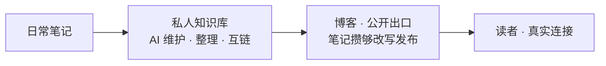

## 都说 AI 能写了，真人博客反而在回暖

2024年11月，英文互联网上AI生成的文章，数量上第一次超过了真人写的[^1]。到2025年5月，Graphite抽查了65000篇英文网络文章，AI生成的已经占到52%。澳洲麦格理词典干脆把“AI slop”选成2025年度词汇，中文互联网这边，有个更传神的叫法：AI味[^2]。

按理说，AI都能替你写了，谁还费劲自己写？

可现实是反的。真人写的独立博客正在回暖，国外叫Blogging Renaissance，国内喊“部落格文艺复兴”[^3]。

为什么？满世界都是“AI味”的时候，带着个人气味的东西反而成了稀缺品。AI越能写，真人写的那份越值钱——这大概就是回暖的原因。

但“该写”是一回事，“写在哪”是另一回事：是写在平台账号上，还是写在自己能说了算的地方？这得先从平台上的那些事说起。

## 租来的地方，你说了不算

### 说删就删，连个说理的地方都没有

2026年3月，某信更新了运营规范，明确禁止“非真人自动化创作行为”（3.27条）[^4]。新规一出，误伤跟着就来了：有作者的文章一字一句全是手写的，只是用了第三方排版工具、统一了段落格式，就被系统判定成AI创作，直接删了[^4]。有运营者手动上传图片，也被误判成“非真人自动化创作行为”，申诉之后只收到一句“确实存在违规行为”——哪句话违规、证据是什么，一概不告诉你[^4]。

申诉机制更让人无语：后台或用户投诉触发的违规判定，文章基本直接删，没有申诉途径；唯一有申诉通道的情形，作者却看不到投诉内容——被删的是哪句话、证据是否充分，一概不知[^4]。

某乎那边，2026年也多次发AIGC治理公告，对低质AI内容做折叠、限流、禁言。判定逻辑不是“你用了AI没有”，而是“内容有没有触发检测模型”——句式重复、词汇分布、情感扁平，都可能中招。有创作者申诉多次没成功，“后来就放弃了”。

这些事的共同点是：**你对自己写的东西，没有最终解释权。** 平台算法只盯着排版、句式、发布频率这些表面特征，文章到底写了什么，它不关心。这就是“租”来的关系最要命的地方——你以为你在自己的账号上写作，其实只是在一个随时可能收回的房子里摆家具。

### 平台用户刷不到你，更别说变成你的读者

2026年，Instagram一条帖子的平均粉丝触达率跌到3.5%到7.6%，相比2020年的10%到15%几乎腰斩；Facebook主页的有机触达常年在5%左右徘徊，大号更惨[^5]。十年前发一条帖子，粉丝里可能有16%的人看到；现在能稳定触达1/10就不错了。

这不是“暂时波动”，是平台故意的：算法把位置优先留给能直接变现的内容，不给钱就没曝光，目的就是推广告收入。有机触达率下降和广告收入增长，是同一件事的两面。

我也想过邮件订阅，打开率通常有30%到40%，触达的是主动订阅你的那批人[^6]。差距是几倍到几十倍。

但关键还不只是“触达率低”。**平台用户不是你的粉丝，是平台的用户。** 算法不让他们看到你，他们就永远成不了你的读者。你在平台上攒的所谓粉丝，本质上是租来的观众。算法决定今天让谁看到你，改规则的时候不会提前通知你。

### AI一来，误杀更狠了

平台拿AI来抓AI内容，可这检测本身就不靠谱。Graphite用的Surfer检测工具，在Graphite自己的测试里，对真人文章的误报率是4.2%[^1]；中文这边，南方都市报2025年测评过10款主流AI检测工具，把名家名作都判成了AI[^7]：

| 被检作品 | 检测工具 | 判定结果 |
| --- | --- | --- |
| 老舍《林海》 | 茅茅虫 | 99.9% AI 生成率 |
| 老舍《林海》（1300 余字） | 万方 | 35.6% 误判比例 |
| 朱自清《荷塘月色》 | 某主流工具 | 62.88% AI 创作 |

创作者两头堵：用AI辅助，说你“非真人创作”；老老实实手写，又可能因为文风太“标准化”被误判。平台拿算法治理AI，可算法本身就是AI。误判的代价，全由真人创作者扛。

## AI 什么都能写，唯独写不了你

### 答案可以给，思考得自己来

大语言模型的生成逻辑，是“预测下一个词的概率”，输出统计上最可能的词序列，而不是最有洞见的表达[^8]。它没有自我意识，没有你的经历，不承担选择的后果，也不在乎写出来的东西对不对。

写作不是“把想清楚的东西倒出来”。写作本身就是思考。你坐下来写一个观点，写到第三段发现逻辑断了，回头重新审视前提——这个过程，AI替你写初稿的时候不会发生。你写不清楚，就是没想清楚。阮一峰说过一句朴素的话：“博客首先是一种知识管理工具，其次才是传播工具。我只写那些我还没有完全掌握的东西。”[^9]他从2003年写到今天，1500多篇博文，就是二十多年思考的完整脉络。

Hacker News 上有篇讨论也在聊这件事。一位博主说：“我写博客主要是想提升自己的写作能力，这是我历史上一直很弱的地方。这件事本身就有价值。我不介意没人看。”有人回复：“即使没人读我的博客，把想法写下来的过程迫使你主动思考它们，主动面对你可能存在的矛盾。”[^10]

写着写着，你的自我会变得越来越清晰。这件事AI替不了，因为AI没有“自我”可以变清晰。计算器没让人放弃数学，AI也不该让人放弃写作。

### 内容可以量产，经历没法复制

一篇深度文章胜过十张名片，因为文章是**可验证的**。

AI可以总结一千篇“如何优化数据库”的通用方法，但没有“我们如何把查询延迟从2秒降到50毫秒”这个真实案例的原始素材——你没踩过这个坑，就没有这套经验可写。真实的踩坑经历、具体的数据、做选择时的犹豫和事后的反思，这才是人的独特资产。

### 一个人干一家公司，博客就是你的信用资产

2026年，“一人公司”（One Person Company, OPC）正从概念走向大规模实践。据中关村人才协会《中国OPC发展趋势报告（2025-2030年）》，截至2025年6月，全国一人有限责任公司存量已突破1600万家，占企业总量的27.4%；仅2025年上半年，新注册就达286万户，同比增长47%，占全部新注册企业的23.8%[^11]。在杭州、深圳、北京、上海等地，OPC在新设企业中的占比超过50%。

OPC创业者里，非技术背景的已经占了大头，运营、增长、设计、内容出身的人大量涌入[^12]。启动资金的门槛被AI大幅拉低——一个人、一台电脑、一套AI工具，就能跑通过去需要团队才能完成的业务。当一个人能独立跑通这些，外部世界靠什么判断你靠不靠谱？靠简历？靠自我介绍？都不如靠持续输出的公开记录。

你的博客，就是你战略判断、技术能力和产品审美的可验证信用资产。潜在客户或合作伙伴打开你的博客，看到你过去两年持续写的技术分析、产品思考、行业判断——信任就在这个过程中建立了。不需要面对面，不需要销售话术。

AI大幅压缩了产品开发周期，“能做出产品”不再是差异化优势。“能清晰地解释你为什么做这个产品、它解决了什么问题、你的判断逻辑是什么”——这才是。博客正是这种解释能力的载体。

### 罐头味的东西遍地是，真人写的才金贵

“AI味”不是一个玄学感受，它有可以被客观分析的文本特征。《中国社会科学报》把AI文章的特征拆成三层[^8]：

| 层面 | AI 写的文章 |
| --- | --- |
| 词汇 | 偏好高频中性的“安全词汇”，回避方言、俚语和带个人色彩的表达 |
| 句式 | 句子长度过于均衡，缺乏人类语言的节奏张力 |
| 结构 | 高度模板化，用“首先、其次、总之”充当“虚假逻辑连贯性的装饰” |

PNAS 和 Computers in Human Behavior: Artificial Humans 上的两项研究也指向同一结论：AI生成的故事重复度高，对人类创意多样性的贡献低于人类写作，而且生成越多差距越大[^13][^14]。说人话就是：AI写的东西，你读得越多，越觉得都一样。

Ann Handley在2025年的分析里说得一针见血：“AI makes information abundant and cheap. Humans create what's scarce—and therefore valuable.”[^15]真正稀缺的是三样东西：**意义、信任、注意力**。

还有一件顺手的事：GEO（生成式引擎优化）——让AI在“转述”你的内容时不歪曲原意。优化重点包括清晰的标题层级、开头给结论、列表化要点[^16]。

但Ann Handley还有另一条发现：“你越让它替你写，你的结果就越差。”[^15]AI适合做粗活：转录、格式化、生成初稿、整理思路；不适合做“讲故事的人”——注入判断、决定说什么、用什么语气说。AI可以把一段想法扩展成800字，但那段只有你才能产生的、基于真实经历的判断，它给不了。

### 饭碗抢不走，力气倒是能省

把AI嵌进创作流程，让它承担重复、琐碎、耗时的部分：选题时查资料、做竞品分析，初稿时扩展思路、梳理结构，审校时检查语法、优化排版。但核心判断——文章到底要说什么、用什么语气说、哪些内容该保留——还是你自己来。

有个很实用的工作流：

AI负责管理知识的输入和整理，你负责知识的输出和表达。

所以，当所有人都在用AI生成内容时，**真人写作的边际价值反而在上升**。

## 搭个博客花不了几个钱

静态博客托管这件事，2026 年的“穷鬼套餐”已经很成熟了。搭博客要打交道的，就三样：**工具**、**平台**和**域名**——前两样免费，域名要花钱。

### 工具全是免费的

工具是跑在你电脑上的软件，不依赖任何平台。**静态生成器**把 Markdown 变成 HTML，**部署工具**把文件推上线。

生成器按习惯选就行：要快用 Hugo（毫秒级，单二进制文件）；要新用 Astro，默认零 JS 输出，还能混用 React/Vue/Svelte 组件；Hexo 基于 Node.js，中文资料最多；用 GitHub Pages 就配 Jekyll，原生支持，就是构建慢些。

部署更省事：`git push` 到仓库，GitHub Actions 或平台的 Git 集成自动构建上线，Cloudflare 的官方 CLI（Wrangler）还能本地预览。

这一层全免费：上面这些生成器都开源，GitHub Actions 对公开仓库无限免费。你唯一要准备的，是一个文本编辑器和一条命令行。[^17]

### 平台都有免费额度

平台是托管服务，CDN、SSL、访问控制都是它的事。Cloudflare、Vercel、Netlify、GitHub Pages、EdgeOne Makers 这些主流方案，免费额度都够个人博客用——带宽、构建次数、HTTPS 这些基础项，不花钱就能满足[^18]。

### 唯一要花钱的是域名

域名约 10 到 15 美元一年，平摊下来每月不到 1 美元。

### 能搬走的，才不算被绑住

工具和平台说到底也是别人的东西，和平台上的账号一样，都是租来的。区别在于能不能换：工具都开源，随时能换；静态文件在自己手里，平台想换也能整体搬走。正因为搬得走、换得了，才不算被绑死。

还有一句实在话：免费条款随时可能变，`*.pages.dev` 这种子域名也是租来的。所以无论用哪家，Markdown 定期备份、保持可迁移，这个习惯别丢——域名和源文件，才是你真正拥有的。

### AI 让搭博客更容易

搭博客的障碍，一半是钱，一半是技术门槛。

以前想摆脱千篇一律的现成主题，要么自己会写代码，要么花钱找人定制，从零开发的成本高得吓人。现在这条路被 AI 铲平了：有人让 AI 写 PHP 替换掉 Typecho，有人用 Next.js + Fumadocs 自建，还有人拿 FastAPI + Jinja2 + MDUIv2 搭，输个喜欢的颜色就生成全套配色[^19]。

共同点很直接：你不用再亲手写每一行代码，AI 负责把“想要什么”变成“跑起来的程序”。门槛从“会写代码”降到了“会说清楚需求”。

于是剩下要花心思的，就是你的博客长什么样、装什么内容、为什么这么设计。像“为什么我选 Next.js + Fumadocs 而不是 Hexo”这类文章，聊的是技术选型，背后是审美和判断。

## 写在最后

写博客最不用担心的，就是没人看。一个精准触达的同频读者，胜过一万次泛泛的浏览。你三年前踩过的坑，也许正有人在深夜搜索时撞见，读完之后给你发来一封邮件——这种连接，不是阅读量能衡量的。所以别盯着流量，写你真正有独特经验的东西，写你搜过但没找到答案的东西，再写点你愿意在三年后重读的。那些真正需要你文章的人，会找到的。

至于回报，直接的经济收益确实不显著，但有更实在的地方。持续输出的公开记录，比简历更有说服力——有人就靠博客收到过远程岗位的邀约。一篇深度文章建立的专业信任，能变成咨询、合作的机会。内容也有复利：2023 年写下的技术教程，2026 年可能还在给你带来搜索流量和读者。

在AI可以无限复制内容的时代，还在自己的域名下、用自己的声音、写自己真正相信的东西——光这一点，我就觉得值了。

独立博客不是关于被多少人看到，而是你有没有一个地方，能诚实地记录自己的思考，检验自己的判断，然后安静地等着真正需要你的人找过来。

阮一峰在2006年写过一句朴素的话[^20]：

> “长期写作Blog最大的好处之一就是，写着写着，你的自我会变得越来越清晰。”

二十年过去，这句话我信。

从今天开始，写你的第一篇。我的第一篇，就是这篇。

[^1]: Graphite Common Crawl抽样研究（65000篇英文文章），引自Visual Capitalist[《AI Articles Have Overtaken Human-Written Ones》](https://www.visualcapitalist.com/visualized-content-created-by-humans-vs-ai-over-time/)，2025年10月；PCMag[《More Than 50% of Articles Online Are Now AI-Generated》](https://www.pcmag.com/news/slop-central-more-than-50-of-articles-online-are-now-ai-generated)，2025年10月。
[^2]: 澳洲麦格理词典2025年度词汇“AI slop”发布，2025年11月24日，[macquariedictionary.com.au](https://www.macquariedictionary.com.au/macquarie-dictionary-word-of-the-year-for-2025/)。
[^3]: 码农刚子，[《AI火了，个人博客反而又活过来了？2026年“部落格文艺复兴”真相》](https://cloud.tencent.com/developer/article/2662006)，腾讯云开发者社区，2026年4月。
[^4]: 红星资本局[《微信公众号批量删除AI写作文章，回应：不得用AI代替真人创作》](https://www.sohu.com/a/1007428838_116237)，2026年4月；虎嗅[《关于连续两篇文章被删除的说明》](https://www.huxiu.com/article/4859569.html)，2026年5月。
[^5]: [Hootsuite](https://blog.hootsuite.com/social-media-benchmarks/) 2026年报告（Facebook主页平均有机触达约5.2%）；Upgrow[《Instagram Organic Reach Statistics 2026》](https://www.upgrow.com/blog/instagram-organic-reach-statistics-2026-decline-by-account-size-format)（Instagram帖子平均粉丝触达3.5%-7.6%）。
[^6]: MeetEdgar[《Social Media Organic Reach in 2026》](https://meetedgar.com/blog/social-media-organic-reach-benchmarks)，2026年9月。
[^7]: 南方都市报大数据研究院[《AIGC检测工具测评报告》](https://static.nfnews.com/content/202506/10/c11382288.html)，2025年。
[^8]: 《中国社会科学报》，[《智能写作的“AI味”问题》](https://www.cssn.cn/skgz/bwyc/202607/t20260703_6057355.shtml)，2026年7月。
[^9]: 阮一峰，[《图灵访谈：炫耀从来不是我的动机，好奇才是》](https://www.ruanyifeng.com/blog/2015/02/turing-interview.html)，2015年2月。
[^10]: Hacker News讨论帖，[Ask HN: Is maintaining a personal blog still worth it?](https://news.ycombinator.com/item?id=42685534)。
[^11]: 中关村人才协会《中国OPC发展趋势报告（2025-2030年）》，数据转引自新华网[《“一人公司”的那些事》](https://www.news.cn/fortune/20260321/943f6293dbe14f918ef29a481d12a6d0/c.html)，2026年3月；21世纪经济报道[《“一人公司”火了 多地试水专属保险》](https://www.21jingji.com/article/20260604/herald/cb8bc82501bfff78b162dc686d473da6.html)，2026年6月。
[^12]: 新华网[《“一人公司”崛起 AI赋能“超级个体”》](http://www1.xinhuanet.com/tech/20260709/95eb319491d149cdb969557c3591267a/c.html)，2026年7月。
[^13]: PNAS，[《Echoes in AI: Quantifying lack of plot diversity in LLM outputs》](https://www.pnas.org/doi/10.1073/pnas.2504966122)，2025年8月。
[^14]: Computers in Human Behavior: Artificial Humans，[《Homogenizing effect of large language models (LLMs) on creative diversity》](https://doi.org/10.1016/j.chbah.2025.100207)，2025年。
[^15]: Ann Handley，[《New Data Just Dropped: Blogging in 2025》](https://annhandley.com/blogging-in-2025/)，annhandley.com，2025年。
[^16]: CSDN，[《AI时代的流量新法则：让大模型主动引用你的内容》](https://blog.csdn.net/goujunwe/article/details/165608544)，2026年9月。
[^17]: 博客园，[《2026年从零搭建个人博客：Hugo + Cloudflare Pages实录与踩坑》](https://www.cnblogs.com/xiixu/p/23039660)，2026年9月。
[^18]: 腾讯云开发者社区，[《静态网站托管平台对比：GitHub Pages、Vercel、Netlify、Cloudflare Pages》](https://cloud.tencent.com/developer/article/2689511)，2026年6月。
[^19]: 腾讯云开发者社区，[《2026年独立博客自建方案盘点》](https://cloud.tencent.com/developer/article/2665436)，2026年6月。
[^20]: 阮一峰，[《为什么要写Blog?》](https://www.ruanyifeng.com/blog/2006/12/why_i_keep_blogging.html)，2006年12月22日，ruanyifeng.com。
